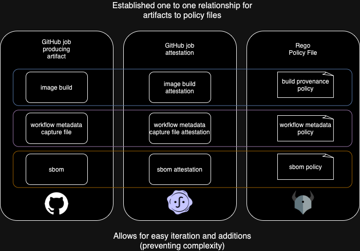

# GitHub AutoGov Policy Library

This repository serves as a collection of OPA Rego policies that are specifically designed for attestations created with GitHub Artifact Attestations.

## Overview

The GitHub AutoGov Policy Library provides a set of predefined policies that can be used to enforce governance and compliance rules for attestations within your GitHub repositories. These policies are written in OPA Rego language, which allows for flexible and customizable rule definitions.

### Policy Categories

The library includes two main categories of policies:

- **Security Policies** (`policies/security/`): Validate individual attestation types (SLSA provenance, SBOM, vulnerability scans, etc.)
- **Governance Policies** (`policies/governance/`): Higher-level policies for deployment gating and workflow orchestration

The `governance` package is the aggregate entrypoint: it allows only when every
security policy below allows, and surfaces a per-policy `violations` map for
troubleshooting.

#### Shipped Policies

Each policy denies by default and allows only when it finds no violations.
Thresholds and flags marked overridable are set at runtime via
`--policy-data-path` with a JSON object under the noted key.

| Policy | Package | Gates | Key config (key → default) |
| --- | --- | --- | --- |
| Provenance | `security.provenance` | SLSA provenance present, `buildType` is the GitHub Actions workflow type, and the build owner (and optional repo) is allowlisted. | `approved_owner_ids` → liatrio org id; `approved_repo_ids` → empty (inert) |
| SBOM | `security.sbom` | A CycloneDX SBOM attestation is present. | none |
| Metadata | `security.metadata` | autogov/cosign metadata attestation present with all required sections, github-hosted runner, allowlisted owner, and a valid image/blob subject. | `approved_owner_ids` → liatrio org id; `subject_prefix` → `ghcr.io/liatrio/` |
| Certificate | `security.certificate` | Each bundle carries a non-empty Fulcio signing certificate from GitHub's Fulcio. | none (string/format checks only; full X.509 validation is not done in OPA) |
| Dependency vulnerability | `security.dependency_vulnerability.{critical,high,medium,low}` | A vulnerability-scan attestation is present and per-severity finding counts stay within threshold. | `vuln_thresholds.{critical,high,medium,low}` → `0` each (`-1` disables a bucket) |
| Scanner provenance | `security.dependency_vulnerability.scanner_provenance` | Scanner and vulnerability-DB metadata are complete and the DB is recent (within 30 days). Optional (not in the aggregate `governance` allow). | none |
| Test result | `security.test_result` | A present test-result attestation reports no more than the allowed failed tests. | `max_failed_tests` → `0`; `require_test_results` → `false` |
| Code scan | `security.code_scan` | SARIF code-scan findings stay within per-severity and per-SARIF-level thresholds. | `code_scan_thresholds`: `bySecuritySeverity.{critical,high}` → `0`, others → `-1`; `byLevel.error` → `0`, others → `-1`; `require_code_scan` → `false`; `fail_on_incomplete_scan` → `true` |
| Source review | `security.source_review` | An attested PR-approval (source-review) meets the review bar — distinct approvals, no outstanding changes-requested, optional codeowner review. | `source_review_thresholds`: `min_approvals` → `1`; `require_source_review` → `false`; `block_on_changes_requested` → `true`; `require_codeowner_review` → `false`; `fail_on_incomplete_review` → `false` |
| Dependency-vuln bypass | `security.bypass` | Authorizes the spoofable `ignore_dependency_vulnerabilities` request only when an attested source-review proves enough authorized approvals. Inert by default. | `bypass_thresholds`: `allow_dep_vuln_bypass` → `false`; `bypass_min_approvals` → `2`; `authorized_associations` → `["OWNER","MEMBER"]`; `authorized_approvers` → empty |
| VSA verification result | `governance.vsa_verification_result` | A Verification Summary Attestation reports `verificationResult: PASSED`; `FAILED`/`UNKNOWN`/missing/invalid deny. | none |

Org-specific defaults (`approved_owner_ids`, `subject_prefix`, `signer_org`) live
in `shared/access` and `shared/utils`; adapt them for your own org (see the
org-specific constraints note below).

#### VSA-Based Deployment Gating

The `governance/vsa_verification_result` policy enables **Verification Summary Attestation (VSA) based deployment gating**. This policy:

- Evaluates VSA bundles generated by the autogov verification tooling after policy evaluation
- Allows deployment only when `verificationResult` is `PASSED`  
- Blocks deployment for `FAILED`, `UNKNOWN`, or missing verification results
- Provides clear denial messages for troubleshooting

**Use Case**: Deploy applications only after cryptographically signed verification confirms all security and compliance policies have passed.

**Example Integration**:

```yaml
# In deployment workflow
- name: Evaluate VSA Against Policy
  run: |
    opa eval --input vsa-bundle.json \
      "data.governance.vsa_verification_result.allow"
```

This enables a **4-layer AutoGov architecture**:

1. **Build** → Generate attestations  
2. **Verify** → Validate attestations + create VSA
3. **Gate** → Evaluate VSA against deployment policy
4. **Deploy** → Release to production (if authorized)

## Using Policy Bundle in GitHub Workflows

The policy bundle (`bundle.tar.gz`) is published as a release asset. You can
download it from a GitHub Actions workflow with `gh release download` and a
token that has read access to the policy-library repo.

The job needs `contents: read` to read releases. If you authenticate with
[octo-sts](https://github.com/octo-sts/action) instead of the default
`GITHUB_TOKEN` (for example to read a bundle from a different repo), add
`id-token: write` so the action can mint a token.

```yaml
jobs:
  download-bundle:
    runs-on: ubuntu-latest
    permissions:
      contents: read
      id-token: write # only required when minting a token via octo-sts (see note below)
    steps:
      # The octo-sts step below is Liatrio-org-specific — the `scope` and
      # `identity` values reference Liatrio's trust policies. Adapt these for
      # your own org, or drop this step and use the default `GITHUB_TOKEN` /
      # your own PAT instead.
      - name: Generate Read Bundle Token
        id: generate_token
        uses: octo-sts/action@6177b4481c00308b3839969c3eca88c96a91775f # v1.0.0
        with:
          scope: liatrio # adapt for your org
          identity: autogov-infra # liatrio/.github/chainguard/autogov-infra.sts.yaml — adapt for your org

      - name: Download Policy Bundle
        env:
          GH_TOKEN: ${{ steps.generate_token.outputs.token }}
        run: |
          gh release download \
            --repo liatrio/autogov-policy-library \
            --pattern "bundle.tar.gz"
```

> **Note:** Pin actions to a commit SHA rather than a tag — a SHA is immutable.
> If you are not using octo-sts, set `GH_TOKEN: ${{ github.token }}` and remove
> the `id-token: write` permission and the token-minting step.

> **Org-specific constraints:** Some policies in this library hardcode
> Liatrio-specific values — the approved owner ID
> (`shared/access/access.rego`), the `/liatrio/` Fulcio identity check
> (`shared/utils/utils.rego`), and the `ghcr.io/liatrio/` subject prefix
> (`security/metadata/metadata.rego`). Adapt these for your own org before
> using the affected policies.

## Getting Started

To start using the policies from this library, follow these steps:

1. Clone this repository to your local machine.
2. Install prerequisites.
3. Review the available policy files in the `policies` directory.
4. Customize the policies to fit your specific governance requirements.

### Prerequisites

```zsh
brew install make docker
```

### Makefile Commands Guide

- **`make all`**: Runs formatting, linting, checks, and tests.
- **`make eval-good`**: Runs OPA evaluation against real data.
- **`make eval-bad`**: Runs OPA evaluation against fake data.
- **`make fmt`**: Formats OPA files to fix non-compliance issues.
- **`make lint`**: Lints policies using `regal`.
- **`make check`**: Validates OPA policies.
- **`make test`**: Runs OPA unit tests.

### Attestation Guide

> (Optional) sometimes the best place to start is looking at an attestation; its contents and format are important for authoring policies.

#### Download Attestation

To download attestations from GitHub, you must [login to ghcr.io](https://docs.github.com/en/packages/working-with-a-github-packages-registry/working-with-the-container-registry#authenticating-with-a-personal-access-token-classic).

```zsh
export CR_PAT=YOUR_TOKEN
echo $CR_PAT | docker login ghcr.io -u USERNAME --password-stdin
```

Now that you are authenticated, you can download the attestation.

ex:

```zsh
gh attestation download oci://ghcr.io/liatrio/autogov-workflows@sha256:efa6fcc6c8059a5fcc2c2dcdcdb83a57a7bfe480bceefbeb99d86f480a8e8aae -o liatrio
```

You now have an jsonl of the json attestation objects.

#### Parse Attestation

The downloaded attestation is base64 encoded, but we can make it human readable by piping it through jq and base64 as shown below:

```zsh
cat sha256:efa6fcc6c8059a5fcc2c2dcdcdb83a57a7bfe480bceefbeb99d86f480a8e8aae.jsonl | jq -r '.dsseEnvelope.payload' | base64 -d | jq -r
```

#### Put it all together

You can also run it all at once:

```zsh
gh attestation \ verify oci://ghcr.io/liatrio/autogov-workflows@sha256:efa6fcc6c8059a5fcc2c2dcdcdb83a57a7bfe480bceefbeb99d86f480a8e8aae \ -o liatrio \ --format json \ -jq '.[0].attestation.bundle.dsseEnvelope.payload' \ | base64 -d | jq
```

> Note: This will only give you the first attestation object of the bundle downloaded. You can increase the index at .[0] to get other attestation objects.

### Creating Policy

Use this [example attestation](./test/attestations.json) to help pick an object to validate. For more detailed information on authoring Rego policy, please refer to the following resources:

- [The Rego Playground - For quickly testing Rego](https://play.openpolicyagent.org)
- [OPA Policy Authoring Course](https://academy.styra.com/courses/opa-rego)

#### Standard Practices

- A new policy should have a one to one relationship with the job artifact and attestation
- A new policy should be an individual file in the policies/security folder.
- The policy file should:
  - Set violations based rules defined and only have `allow` set to true if there are no violations after evaluating all the rules
  - Check that predicateType is present in the payload (attestation bundle/list of attestations objects)
  - If predicateType is not unique, also check for subject in addition to predicateType
  - Check contents of attestation where predicateType matches



[edit diagram](https://viewer.diagrams.net/?tags=%7B%7D&lightbox=1&highlight=0000ff&edit=_blank&layers=1&nav=1&title=Untitled%20Diagram.drawio#R%3Cmxfile%3E%3Cdiagram%20name%3D%22Page-1%22%20id%3D%22d1nyZJditxnq9JhTK4oI%22%3E1LzX1qPItib6NOvy9MAId4kRAoQH4e7wwiM8PH1H6M%2Bq6tW5%2Buw%2BZ%2FTuVbtGpfmRMDFjzs%2FMCPIfON8djyke39qQ5e0%2FMCQ7%2FoEL%2F8AwhkHA7%2FDA%2BXOApOmfA%2BVUZT%2BH0L8OONWV%2Fzr467xyrbJ8%2FqcvLsPQLtX4zwfToe%2FzdPmnY%2FE0Dfs%2Ff60Y2n%2B%2B6xiX%2BW8HnDRufz%2FqV9ny%2FjlKE8hfx6W8Kt9%2F3BlFfn3SxX98%2BdeB%2BR1nw%2F4%2FHMLv%2F8D5aRiWn791B5%2B3MHZ%2FxOXnPPF%2F8emfDzbl%2FfK%2FcwJOcSgzt%2FuIakhdNItCCPn%2Fg%2F1cZYvb9deAfz3scv4RgWlY%2ByyHF0H%2FgXP7u1pyZ4xT%2BOkOphwcey9d%2B%2BvjX5fLpyU%2F%2FpfPif45epA1%2BdDly3SCr%2Fw6gfoVr%2FOff9z%2Fiv6fIX3%2FD5HH%2F%2Fhi%2FGvGyz%2Bv%2FFdQwF9%2BxeX%2FQ4zQ32JUdTBrMCRZK5BO%2F%2B6Aodg%2FRwwlfg8Z%2Bq9CRv5nRQz%2FLWKPapHWBByrB%2Fj7OA3ZmlZ9%2Ba3SpSpiULr%2FcxxBRJZ%2FDlbcVmUP%2Fp6CyOQTOADjVoFiZX990FVZBk%2F%2Fl1H%2Fa16Q%2F0OBJ%2F458MzvcSf%2FVab%2BZ4X99lvY92FqihagDsCjfImzeIkhVsbjsk4wgYsKROvvlr9%2FBujflr%2FEb4Gck6H72wUKR%2F%2FdgSJ%2FC9T2b4%2FSn1H52xAI9R%2FBYbws%2BbzESzX0%2F%2FVQEGf%2BXihI%2F0d0%2Ff8a7v%2Fr2Ur%2B3cib%2Bf%2FJIn%2FrsP77OeUPVPqNVP7Wcfv3Uwz6u%2Fz%2Bt0eJIP5uFIP%2BbuTsvBzAEXNoqxQ%2Bu%2FivtN7fnl1I%2FO%2FFLujvIvsPWgGmZsv7uE8hGI6%2Fwv4%2Fxfs%2FyM35HY%2Fwk%2B4oYTflvyXxXKX%2FLRvStYPx%2Bj8QTvR%2Fg27QfxFQ4j8toL%2BL7X%2FNN%2F9FIorhxL87or%2Br8l9M818khP%2BSdP7vhvB3yf5b1P4Iy4%2B6xLnvn%2Bw8%2FnQhIfzFf%2FxQVAfExD%2BhVI2TvDWHufpyPi4kw7KACfoda5dh%2FOPK4KdvIeDsLzkrjrB9wlceZ9g78nyUAwv%2B053X%2B%2F4qWZaDP7EWy7Mh%2BBNAsSg5qwCPcZLOO54l82wpF%2By7qb7fbHdHbC%2BWvevMznJCkXIjl2TiDk9QENt7Iy%2BM6TIpe6fdi42CsY%2F9cA0xZhk04%2FLB12TwRfsuvnLlmvFgTXvJI%2BA0fP%2FHsxT8virv1bF4VpF5eXDed8%2By2WnEbPl%2Bx0Rske8O7VXse93z5748B8cYydErLcdOhHc9J%2FyA42SLH4F8Leclh7Hgc5YnFuuFjRFp1U0xT8sVUMACiPcVRMK41ku88Es98%2BIfGFcL0iPK95UyCIrqUpx5sCX7X%2BK%2FXQ91wcKXB4OAn%2Fhdjw%2Bv1GMQvpTF1OizBGPsoUWwGaUBPmenV%2BdEEhmPn%2ByR7UKolyFryYT3HIMaL1CV6okpY2eW1QRfZD%2Bif%2FrL1FofBXFwVi9JruRYdwxUIjY1ShgumG8nvsGJXGpSoeAzLVWkIwfzzBdXAx9MbTzZtwi39PI8dxJc%2BfKcj%2BcRfZQ3DeXYw0ccNskWUpCa3OwQny4%2BX0trghTwQipcJf5dZHd9F296D3JW6NxxbWd46RX8wnr3UC8zuSv7HXy4lyNxgELnnrP1kQBViLf48e5hlNTdZHe25A4FwZ3P%2BGBkbM3HAHzXBL8KkNEI%2B3EUqe%2B6Ltisj7jvO4LjAruobM3SoAZYSeXxFNfU0USODmYOPcf6A%2FwJ%2FpfjUgZ19s6pnpxWrIAXfQaBS9Dfz8XXiBNUVMt8CguPaOJkHJmLGY2CpoEgE8HlRCPEwe%2FXreHBV0LufB75U4j6ZEtxgkijTyfts8JuLC2AuZTutctw1gUf430VDK5h5s0EMYyPMVoD17nS8%2BOd9VznJUs%2Fdo2V9bqr6THa4qAAekWEZQhiZjkjcQkz517avk5ePB1xKLFB6cPZHqQnscngHlSB4k7L44xZauz3rCk%2BsrXzGd1%2FD7HIdEwj3PQGjI7jkuk6jhFzFbW1kfUEbCAqDwn9oAlD6p1egqm6Xw%2FaFHYzknNsUbe12IzAQzOdOc7zxK5u3MVQ0A2Ctfjx0cdK3j4cawVYU2iUkXyjmhYYtX9gXp%2BvzWUekXJgV12Tp7c836Eq39Cn1bPRCqb2oaTDA4VYc19m8PuesuwTHY39dphN4hDEZrOrED3AyFwvHj0leoIbjDNMj16DAwbPscVXHYDE4xgZCTJqf7CCuQOkiJ8y4oaM3KxuRRVVjS94VrwKoYQoaUyb3hfmsppmEFUdWRyPY%2BduDxDF4d47uo4myFJkm58CchG3krEPgiBYTXdhPj0rKpyk26D0TCSAOuNiNW8mIlGJAIlxyy7vO6hgzpgDChh07v2xN0f5XD18bpEqaHAFrk3SlGDv4OrR6LFD8dD3VOI666axzgPcQ7DTj2c%2FjzkBqSy2vRNTCU5BMhNNMIL4EdR%2But5%2B0phktgQN2tfQTg3GcquRCI9qzwsTCAkxNigJ5mO%2BodogchBEebatfU6%2FzFyH38g3mcYVNmElWE%2FcMLiZjjvCOPUS%2BHTZXVtf4AXAL8Ni2VLcITrgDjdt%2BSssJg9g0eVXHM12sAa4T%2Ft6lnniFzQc3zouYOrGHKEMDpx98q8rvUyK2WpI9y3qq2NqJq%2FyBaoLzKfxgkjxYi5jf2QEjZUJjKHPYF8%2B7LqTj45RdyO1AdKJ2%2FwpWxmqubMwSxg3vBlC2TrRc3OiyeKJPEri93UHg7Z0Xb%2B1Qm36HxRb0ge35z0qvECowZzrBJnjELmeRqPDh%2B4oaiT1eqDyV542MGJjbVwYgzLDlKLb9ADplFYLKvMYGz7YO5uNfkuOH9tVILziV37m4e1GEJ87qcDKkq1BHGZTafrzhjT0IcIcjpMPnfzx7J68tjt9zSejEfW9m70XYAe2BG6F%2B%2BzL1O0Bfyu8CCIVQExpDBeMyqimcwo9yPIzuYx753yLghWWSFUmMLXcrXGsxNEl9Aj8DyvMoMKUCgwR66O2xyZiKocAptTB3r744XYf1K9xX58WWGvVR2LLp3uAjOt461rpOgNRF0VisWhDgEhe%2BLdCYuG8yi%2BRPxLa0WUhC6pBR85E71Bdsm8SCQtL5pSPaH0oPMDHwCNXcVHHTLm79ADxTpZc%2FXKCgHjzOl5gefvqW9y0byopWuBcVnEWE6l4WzHbfDsu7Vo2ALgyh3lqitZjm72e7YtYgokOOWOHzyvzaMzAnD00mFH60sLiIUjlp2ZoDswadU7Pue%2FWNKkNKunft1yjSbNKLM0GKWMYr3HtX9OHXCdqonBpYMZp6UNMr3GSCm6Q3AxXPAYkSXATzxeqWx%2BrHwHY32%2BhvgUe7T7ZGs7JMffZdrojU3j0BUZR9IKmpSntQcqUoP47ZV2sjpBJHiE49NlMQdrcpkEgnQJJLjZHmSQSpKA39gEHuPJ%2B5WjOSEQBkRyMeNBwr4jROqqy4MMEOGouRxkkILmE0F09GAT%2FDbmMTB9mcSxCMKYws1MZJWfazDaaf5eagIXgWolcgGDcmeZ0CK9VAvmA8%2B59liXW3BoqMeL%2BeL8e9SuZi1W5Nw%2Bktpk01HIJKyeIAiIu9H2QYRHaYyqhdrpRjsWUlXv4LPS1OmDO7G8URUVYb%2FpkFjok50M%2FwI9aYeLsfhcyc0SUWExhBgS0VkIecTKpFHpI7hgMnvYwa5C7dzh8Hd8ojHNhSCVAK1wCeeElC9LBDDxIivKByjCgzqYoeH57Fm9wHtAHAnY9LzsmbhdyWcyYSiabWAhXCqxX7rpgo2XUzcDXiu4RtfX9W2NJzCg9PiJp0qZFi7h9mQ2OBe7BYzciipLo%2FXq%2BY8jR8Jf1MFFvudGxnl3JDaIoqylohheF%2Bun92zOPuspV0K8uikba1Fg1bDjWZNPRk4Ew9D5Q1B1jf4Y0btG%2B6k1Iyhk5B%2BZK1i3bPq6jetpUt3Gv%2FEifbwdUl60Gxsxd9B3hTC2nAR8YWZGJbjCQP9XDG0hoX6xCnWjfX0SPNU5KiwsLSFRjL%2B%2B5eSEIN0Jefcw8mRQOW%2B2tS%2FXNFadpNwMRhxhMlGIC0SOcRKDXwZFgDQjxFevRJZa%2FKOfJ1bqkAayMlc5DLlO4aKQLGYXgcPGNwGyKx1ZrpyiD4yqYvri%2BcqIIsSQ%2FjBQGXYZ0R%2FiTF4FgyFiL3aFYwlbU6Fyhn2dNM3LyqVx739xroJfvbZeNjxjq4fvmJNlJW4B7hY%2FSJV2EZ1IzXvh%2BOnkR6H1D7PZZWXfWaIESn7es8LurJwrI%2F6DOLT5%2F%2BqwRYX47dhUxMZvG5yAtWQ5bIC4%2Fq7aRx73hrR8dllpqwZlt1X1iiRMQvGFnjdUBPv6lwXxkdNgRkhgBMyQV%2BjcsR%2B7lwhQ1pUj5sC%2BaQWETgGs%2F0ajRdMFKTxFUDvkCHOt8Iq0rZM%2FxHv3ew%2Fr0eQDJ3GNzv1MVAgK6DW%2FpMk7pDlXWQlXgY5vhwdzvOpw6xurlOx2yAKWuiP5xf4fh1ANKFnAmRZhfvXPc1MTeqeUkiD2E2vzgH%2FAp3I%2Fn%2BJHdYmFaP%2BhjtsBn7gXoCTjahdFOV517E7LPFbGaVcLoztNOm3we9bHXhR4cuJ9FR%2FnDPjPgZn99x6e2Oxq1dgFPbWLWcDo3C6zkaMaPqqfnawNXhmMRJTCD4DlRScJx5LrJydeBASCdDb5vVtJMJAHvI61Zg6gMn2w%2Fl%2FqgAIcFbJNpQmG%2FR%2Bcrkxb0Hb037XpqX780dEfOM0iOO9JYA9%2FQb7hCslXpA14YeP0F8LW%2BjItBbNSBsHXH4Vl59FD16BEV8TueCiLK2MICoWYRM8RwZkFHx1LdUfoBkLvwRKNWJlYyEEBMbByhdZ1FBBAHtAwljkwbp5DRjKEJIOgvzTUptwchhLFVH8eczW398vBEjdy2CwLBuhnu0Bis%2FVFYS4ixxRlfsIKCTOKQAwXe0CCquXgPGfCh7J1HwhvNMLWomLdrzeUEuKIZoyLI%2BvKNe4Qlzy6tD6RbHGJ2b0tfnc70oIJkrj%2BzID4BUftk%2B3KHaQWiT4R3RTYwFn51FLVp1k5T0%2B1VwRy6852Z3MjQhxo4HrdFzHZeh1I8cTIdIduoLTFY3vQ1tGsO0uBD5MQdaD5eflXli55KDNTdGGrGQ0hwW37xjGZxLIZLuIo0pKZO9Zpes77Pgbod0c8YuVySgteroN9kUtiSt%2B3d%2BLAba4UjJMMdjvA5evfbOeOZmGGHIk35DTKTLchXi9tUpuX%2BKi0FCAMB7LL0utOgjlkMsl32oqD4x%2BknzHhWFvrTNBLlkWAjgPGhwGoD3sUCd%2BkF13WLRX70LB5n4oIdetv5RBH8jLCpbKVfMtk4rB%2FO2H6cg91b8ov93tFfp5VSiQQ518pI7DfzxQiJup1QJbKnsuqPq8hlv5lB3BMoYd9N9LSggS2fAwccSSwB7BqJFegDKaNOdr3RFDXV0nB%2BMesklndd46iGlDAHgB4SL%2FN2Ai%2FgDtfKnr7MlgrQPoKNAEl4DfWKWQSJL1916z7pq2EvXHhD%2F2hld3t%2FADK8C6o%2FAZ0aAhW3SlPTTm8NHbdq%2F9a7%2FCHOggVPyL8%2BXucHbgrV%2B2WUDihU8Lxin%2BEZWjSTbWZahkEYjJCv6xNJ9ASK1QkmcXn0Lr2dINdZzA8sVuMeCUWLn9b%2BAYvtvPkVtYj21%2FfZEUBkqKYme4LXzNv88NX9NEo5VPGQHYyXBnUtVIjWohKIjdczfye%2FmMAG6d1GdqFlNAR3oJBi3%2BUG6G14%2Bk3sDuhJyZyTGbVPxUGXBM%2B2DmGrbVeTqMMaydnlUH%2Bg01vlp1I4vufBnMc7RwAhfsi0v35SHap%2Bl13XzqMuQtHNog7hjUzg%2FIdH5D0JWIk6JYMp6O9xUbi2DfUsY0Bvygub3USPrUJHVR1rU7vmS7B1%2FEgy1t83oRTvzlHm0nK7TupJKQbi4K5i4DBKt%2BzxjZLq8PodCsUgUzgYAebO%2B5GVLr4Kzmfu751d3tzOnSqCu1N1qTCg%2FpJB3VXEW37CCno%2FJnvJjFm5Qx9iAhh8yaXBejcQDx4px2ezk1qtfGSRwl7Q28kIrUzjafaX0l1yPfA5f9dYhZva19j2HwsgZKZ5StROxVBBTYFIzrJJ0ckcQZtu%2FUCyROlfQLSpHZosGGmAnCqA4AkOoFQaaKNV4NSnbIAVY8kN7gbIFKvJWJcr6WYPHmbCt17c8N6HrKwUKQ7dYvdaClMqPlu%2Bf7FBnRmjYx2m5q8Pc2Y6%2BrEdoC6b%2B%2BbFmy80A6lSY6WJEykJ4PuyqKjgr2nhAY0DTCanUEAkQumZfjLnYx9ztNEh7oqR8OPeHhMRmGxQPbsCBcL9gCAeWBIt7iAe7BRHo6FT%2BgSArwfM4NifzOiLaUNsSCz8Mk45zjArOK5RStc%2Bm8oNJu8np4smQniT04BCt%2FQjU6G5NIdKa86Zmg3Ir%2BeukPKXA%2F0Z7%2FTMzQDHobSp2kh2VwcANxEGkEA%2FB%2B%2Bzbc3mGKRMkKE5%2F%2FSt2FF1VZDGG2DIzwlxQNRCYAcCiJhrsm61QQ4DHhGIBbL1UZFZP1wHLG7RAw7O70npyQwgW%2Fj749jTnldGS1QTnDc8ReseJOyQy5zvOeUL68AcPVoSoGeBJVcHlP4BiOaGL1R%2BITP5VD91MF8z7AkW30ZHUSD2tye7xAsJ9DA9kh7ghSKoqA%2B0C0YffEYSKgDwyCLgPpkMGOH7jZfbbv53ehbElzzOjDYAspzz8c%2BnOgh9iHCs9px9KlvrsVsa37XVImio7vqlorqnhRWiKTaVQ4Tde4j1YrhL1goyWb7lhP9hXmvL2Ji5867y6HDxBApW5ruYTtE22UD8radHvSmfQrj3kkDL%2BEZqi7EYJRmu7XOlxwM3sZWETh5ECGVMNyXzBskrg%2BvfKsC93n7lpXYBNasbbZyMBXiWAkpCYuAkqJI%2FaDmb7z6DWY4Ywx%2F5ADhAynCbf0SY9Kb1igVuXudeIA%2BxLms9qr4t68fjsPWzP0Bdlg9hWack3tNzXYHnMKgVPCcXPVi%2B%2FGQXc%2FsleWPJllgqmKrDggLhnrVEIhXXvkP83SqZAJl2Z8tnPHr8R%2BqAJbDxFPEF2KdxoHET7GSF%2Bnm5PsTruRmVzLCEISGOm4gYlQ3ZSn3IrVpG6Ekqn9tGdPbqVHUHHuRA2XvOhHq%2FHBoD0LRMyOvM89xQWTucfdPes3ID%2BrFkEdvLAvQoPPxdfNnDehtfVyNkqzlniIXozKLm%2BEJ6iC0NX80n8Z6zvu4ObEHIVFfxGKl9CxxreQrfw9KJ8yYOxipj3VgCpa2LDhHot9qJZBSgrt48gmjK7pAPWCpNMgNEQ753E0oSsClEqAOvWjhkhU58ji0HtQPwLXkxtFUYAoUIExQhEJgqlrqNZN4RFiqDudKUbJ0%2B5PSZPX486jB%2B3MJZFVx9w6fdXLfNhvcPHxFQV9s8hwxQa19eSGRgKW7vO%2BwnYiJiE9rcC8yPb9iAqmJ46D9AbGXn452fuSmcJzncGjLy5xgq17dMRDHVU%2BO5eme31gbD5%2FD71F%2BKF%2FgZwKDEZwhR8vXt%2BVW4Ojc3MpEglsFa594WxiC8PpjsLrwCnwG2v4D0EwpD3YXAPoQ%2FSOrJgyiAYT48HMeZJjIcF6DZYB5hVpqRM3mxmRZ5gopt4cMsSEz8OxhOEsyLhIGTOYww%2FvCcCtb62X1216hnTmhQKTqSQhXbrRsLdNOyMPt5Msj2wrLsl%2Bn0LhqqQ12juiULIZbq0Qqz%2F8wEC%2BEpW%2FbLQmA5S6e8OEn8xowB%2FkwCI8GOjnkn0xRDbSifeItkV0wAKvsztJ9lAx61BdPEGf1dhApO5jqSsVC4Rs%2B1cTEFiC0OAuAl7dEDUa5tbWBz2T29Z9DogfSAQlPKYHoAlvKJizl3Up7L4H3LpeC4Z2UG%2B028q9WAu7XqpLRtNQF8K%2BEzwgPz278S9Z%2FzqWESb4PeZR2wRIQw%2BlGUae4P51v%2BUsPuX%2Bfq%2FTWkjQRk9T0NMoguQx3DXoisoGSHsE3v3nC1vcyjhHf%2FNv712kIWyFPNC5iQGVp%2B7v7DHVjdEtRazP17gE9swnNEeE4D3LIHY3afHNSofEfs%2FKxwVMiPlmAQOZlvWxw1fpB4fVDkGOC2ckngx%2B5tpXpggJu1MkPrK8UnEC7m%2BILine9X8ydDoG5jyqhkpGy3KFIRJaluKKC1lzOWBUSankShThDtXU%2BR3IPS%2F1oheTA%2FUXMyGZle5cfu0%2FsD2Mn9m4I9%2FFL%2F8sUUYx9sajeppJyOorUeufFqcWsE2O5i%2BWf48Of9k27ZhEzu8tS3gw5uGnCc6%2F1M9BUplAQh10ozwaWxX8xpNNgLVCCnB13bSbfVsB7LG3iXxfu0L6EvcAbxcEJ2zDrEAXv%2FPGf8iiT72hhZg2r9VNWv0%2F92FON6ECbLgLIrA9OXqZ%2BogPoUqK4ka8qsyyBcfzs5MHCQKyH23lF%2FQiExm1neFN%2BOn3xqFXccBEU9TFtOS3iRkitzHMslSjFh32GOIIZIUtbDJm7iBgv10yyJgDdHOODq8%2FsDoK4XOgFuS0HnKCCnJqiLWeuAqADZOFkha8vCAMEqBT5RnxHgO24a0jl6rmCNXyjzsAcSXOvghfUa5%2BPCoi5bepLJlx4%2BHA7Ue6gsv1YNbsZtq3JK7rwvMqK%2FMPeZkYwuwjUUFHd8wHbXuqNaDdS%2FJYSwB4E9Jx27Vb4dFA1i5nBl0f2l4jJyquu6X9KvG6sNqF4f1%2F22tfSyVSvBFvWd3blowbcRLrJkNWwAXVeaQuzjeLPcefxU5IbMM5997Dr48vyCSAmf8GBg119dDdjCYktpSM%2BECfKBNOr%2BRhqWcDvgmnALQGOgfXgDdBO%2FkMqz%2BftSNoRaJzQfDsB2sgTumCsAvKZx5BCKwclIoqY%2FdxO8GenrKiSH%2FCmbHyUK%2B2q5Iw3bevLtxVze2DWkKUCdzmlAR8440Ps4YyA1ZUtuj%2FWOp7aLU8nwWsKUEXUQBdk9M5IY7wLkY5QqAdf9CoLvyGD%2FprxM07fv5goe5q2vLItPRG2Ehp82gB0N6Kl4S9FRoDmACxKRatmI7f5r4RfiNsFm04wh10y72rRyPrDJsP%2FWAJfXuz9AMI8KkEew85Vhehm%2BMFhnfHqqT41NWTUnu8aFYeKY23JkT5ivlpwdNKbtEY9hXLcRza87kuuPPhXCQ8cW%2F4PDKlvkFXFQgljJaIVWgAi1By9k96XSXmJwSxOJO9OwA%2FNnwk6Y9lVyZjJ8N5W4l3a1tLWWXFZGDagHJe%2BhU11L%2F1iNekp1o3PdLcCL3KS6UozmWOXBuC2N2O8GBz33qcGMQd4I9wD62niXQOwIHFVTOECKBTjmDjaltLJAuzq54J4%2FsfskYwnmptLgeqqmQ%2FPHDwEfRUANoEv81rOP7hHfLmX6iaynxCfElkzaBBfoy%2FDBWb0lhzXLkiJ3EfNFlE8bUPsSnxrtA4K4QRv1LWvW1BfbPnDUR6DCrwxiEHPIEaSyEylzc%2FHwHgLIIV9qm%2BJzoZnvJEN8da1%2FVrxYbxLdFIfIa7g7ZEYd6CrBKsDHBlSqpK9ovfijcQMR514ZvGv5xMmkt9mK6TncYdDsuvnbrO2sUe6oP6Kf2K7h84Kqrr7dIZXzJj14nBlmws0X1O1aLUkD8SzLOJpWZW0vMPdL9WlOiHHFJPrdzl4Gxgzxow6AqkeE3WCFTulEpItFoMdj4G102qto6GEgi%2BrVCdelTQKM7qvq9RyWXIoC7UpOg1BbJhzVK0Z9iMkX1CjXSQ7I63hZIZxDQqNmav3cvbVYHSjhCsmSukHjLDYLN5xihG92acBZeUlDAV8DlLTQSNC%2Bxa7CR0UgwcbV9gJyerNyMHRjFiCy94oBxEr2%2BFzyIUTwaSV5PS%2FVTzgDJ%2Bha5jnaxct7CFQmod8RU0t0gAA5otV63cFFe4W7%2FCg%2BonG%2Ba%2FiyAXNGGIBN6vTFDjLyzbHreRSv6kGO4YsB5B65JNAu4L%2F5gVBU4rr1aS81yJDQel3kQYcPQ4iHEDnYx7uescIsRugGtpMkB8KPsCJXj1wJv71ElseoiBOEd%2BcxT3Oo3xFOG1cEXS%2FdAdbX950vXQsxBWgmxmi5JA1vZwWuBzzKbNKR7kxhlnXAeFXAYwK6ApJ%2FfLXdK3DGIccz6WPc9wdkxzHhsI7ao2gKz%2B%2B1Lb4UYg8%2BXR0pxTFliBPd7rDuwLUplh9YHOIHjXzatD8Q7mvr2RefYECl9vFaGcznDnW6i%2BAc8pUypYFdaa4%2F0I5Am8pV3n4Xzx%2FjdrksGwtGPZBa0VJ2n91z6CMUGtBRXTX5T9UlCv3dYdTrG1Eg5LdhmK3CqhLi68tO7p2NeR1IXE36Nrc%2Bho5z80%2FtSGIteFAkUMecS%2FVtANiNfuMX2c8xBkZX3LuPs4J5xGld%2BO6VY290yA4SSeISin48t1onUachg59uehZQt3PEeDfgSJWukKqvh5XG253MDdzEreF2I8nFHYTFkkAVYBp4NgCtVAErgEEbP%2F3xDIMZ0IrwKXHHVui1QVwfoDsmnMClIOXr%2BabFVinupu%2FHovXLZVhh90Ef3XozehPvAcq8mHvWCWAueWz1PxBE8QUvYM2%2BmwjHHg%2BpRzLpu0YjHX%2FS4Qan8JY3PqCmle5OSrcQt6BvawmQCUTn7SNfKWCo0XcxEi6UThTmPCRJkGMJZoMsHH6iNGdYQbsCvReDztua3G4zMA78g%2BRsU3r7mtpd2Ya%2F%2B7Xo3kCvLxUJ9AxQt2raF346oAcN0fMqrVl%2BweqwIeavSE1CFQMZWv%2By43APjvhF6iEGG87rAzY%2FwMNHZciV7PIEfHMhfawknzpw7yjs2cUivl5NyulDRVHXjulzDCgYe7IvVn2Ohfom%2BugJmINyDuXe3r7dXn90Itp7sHXiz69PR8vAv9%2FolB20lwarHmQvMVSOmnRtv3jTEjE%2FnrnjvqvdENOHdx91X%2F6Dga4sTfBhRI%2F0hC5ELIBSJZ9U974WMOvUsH576rvm0gx8aQae4zD4RcoUNnbUhlErcCnA6CChxBBiUkkT%2BsGSF7l51OgjL9xWDaA%2F4G6DPzaREfmvzlO4Pj5o%2FgtnKoAzWITBW0jArmNB8t5v%2BbdZQXEMxkqWBTILq4r7AfWasLpr8dhnuGJd4Sb2HdgW98m2BXz5gtbbOcVZBvPivZ5jEDirfOnEKojwHJkFkBbPZDTVzPPxHiyjksFdYF7zgkltvGVgfslrmPbNTEveVKCC0SDQXrBZcA2QInczerM6OKV2GR5p1OGaSS770Yb%2Bm6ZYZZLwEKg28Gz2AtzuLbR2Nu2IPZX453gHbgm3wnH%2BGvulbrHs8r0uYMCpoZyGO2%2BlFMZssHfvMKY61A0JNfwmfrctoWvyODXdQ0AcNjXvFwo%2FvjbBR2vAD%2FU3S4kpwpEMz5RhhnroRq3lV1G72iWf9GYO75JAmGlESTw261nwgWOS55hcJ2DqGQLkr41DKdE9YWk%2B3l8tz%2FJRj8SKKCDLt6%2B405c8rycUdqEBlLzh%2BaPHUsa87sDjY9l71r9bdbFynNYzUcF3X%2FEUQKAE5ZxwjVByx5mBLOGBECwuBkwTlT6hdtdZaJbetwx59JoqSTjN4NnQbnshHiXR8qhfowryXmvj%2BthdAO0F3BFmKUuZ2EVHw%2FzqFIRTSMAAgjE%2BGhJNoYTTQB2%2BqIbCaEi%2FQvxW54uV66tzbX1EIum7T9BwoQRjcEYB7q8PgWiDXGEmXHetb2ZUkKi37v2AcJZMNrE7JsiQgycZo6ayfjYf6cM9ppY92gF054gjhWAYIML3ACI%2BIE8DxqfmvqXNUqGBBkn1bUeZ7yEr4xQ4j0oBoufdnp4y1wCdadNTTKjwIfUIqOabj9pckTjEJOOR%2B9CGesxQGSB7DLYHlcCPDMoQ1FCXFL4BhZQ6O%2FndPWx6x8k%2FpFqZoglwsAGqmSEApYLKnlk4J%2Bfg8ePWSDYPeK%2B%2FYX%2FMIoRwNnWMip1hdZTsvb1bnnXNVBZ8UFh6RL1LD6CFSqVlglEBYG%2BRwftrVuJ7t9I5n4wac7fBDFtT%2B4F7doDjkcGdZbkJYIe4VKM66vdXyJJQeKISXE24kUDmHDtbvpRPF%2BSwSfXJQQZp8hejwMwIjwpCHMCDAlTlUq3UEAFwDissYLRp4B8XT9AW7Hgi0KmtybNYvxui6vXdCCzPwwzB08uoc4qFeuYwsx9e%2B1S7yG7jOyLDMAGK3gf6bQRjvOdwlZi6bpix6ybsJN1MuOXqKeiwUaztgtwy6JfnNKDAjPdLKFlu7Faiid4wEamZvxLx3ENN3IYKpg1nBYT3JLKs098qyII8wsLC1XVkXD%2Baq1m8TDsijl8NyTb0BZ%2Fyr7X6F3Rh7asCLhKyUAURnZ3nEwDI9anuF1Aiqgx5XM07BuEIUs%2Fp74pn3BLdgc4ASyh8HMf1piSTAgQY0kUtY%2BtPDahuWoC7UkHuLHyfU1rXki7CAIkQSJkIUZy9Hkr7wZMFXyH31Aas7vvGw1QKgEPkRHfVFXvr%2FWcSRXOrnX72XFqt64kujKb3%2FF6tK8pGe%2Fp0Tl75hbw0SEvGoX5HnZq0sn4zLe7VXD1E%2B8KkesqA001vYdqiEXURB33Fqa3XdLscz0C6grMO7oyct6pjnVAGYBqS0%2Bme651vdnon9FstEBtlYWL9zpDuVz8rIXV%2Fzj8bjK0ChIlyGeDiGGUG5nBJT6IArpOz1psd698YQRdhoJmT4Ja0DGVhlGxMfLQgUJVpiARdzzoVT%2FypVdFwbvEWa3EnUVoga3x11Bu0DpzIvQ8NihqqF2VK9%2FMYAUnAkS5hw9wuuo%2BM0C86zP%2F5UCT0GrJeP%2BlYNvYN8glr73G5CZaCiWmtFEgO1et9%2FZzGDLigFiYGni7ohlT09ZWpsFQDTGGMef5q96gjJtidgiv5czCj7wmIFAjtcC%2FC3tGe5tSujDrR03QMxWWjzx3oand8dORCNEtUPEMX%2B%2B6xY9%2BK%2FWQvtIbMz%2B2wROAWygVdz5ZSZvUMFHyFPdcFWSiHGfWz%2F7zMwoBvvdSdipjwjBikwKKsDR7diJUpEQ380lWeRwUsjtPu3N4Pt1h7R8VgbkFENRviUhlTNBfgC%2BGiNK9QNxmywrZRJHn1yoPm7rOeqBNFvodYusQKriBzqjk0dwruzCKclcrvB8ZNuQy3NCVoVhRQOmHVgS1U%2FfbJoEtW9TLwlmrbiVDmr7bJMW1J3y98e09LA%2BePpDYoTMcHmUiAGRrK8fEB%2FbYJw5y7960%2Bj921POwI3w0Hx%2FTVxJ2rJ3o6ItrWZHQBbtgj4a6ubbr6G3SxgNvKHq8uhcnJ5rQIm1EdUgFKRCBDpandTGAUk%2BHhIjO8kW2hnb9Fb6reBYQpMuhSuFqhZPpc0Jxo2kzdJoCLhIS8piBCzJ2I4Hr0JSomYSJF0q9NsUvR4FFZdTQm2gGThw4Zd7K%2BZgo7vnR%2BERXAy4af8fPdADINw%2B0nP53AlldsnY7XkXdZL%2BEKpv7Ix%2BuUgiJtisUoLepCrHnFEk8tPnwinS5huQrVRtRrq18t7q30zUYJ9PTGAOmps3f5sdYUrUbDr%2F6vogDHu6UxgwBMS0ajflWnR9AI1iMjKCAYisVMTlRMDS%2Fc5xujAJ2EOOoCKJcXBIs2N0rx4XZCnL3MWj6Kg5zFcr6GjwG0xy2CE%2F8eakR954QQBaTl7NnTaGqnAhJZnoK3MAiHliE9iqftRs%2Fz6i%2BvxYUdmWLtWpy9PRb1jrg27Ut0nvlwRkE02qmig0oglQR7NxTLTRoO0%2FcNJ1nEqYE2WBF26cZwXrv6RqK9X54WCSv%2Fwbv1KCCvlXoelHFjRh55Y3DPw22lPq%2BP3EKdN357NVQxp7AIZKrYMvPVkBRz0unLtJ8p%2F1E26rDYcrmiQiMAyObu0PbJAxjMB%2FQeMIOA5%2Bu0I9Y6Crtt4u3bu%2BTDToWckuqP%2FJ1T68Ac6NtwJFDDRa%2F2Z1nDe3O0gH2SHtkRl%2FSqeJnQDqtbBEiS5afnZziw%2BE0gNDA0kps89%2Bn8u%2Bf18cadaSr3xGEvA91oDbuJkNj8Bl5YhB6XmR6JcndlKlC2HIfNxqJG32J52Jox8y2L7EAlzThlP61Fp1qcUGELbJ23rXCLI7wDS72UgGZgwJ3vfo2WcuLs%2FqbCAZA95oxrnzcr5Y0zJBd7IrLXufv4cc9YX1DNfvzDpXJENlZmuoiCIzfNVnfEB3YbdvbDmUGCWXE2Ge99rLPCwLwPTue9ZZcnOXlkHaxFC3QplejXPXrYSFak6X5AAc%2BPgoWzK2PoKRFD7fOglWiLwow12JEIjBV3e6DQj4HGXM5ViqdeqHkweytw4U%2BsO1Y45Qb%2FuX0zYVr1uJ%2Bp1V%2BfHuJdb5alZzPrb%2B91Z5eLIUgoNuEqLrR1OalE2MHyJZvFi09lFHy%2FSUkGAbulAXsKebWZ%2FqZ9qHnKY4x%2BxvFmapO3nHob12KOT8h0Ow3gY0cxSubuIjLSm08dtiOoYlJR%2FFAL8SU0Xn0tIeEmFEXAdu%2F3rY0XCuEDKsGhkRKBfbIc8AixHz07u8%2Bg5qRq6gbcrPVMiQ%2FcESYexK2nvCrYmK5ZELh2310tPsbSIvJwr5evPoUrcH1i04RtbTv4HAcxAJ8fkyRBG9JgPXm30%2Fu653pX%2B0RYBtNJfOlPaWjMWAAK2pg2oIa2rltamH8SN0ov%2BGYB8uhWtv6cZIEQvr7d%2Fe4IRichnvQbge%2BHZEqdKQ6CMqRfv67Cb6udotw4mJZsuMVbEFA4ua3lbdCxg6TMtleJFU8mU%2BqD1wv2mHSha3oB6M7pmffEzVzNCiNZZjXF3ShT7%2FvvTnGR52yHGQWfpDCBPQ4kXcAOpwEaudmJIMPhhZrO7wtvczZiIjaUwMn4BW3%2FcBOwtz1tSwx4JGopIkOy3pbhuvrrnuJ4X9fXqOZSBpjVNyiu5aQnTST0OUwwJ59B20BGOtcyH1g%2FjGSAi4sLw7dJ9yiAVQ4hrUf7ygsCnPkCP26nFmuR2pEkU9%2FSSJrnjiV9llBhbyxJrv1oeKYDdWPNbQVHs00fmG%2FFYTxihp038eEqgPw%2FXHOmDmQ4l%2BIPWMHP%2FVe2N3lLvvAwM3aDdXxTRzE1Lfx48eolQz557TODiO82qtXlzdACDW7d22V3LyxO2%2FW2WIGbGp%2FbNJ1ONvIH5QaWiTwTDKqnuQg0WCeqSPkZlSno7YiY0d8CfIK5Aewd62Cy7jGT0etlaMDubTg%2FwsaIrYy%2BMzaAexgf43QXccE4Pu8MYLNi2%2B%2B9z9ihk5EtWoX5FI85%2FCLCTN9Ji1M43CbotWlPhKRQByPWNVf6biN0VvzWxZsqY33wh28fBasxSm%2B3FrfR7D5TIXATCpZgQfNd0kfbdGeFZJbe5WAKz%2BDCd6LZyTUPSZBEOcnH5X76juRT6xvyOJZMR3kmz58iPdcvXC7CRv0imXXdJiSQ2KDzlHvHAbM3aZNmrsUaXCFEszIy76CWjXMNzo65mBLMrcuVgUazfm%2BCPITNcoSaFYWZZ%2BnquVEFWpcNVCAztxFAPHQxNJYy6fwdPzZ6Wb6h8E1oEZUy7mNZqFGzF%2FeekN5lHm%2BFyCvLm1N2YG%2FPd6oWWoPOcbLcuZ0jXslUVZ8%2Bsk5TWuPWRMonsRo3yZ%2BLtRnR9jmeaKT3J0W9xytz9Bq%2BbHIRDvPLFkiDxrPmXJ3JfiLs5CxKA2fgyaZ8Q9vI7vhdvLWTg%2BfPInI2qoArEjFu3198I9oFttHh2eeSEyBd%2FMgw4dg25ctgittwl8m7ke7EcKLUSfU2GgQrlttnAuSxzxgAh%2B9QPaL%2Binv8ka6EodvKDbCSYjbUm0bsoVuSPkJYjn97QImdQUTe4AJehj4zjScOTll4IxtdGnegrGRQg2I311p4poB9OZxwYQ5bYkhTL8whVJjskUoOjR4%2FwpVxkvqLhcz2XWi%2Bq6nLuM5lHP3PkjZ%2B5iSLVT6kTY7KZYaX3V4PgI3ThZzkLilkM8EuKpxoX90ym1P8hMveoikMj1gJETeg1xhq5kForqfdtJQIdEeA%2BNLCjxh7P%2FgML%2FAuVytIFT5kdeIauA8beZ%2BTJh5cwNQkXIhcnq3aJKylFbGXPK%2B5UbHstgYqiFHkzJI6Mc1TGJ4xq2CgRuEERk%2Ff%2Beqt7F5N4dbglj1jiVFnqyTVxa0plAf2fvG1ZuafYcBv0Oi9MNT8YhLcxm1FBZMCrKAHLWOlsoN4QTpYPmRHHeVF7nveBd8xNl8Y9e22bagPl4UfDCiirV5avnWZeppnzbi1fsOD4e6Wo9UyRgcQOpklxG2EUXwH7hBKImvd%2BnrF7u%2FTbhCz54kRqqeYYdVEHGWzwTfmNsQ5QuhwfBWFYKBSySdJlZkt%2FrqWpzSN3Q8C1Zlm3zS3uQ2AEEGGIWTvp%2FV1fWbSAEtx70%2Bn6ScAlezpTv3eLDngZuh7kpfd%2B6AOjDJnebTPKEjnSdPjmJOu5LFYN4gSNDUqKjVgBlsl6mXG6s9VuzNgd1YZrAMDcyVYSCYbjY7Y2PBBswe38%2B7sqx655PlMQdyJgRPNMY%2BcqPrGXSzxQncSc00KyZ%2FtidE3OnHd4E1n3P18dInkxycAoraKxzJ7ZJRVZSWnWU8gPnmDZItArHYlRpNm8k5mV%2FwCQo1dwgUKSx9KzdWgXvhEgKsVZH3hTkFFZboFow63Tzs72sEAjMhAatenQhMul54FSjKF%2BeCQbIMkC5nMR%2FWA%2BamPHls66Y3wicxc3geNOqnGeIvCdsQ%2BeJ7tzhZJLmMHIysg7hBzE9S5nZOe84waPGGI7btDOXwCC%2FFuoodjft9amIBYERNeGLjj8UaA0G8h8ap5jeXfXSmu71DDzWCTqEVu0EKYa7C%2Br%2BEKgL29JCckdCacP9eWnxFDTkCn9YcHBJgVQvRKvKjtpQPHCYwy%2BjFP1uYkFcEvG6GU7ud8EXiwmvErFq2nPHCs9Bw8fmixF0n1BB9dtYRDJ1MqHM%2F2wbo5u6G0RZC20U9mfLczQW7RHmxaveFLL%2FpDH%2FBP7Fe7xK4SK9%2BE6vserCfgBYrCPWvdQ0FYk0sJ8ohnisUgaKQU7tolUkq2aQl7wIcZYRCFTz1nCKg3FzLGaxGnPJS7QqsFD64t4COzehf0y92egsrSLFK0bk%2FYBsIWAMA%2Fq%2B93%2BYGRNGSAY95oI0XpiYyFQSqFUIDmMd94s0SrQG3fdCBZuoysMYrbki35VQqqhxzeS8zbZkwl9p97ManRQCzcUh9zkdVXTZJP6KtEoLeuKYC0qHtba3SuVs%2FkWgZL%2FQKqM4Caa0qtJ4EeFJmPn4xtSA9kiJFdGtpk%2BPC85xTwZcVy%2F74H50i2DNmb1UoDf8HFbwHOJixdjeKwL5qQr8%2FkrUwBs9S%2BGiikn0n5gK33SRA0aIKc47XCVRd08U%2BBopfXDC2uLyJ392N2DmaAihbcjKFfEpTw2b2cblzMUkUOSo1FjrATypvuDpVpGS51HhBs13l9wn7P%2BEKhlmUOGm6kKqWoJ%2Fx9jfAEbXyoJ1kMoYkCrgsNUu8Yr0%2F3csyPCncBHGlvszHG%2BzuPWVSb4lWmNDCvQCXesj3Dv764qqGtJuKMLWKfbBBE0MB03i%2FXvB2OuzwYUrhSdmatscobc%2F002TTAXiGFntVc1BrB5VC%2BYMyzWZ0O3vftZApsmXHwPULYxL2GhmJKbuZwjXpCbvyuUUnw1Z8%2BuwP6NNdsvUEgD5dpPqjbnDbbnfvurBE%2BygfNzxnMnekyWdpN38FusEM3fermu4%2B0qSxCTQZQzCbcZLUlQwXfM3ywVAdUq13nZZ5djJrDd8BnZi3NJaJhL1j06VvG%2BDHj3%2BLGdB2Su7G8YCfT%2BDLRzREum8543fXWPpiyOr9ucDVeuOA9wGWFGGPhvh34rjKHbDEAcTDLL0avE6zMS3mRYW6cGxn0qgEFOPaJkj4YZ8gHWmUXHhL7kvLBmcFtCYinIJXDRWbiqYi47Fv5nEI1nLvFo%2FNJdsyo1A3kJF3ytuIO42qZRoTlHY5LqjoB7biooQm3yrXqTJNMqKF9vDyZZW33R3drgehbUgdFoiDPVtX5LiI%2FKLx%2B9eCBFioNk4Q5ImRTB2GwS5Fm1ZDldyEGCBtI%2BB2M%2Ff5QH5hehzjcunz3Cez28SD1ZFh9RN%2Fnj3onf7qKJZTvwCc%2BsHvoUP3qq8KyfOwqDodn5yr9KTXNd99Hcf92InXAdXf2vVbmN2EepPCDznnZOOlkS1Z9GciP4rFJXUCE8Smix2k9kujwL9RmqONpCfKvBrUPX3o%2BNZJk0u96x3CfHKPDSDIO87wfycIhhgwP5f3wn4cvY8b5XFdSZmn4PjWs0IPZRDzKnv77lZXbPjFFZp4E9cKZ%2FFW8LIc5dn5%2FutHNS6ztZCJsy1vl8rCrTle41%2BG0SV5tArgrDVcOGtapjZtI42TBUE9HxdGcL7A3w137hSowb1SAMDyEz9akRRG4xe12o6gNhNhwgzVefAl65lVEgCakBhHU3szeOVXL0L4LcGSdN2q6EYYVkG3sjhkyYVDWCE5%2FbQl7R2gaCPjKDmfMHorm7s7s0qkf9NmohwaJeBTQ7lLqYyHgPxRytzGIO3y3rKsr6im9pnqqIA7CInqU5lRNeCFQiy2TnsbOoCj57R8VtpNWrXDr1AKpLrjeWhHKWrOUIu83Dlc%2FuF2mpQQ8DsXki0%2FnKl%2BQ5UT91Sw6vZghAoiyh3T%2F7p1ndXaONsqf%2BJWK6G4sYqBKjuxaIXxwNyNOEpy09RJhWcAiUFtV7PaQ2ZnzuqWqSDZpjs2Lp2%2FTAuFM5X3Eo1ovBwrN4A3ml%2BU7Y1Pg7F2Q0iJ4MhY0UwmOUwTEr1AdJMMWoK4%2BzmC560CnCDxEgYQehotV4xLuMkDh6jEHtWrwbBVjAueZN%2BBOrMNZs2L2TF0fb9tM0b55bTZXlwL7wHnFw99c8N1OVntApXwMK7y%2BG6ojscXa0%2FoJTYmbDDf5FJRTkgAqOKRnuf8s5Vch6HXDa%2BnJhCm2L48CUvV1v9kQ2mi24dMujnuPMbT2JMJCPDDhIXZ%2B8fq%2BF2aYxPr0KP4o2UR%2BRLT15Alcwu3Ie76LlTGQ94jGn%2BiJJhhDAT8NXRYICNyftiLwldraNgLGQ6H905%2BtRio1IhxjN94GMqsHYbUc2GEZVzZnGjPNSWBNOyDZdShHJu0hE6WDUx6a%2BV89J0rS1rIZW8YkcXjxAb0Oh%2FlO8FYztrb4ZefLIOoRntAWCMAxRNReQfhjnKjsgxp4hGfwWWrqh6Ob%2B4oCAvOq3adutHHa2pp%2B90V5n43hbZhhmJxk8N9NMYEyLNNwhHUOdUbO6xF9AEl5P1yaXbgzYOapiREmxZafXR6cjm%2FEJPj6knho8RLVjTwE63XlyILYOrEPxUInXMB92Wlq6UWykRxuVG5BDZnSe3EKNHDhNED4O2hO5vyooz7zDa3xL3wtTzqUQpP8oNaHPq2lzgl2mxoKxRNzB9V4%2FfpXEyDmTQPcPfJd8qWvQVzdvCaY221oBPFE40W4k5xi4mVhGiSB2a5JS3ASaCrNH6Yw3xe4tzD5EGrexJA%2BDD6AKHa1B5hTDb4L2tzQ%2BYePvm%2BgU7aaVgwIi%2F60YzVk7u88FXnmaPJ8rd4obh5QiWEIzjjj66JtKZQUH4coRtaZATXtsYu%2FWpssIiRaXaB14SL4hDZY8ayHTttzP8GeDhzSHKFYuuXCcJrnWwtW7bSV%2FR0etVYUXvXxuOxud0r1c72NWkVno0wSvyejhNjMnWFl4ZGubdu0ud%2FrE%2F4puvbVZohwxp3%2FQfIGC77kBbhdVDvbKhq4OwAeMlSW2fSLk68VG4f4UQUkF2su9m2wIAtWpIrj2LTfH7MG7HIj65kEewcUXmQ0GeZNpN5WYy%2BqJnanBIdCvNofpGYTchMYGsMyNN2R3ohVwVjD%2B0sq9uSsZ4tEYOqBKMJVvWf8hqInmgZuib2zL4OyyyVZjEBKYozUVY0nA2cZGPg%2BwQHSAZfOBYAAmz8jQdEwuW44NW%2FX9rV2aj3zWBuTt3D9%2FIhLYDmuqekikdlZdp9RBG7P4tL1eW3kapJfiwdhI4HvjwXZs7D7vFRSzAIOFLHF285KdfwgZQFRJ41Sf%2FDLlrLyRIaAWZkgx%2BtGH%2Fv8wSA8UNlBC7eD531SwR7JeMNf9Aj%2Flatu0yl2A47gPQbGshwlV2qXRunqwKk%2BJqkaFNR70EDVnZhVuQTb9PDJF6NMAzqz8D3ODQ9GZg5Ut1%2BKjK1yKoqSZGzbqGWuDI%2FGUFPT3pLYqNxZvddxruTDSUXUdwolqcDuWvp8p8Jo%2B1P0IcIOSlTdfVLOIhuIi7ClclxMNM0lcDJQe1Lk0uoG5jQkh8I3wye4u2FtEtvM2CV%2BwF4mZg4IVz6tJKEOqI%2FEh8AV3nHBHXPIZN8jfKXY5b%2Bzd13bjipJ9pfw5hGEcEJ44d7wAuE9fP1kcqpnfmEe%2Bq6%2Bq26rzkFkZpi9IyIjAhnV3MZgFaNqKd4SrPRHhZ%2B1JukVMHcWWIFMG8gZS9izUROiWy1xC1kSrG59vl%2FCE9h5F2VNK1XfbWWwHHb9aJeVcPtp4yqeUmRvstuP2bHTDE6K3zlLWs7YYa7pJCN0y3lKjQwvbj7uwCMe2CKsj%2FVa2VORx2x%2B3zlV7aIR%2BDwEsKLrRVeftwAdzcyTUNb9dTUfzovBkfzTZX87lQQQSbTME3D1INjO08muF%2FpzE5dGaGQ6%2BC8%2BVhI8U0BKueStBDedeuF%2BBtxTogMp%2Bpqxnhjzk4QUcsJbjw6JICa3y7j3KGh2iknbHC%2BRThPwOsqeS5cLbYvBouJf1GXwvmfGbbEDdG0ihvXkAIdW5x3oUE2rwMXmAkBWC15z5AB1PctnIwpTHE2e9bzC6qQwU3g%2BXuADGacp%2FNurtA282rF1sDzNRfrKzSyE%2B6YM8eNL%2FcpU4albo8Gs4zpRbI%2B4yVpZ7GisJHbFmxcld3BYlaX%2BAfwZEkSwoTD%2FcKJ0M5%2FN5kKVo42%2F7hXiLAO%2FBKOMEwGYGlJpy3U5kBfkUnPXesMeefA6KkT%2BuFbNQTUCW0jHKoJ8Ajem%2FTtM5cWyjjyW11jgJpZRnFM2AQYNNPMbVJS9rvBj2kQOcJuta2SE5FAGFioNJ5EogBgNCl1wEfc7M9oWAK%2B5c3RzXinswFPJoQUXgaHdZ%2FpDHSXAUjWCR7k5q0WA03aYIyV4snn%2BoNtenk8%2FiqDHF3%2B5wD2cAa5WfOhcSnfkOnh3PhJiOcPrEuNcvG36emN21HgKjq6cmmFDVH0B%2Fo2Cje3E2gfnd0eWoTPFsidY4dEuQBQt2jHknf8BiXIoLkKE2qRdzYtNx6AgAvTmDYL9IjKZlt5SmTNc2ZXvmCuy%2Bl0RR5%2Bx%2BzD5NjLx8HndnB7Yd4S%2FRrkNAmaB3AeWT1A8LGA14XeIsolXsL%2BcHWZINUDTUuCuNx5xSmNk8YkcJQEYShG697sz1vVfzSj8sfgIIchD%2BDlDzn5s0p5WPSTEQwmW8fBaX0plZu4PSxdmiuNxWX1hq%2Fe4E29fzMmowLxDaavpP3Hn6r9r%2BeFKPt8x2CeK9zdc%2B0CrC7s0%2FGh4hi3wa%2Bz1XvmInxlMFfraZzIWoWsCX8tnNqbbexrRz6u5wmT%2BkC%2F0DjMsAFC4cOdNrRfhfbCQKHxT69BD1M3C9xDHI72RDUS6o3RM92VOSgBp5QDBSmEytZ%2B5MJl0Whtgf8sze9Z5J5tf9ZMnNEeqE%2FFdOYsvO5Eeu%2B6YzgxGaMLOVvDRHvLxRReI52S4pRmDQUP1OFF4JzZOi56THaSclmK3hTJ2Fn9yO3Fez%2BTXxa%2BkfHKhorZn4NbVZw22CyBW6AQd3UQnJ8sUCjLqTwEzeOan4faHuqO9NeXC6v1paQK4R7aS8FAXLZ3Y9PNjEaHkuB%2Fr1mSTLn424p9hM%2F4gYhPG0ZhTw5LjbIfV2Nftd6PKCstUkObO9NtfxzUqY%2BdVbf2xh68dPTAXUbV6fDeM80ERrq7QfbNy7ia5K824ncUjwmTwsX937oC28fWiWOZdjw0WgzPtNgCVDFl5l%2FIbX2CWartIOUGEjkc4V5Es%2BUyGCmvjYk7ue5WROHduPrhbENXoPsPo8f5A4BrTpj4%2FLAm%2FZ77LUUOXZM8M2dwFMNeRccX7nl5NwFNlJU7Yr10gUzSOgYrCvkHLhmBrZlJB0IQTqhFN7JEIvDNU%2B067Yz2KB1MVx8UisbgTS22clYgpoMxIwareyif4DnZdI6BUl4ShBtRULf4bwuj3tSywy1AArfMODFjSNdJBbJeXUHvzzeaGtgEMKHnuR19pjCca0fqdfPRAK6s72qaK%2BET%2F1tongC5Opk0pUQ%2Fs0c%2Bm3kL5QA%2F44DeeLAeBnBiOC8q0jkF%2BNXgUoHalI93YvjCL43jl9zsu1%2Bua4%2BWxCTEYY5LeHp%2FEOndoPr8OUEiuvURHtrlFIQpOrSOAmfVdCFPDDbFlFFNtZVzZUzaSurlZnK5COAn6%2FuQ6f5Z1FoM8UXeb4nhmHxj%2FFHbG2FphQKkRX4vmizxoTgfvX3HU658FNW0h5QCgZK2XftijZ8c3OwInlK9G1jTB8ZEBduIQyVzRk8zX7oiy9%2FcH%2B7vu9BsCfjKmoYnESb79kjViybaxEVzI%2FbKSK1kWUCSAxRN4px5ax3cytD04%2F7WAdESbSO3DhPkGO9v6qfzW0OaMb4tr99nbA5a48HJH5T01pdSkNPA9%2FM8OAZbJiePdITYPMS%2FwAI1twArGEZqgDHzHYs7Lr%2BB2cAKCGeEqW8ztiVwEMOFKDgvqq3Bjtmxzcopnv4YA311ah4r4SqmZy%2F2xckwg4CxDJfrfdk3Qr8PfZFjWoDCihzCPYbBlsEMUblNHYnf%2Bs0KH7ykwhCF8L3gpBZZ4QkWQxRZWaxsVF0sJFsAT5lwGy%2BoQU1HBQkzaJrLZBUiLasZj3tizzYCDtRSAyLY9%2B1Pnfvv7Ez9xFBal2ao3X7rgIIB0DQhGQrrNG1Bqj3PSZhF8C%2BLe5aVvLuC80YMHwSYv3l4hcywOOmOaa%2FMTb3Ra3E%2FK92mcPsBQD85bNceBYYY3lqUQ1Iokl%2BCullL3%2FaElghfx5LtaCxOsb%2Bkz5%2Fyn60ZHcMqrq7e9tpA2gWEzGGjLu7SIiuz27vDH0h%2FtIYODLi%2F%2FM5xVjFdd8d1GH7nUQxXPquzrVCTidFaa%2FvPkPfsZVvhL5q8Yw3hrUR29FIenb01fh3KbF4kkdNw6ibH9LuT6oZ25BuSfx9T0NwJoTDd1ps6aXwYapoFrSfrifjNgYwkNAxZjgiwRlXc9g5wnJqT3vYszNoyThpbwSYp5kACfJg62s7UelVWA6uJfIWeIobO14%2FknKPTf8vLOfOMQ52ohAiyndHtiOks%2F4n6Kk%2FPLOCUd7NSmjWumN9YE9Favzgi6nG09T%2FWKJPgb2fMQfo0B0CCZB72sImzGP07SteBdVM752Lyno9uWN%2FpBBu%2FVaNuWpJDUkB%2FxaVbK%2BWvQnUIWhTKEUueoUHBwLnpIeEPa%2BpUgrH55%2FQ%2Fe%2Bbr7oeVpYcgqDDAkH%2FrYv9om7MKi3mSlzfQO3wSqOkkq7Bs8oPlyzzo033CwVp1UgbSqzSDbTB4jJdZ4AcGNujdip1FNuCW7KsAF46sbqKyj76ZKav64IUmYGdgMbYLDQ035si4bEdyH%2B931m1voGAY12jsvT91duoCQ5DFXRNW4wKDurae%2BcuavDzOPHSYAsBnycP2Go7iHa7FKTYdY1pFXvm5Qe6jnGVAX1GyIla93f3cuqXCGax8XWWuSfdSemzoR93clvLJmXzO%2Fq20eky24C7LXZWj4qUdma8yFUql8lZeDjLj1cAk1cIcf7PlrugytqXkPRe1u4VA8C%2FaaF0LgFHAsGnxfo9sIbP6lnE8xTBqSz%2BC%2B4mN%2Bp2%2FG%2B%2BlMmI1E9nwZc9W7JHF0BeA8UU9bPK5QER8nRZLDMEU%2F%2FPeAj2NZHbiOEm9ixhTNnX83dm5eX%2Bib2brImSGu4UmqIk1P0%2FT9AZlDLyihikxEd313Y8vABk1bzXGAHj57ViIG3BLc1%2BuT4nT3%2FKRpmhWPrwXNNLDNeWpQTXPQ7ilAUNOd5k2vHEYuuT2B25qL2btLODtcZeELjcB0QwVKqTiGIiMWI4dpg7Uup2k%2B1PYaDjJB3B%2FyRfazIJNr6zAgMLnJEOSA6OwPog0GPNZIDDvC8eQQdr4ZeLuTV0Jh3l%2F%2BLjeOY8Fd6%2F5btAzHxM%2BYDCBNLLwL0Er7Ou3Pg%2FYTIL3pmySx3Kd7bkgbFEhuWmRyhE2Q%2FdzNup3bdG%2BP36d4y%2Baxgv0xPt90tyNo1FK5GHjjsZPeKqUb3uD0dJ69TvXLR9fZa2eB1tUz%2BzyAPXv0ejtTqj9eGJ09rSvlCk7BNSMp268z07rh%2FFPBNEzwK8lhvkeo5P0Ru8Gk0kDu8j27VObxAKYPiPsX7z2c%2BZz%2Bytrkl5OrZ7k%2Fhna4rrfTNjm8WwDLIt9vvca38oL1xSIJe9QYhqS1GzTbIpT5WNAGNTFd9l%2Bjc1hL2G4osVHjXauZf3gg%2F4VgdoXoPU1ZehEjH616RIMvLZ82kslJ7iU9%2FwhqcsEmS4bNZxkjkY3vViaF2V7ud8QGMbAp53IYi%2Be47INd2UI2HhwPwN8X51hY9Q3OD256Bo7sA7jsxNo9h73iy4qn7ZOHFk%2FYb5pc%2BjLUdARYDyetGYYM6Ab2ghVhVU%2BhUzBd%2BVOo3BXMmvgGzWsWuHfy9Zx8gQ93ozUw4cWA1YU2nwT2vmHTWRL4DOhVXtSfjhherxxJ5FtzetyWZ5xTiJcJttROZZow%2BfhtM3cOpSTexSbjEM5D2NlVch4IpdJ2vzfXu1hTQZ%2FAkNTrboLWFDceLWzGBf86M%2FJDLczMpiWbNOeXIg%2FAYc3nBJ1NmjgAFT6jn%2FvMr2KRl7onvgzn%2F1b4t7o5JfRAWojNqOLFgD%2BfsIq%2F5aJW4XLV%2BfwAm1FaTagX7MiWzXgiA%2BwrKdMk0TgIC%2BDR%2BUW%2BnaVJRC9nsIsXrDOgY0oB2JniflO8dstmas6x4JYE8BagZPRFNxWZNfggPL4LS0cLdu08IT7fnMI6gNFJyvpqkS9qnXfVQJGIkLBmiSNZAsdr9bdZlgpPI31wjXJQPkHQfb9bYD9hJynwk8p55%2BP8RqIez61YpXCR4jqTlTWwXhx4hNSj0p0ybltMv2g6cV7e4xXTaxFaAiG5XZcg8fN1cmPk871hkMnmyKMAQ3UTh3C0FG8BQY75NxFZlKKdlyt4zALwl5a97MtKOEYwW0HvrmUES2ERHjm9PpLtFbZ8Q49vNenI2MEbgKFkI%2FqLHvy%2F%2FomW0XwwbsSDAFD2lHoYeidxXG4h0yBRnyR8jG%2FdHqCZIwf97e6UVwMcoX7vZc8SQc%2FsA9OJ6GUjj9%2BuorhjXpawS%2FyoH0um6Qz%2Fg%2BkOK63YaK566UtkygAQ3QfTvM5FT5pRCjvWami4xDhIr5AzuRA8wOzplcx%2FjXYyoht7PaXwVzbXHg7l8F4L78a66ePNlwCEpHljvDNEjo%2B2I8ojC64%2F3sIuk2EtfbsYX%2FBjiLIcWcDvcaJp1vs4fTsm0xzJ5Yd0pldKJ0yOgXZE4vjeozEoCBhA9it49v7gyg5ObxF34wg3P0a%2Bv%2F1lj%2Fq3hY2MRJfj6Ge%2BeNti268dOJ6nGxcFFz6ObGO8Syulkug0AwlMusa0KfsyL0SO%2FKzLcBydqb75RZwZ1kNkX1fDzPD3I%2F%2F70%2Fl4w21Hp00FmNyqh%2BhmOe7kygPTMBxgk5f7cs2BdJldmwu%2BF%2BRfcE%2BNUCzTwRoWQhOPwrVltIjzjX5WuG96BI5B1UiaIJRQ2qKPIg7FNXV2LNhMZc7A0T%2FMkKFSw2Ll44E1UHH5neTPIzfwVuL3SIuQByc4363A2TTHHy1lrkz4QFboN0rvIucj8umxbu0fJ6zXNVhm%2BTF8xdeib8UULGc9zBjXt4Q9IPDmMbvwfEtcol4XT1oOOZ7gONiffnOqlsxHpZmyloJUEa6OU%2FjDT5o2yU42f3aDIHw%2FHMCL9Z374YAEcd6x75ZHm%2FbL8iZ7caFTmrFkrDNA8pCntuYtf0ziiG%2BdJcnKuKE%2B7CguLop9pQQQUAL4ltxBRA0TQpbAeYZLdf68FvHCDuyA6s7nSNXsH%2FG86pDhQ36njGvd3PPHelovHKOZx2%2BnWqI5JcHzZBWoSCYBnvQ0Q8z9cOkLqXkgAhECLGiOcKXJGS%2Fnk46m3Yo5xe3EjzxODcUoo4yB0lY%2FzuI2gHvTAM6iaJE3H1u%2FYYAhsK4xL90oCamUxdfLQ6In0Gt4asIx6SOl4AkM82TzhwNQJr6iudYAMnSojLMKZ4ER%2FcKcIICryTcfqscI7Pra6K%2FA6e7mpC3A2%2FdV%2B7zL%2FavkOGyus4oMCVHlW5b4aNpUcyFkUNJp8fsTav%2F4sa%2FGh3jErRFhf4QCRwDq4jFrZ3MvYDdlxV3plWhe8adoAEC0cbOXd25v7f3l8Abd3xluPqJfFtAv%2BWVLUJoBjyhhblm8%2Fp76KMFT%2BbZpxDORHWB6nk%2BKHL719n3aEvAdlmLDnvdAg8dctyx1emMAaSwIcExAXfanSBHWUhjqcG3TF%2BH%2FPTXuUnYWaj%2FRv6FRviuo5Pu2eMMyybY83m8Pu0GK5DORgEwVnu5apzTPEBaUKSfKQj0lhYzDqDiPfJuP%2FxwG8jTMOE9LyeKMvei67rpNI03N8AkoQMrNeCWyBJs8w5b%2Fj2%2BZS2E3Fd130s19tqonSSLLBNTEo76wmRVpQ6SrPlQoj1E%2FLLjmAld1JRRYS8lbYYLQgJkvLEsWRv9%2BOVW3VHsFoeGBACDLfQ1g9lM8eh5G9spQ7haG1DjeYbbe1lJ4cjuzZgdgNSfdFXK7eMuSr4AewVVYAEQdFyt%2FlXfX3nf92J3hdNVI03%2BajdswCvFo%2FVfyjl8AhjwEOoTnqSSQPnqv2J%2BAlMGLG5tSQ7AxF1OWacN%2BO3bgcs5nzRBKjhswlcK9IphY5ucxNQLTb1ayj6yY20kbct5OMLCIJdzXKAMXj28Bw%2FWPDk0Wxs5YKJ6jbEmJQ3c4X95DRZaeCkk%2F2jkCxs%2BTQHxR%2BeTIibPJASLMAZ1MixKBXaAzGJ9xopQQQlFFM9mFO36BMwRmPXvm0xuwllIeoU%2FtJSWVGOyJkUT2OGF25Q5XcrrwS2fqIMywOFKYP9%2BBL1xeGXVtv%2BK2AbvJ8ULddfI7r%2FovDDWxKJw5InYqfDAtJ8%2BZs8x3IvPji8Lg%2FqqBhiHWx6UXFmjtKAyOGZeWWJYdEE%2FzYPOHwj2x2mu%2B2JEzj5dQPpB6xlhY8Ppa%2BSMOrvHBosYGnQvUVq9uy4DvORUcf7Q6SrU1DgUhYrzPOFtMOobNEFm9eX7FNptYKmRJMoRf8XqGywRECwHAin9PGrBOkew8Ewebg75uRrz41L3AGQ8LDwQtcZ8MMWeVsCy9jeQyLOFmuh8nltzijYv7Icl7XgM9PlDt7mwoMUa9%2FYDn0RwYQOtwmhhimq7azMo32pUAVYbhLueZ409OEADqwiUe1aFYAkuAqCNG5xgAoIDwzMC%2FCN%2F5RHOAT4tgqlbwjDmulXvXgdQm5Q727TI64ZekDBUAC1WyIfChGU4BC4E00X3fR0zfgjB9WsUIPtsQTl6SfLSxxu2SU2fpLd2tBF5x8CN5U9I%2BxXPevCQcr%2FylQg%2FKf%2BF1VIKJEkgPs97iyJczNrBOBx44elL9gUTcI%2BF9P8%2FQKLuyphQJOjr%2BRWxCxM0sYKG48K0umLY3zUgSK5DyyQ9W3s5SQl6PH8Nx72drmNvUn6daRfnPaCERLk%2BpZDbJoyk4teHZXBSL44d6T5UBcr8ojw%2Fy02U5CD5i%2FKGx4QO8w4thlM8mK5iynVtmBaZmpLmTRWuNd8Jk7oK1zcnIJvVKNmtN%2BGkurOcm060ffpWQe0Q2nPzlAc4CVQO%2BSR7jA0D7LGv9vUeLJ2lhrFIBZFCJdK24TQVUAB2xhfninmfViOqq8zDOFCSjQC53l2%2Fg0nP8z0O1goqbNEfkHRwpxYeF3PCrfsAC%2FV%2Bj7qERAqKj6vM17KRO%2BZ%2BpmsBa9AGgHOBzMeP71Q9gYV9xbqU6S54%2BceoQPyHy3ThAKoxOXDSbtmhgRT8nnMYh2h%2BLIAas8DUPzi7l90QGsgnc9k4GyYLbC25Ojz7jIl19%2BUiCHTMtA3RFTfDqtAjvvX17sGEG2JPZzPdYDDcMDe49kbQVkP15aa9LfMAIFPEzgfHZ1hUgFs%2BHs2lewK%2FjlHlIx9BZcpR%2F0tm%2FWLQTanPnrcwtWOpJmrzDO864nNc3D%2BixfMG3Nwrz%2Fd7TmqjB25zfyb3HHEl8GWsDwnOikNYNRhMs0ZzI0H3EqkaCLw5k%2FfIB2g3LR2hNXkz7s516gGPNU6hfV4XKMGeakzkrVxDt37fS3ufUfld6o33qU4%2Bzxb3f3gnrTnmj0mRH%2FpwLsH4z7EQqeiOcEwUYWnI5FUmHtLLN0RhOgK1ppvPLPjWwc1Xn4QAGqi8P9dfeGBZflmnoAWkeekAOYVuqCOa5aL8iZZ0tXvmo36IHFVbj2%2BI%2BbxmnWBgQ1yoFrJ4sY4vS69mftPq2%2FLwO%2FUZE01CKoE4WgA%2BQJUWdepWsrfKqFejtfd8vUDKCTmiTLRlesTd5wVsrurcTThFY6TsnFcRQeR4Ug%2FCKFGdtssWbdKIxOC5%2BWDRAQ%2BOpVSv1oVuAZmCMD9O7AKedNgUS4rCZPeMHsDExOIW32a50PsEk%2BS8Zqld%2FcqqLDgAFe0S2xJ0zy9WMJ%2BcK5E%2Bw3i3UafgvEcpmopBCiPkwFQYZJmUjtvoBax1H1B8mZVXqwV1DcAwA3Ce9r6H3Tp5HGct9kxS8X3YFvqUMQUZoMFSP%2FgJkzMfYjUbCb%2BhNo1AlHksjAgLw3QQHNiCy6k%2FiL6GuaNEGnD8gweYN4UukeauM9RvsYfL92rkxqDAeoD4USKg1W9dlFaNgA1lJgieQUnSPkriKfZIzRCUCQ4JAfvA0nn6iEnitBs0CF7GZqIOy9F4A%2Fgnhqe2OAfRdefhLnG%2FwuMmEbYVBeETKtXXu36ScNW4Qfo%2B5oX5i%2BhYHANt9My6XI%2FyLaHqC0dV57yazktH2uEsayuwV4Y%2Fw8xuTDyxBF4G7EuTrzelKc10XioOXST1tFHZaZ0KMQeaWhRPG0mmSjnw5TvYC8nR93%2FUnqekEYhAgHR0Nu0s%2FoUXIgERQi5LJap8VlnEUPlzObRO0%2BMg3BLCkFzarrtNAAaLZaL0jtyHYDfNuO%2F94FMoSfaVrEqvfHeHncc7i3zqXPpZxz3bGFOiTyPYPcwEpi%2FwRw0xHyz9gJfCam1maAD2fucjtenxHUyH3yQsY1S1JtuWk7wP2%2FWDOtpFJKDinJJu7zAmPgW5aRjXh%2FUeeGpoRKYcgM2HZaYN8ccbkdO5HTQEF%2F16tRKB%2FV7V%2Fr2jNCq4ApOknfdfpwHAcF9Mbg8jRD9UoglVsUwgFSzXiN1YYB0D0AZmshHl33oNAUayplOfU7zyy8ZKdfAn77W8x8CO4zlIWkbe7VFYBsB0oEz2Le9dkcoW%2FCaRkID8CN2zFAudeaWRshCbz5p7oik32kCAMDC%2BGKvnEtV3eBQ6VlTIUzeRpi9vrwHkCnr%2FWBtvmNC1uGvR5wd1N5C%2BmZdk2v4F%2FghYCz4%2FPUofyYwesFIaRIHNn2GZcltFDeIim4BY9oBw0QA5iYBkgmIYgZ2lPM5%2FNez7kB0OR5HHdnJayIDTAmhxKw%2Fb6AqQLOLg%2FZyKQZhSIL2wa8DEBtgWW5bZwD2%2Fxr2anRXjtkacdqbjCZZDsZ5DOy14KlrL2qD8lH6QPmpwowzVo6fgDMDw3aoA8LOyBurdtVzr1uRkBA1Ma4qbZcJotz5ec%2F%2FsGHpviwLJcwLKMibnlZVZHJA3TTeANGsDkKT2LNrapub0mo5GF2OADoCnjvrlFrexfJOJDZOWvBbVt91fJC13NAQQ2eNVM21p9Ikxr3irgEw0g%2BpB0jJsj23vKIQ%2FNuFsDMnt23rd%2BlEqXHc3zrzQtVomvT0wAvkqKj%2FjO9vkmvY9gbzzXTWPBvmexxlGE96lFzAdAnyUcieAhLgNPsTVe3xbAYk33IEFluZ3v9a5I70D4uzaHOXlMTQeB4Ag93x1lyGQBACVjoz5PNw3qsXot0YodvzrEjOZ9cx%2Beb4WduWeBsYrsYNnnLO6Iq%2BwgGbBSO6fFgz8SuAc91AeWxRVUFGH6tVPiugK3MUJrxRXLiSdih8CujPvUeU8RA7LkOr%2Fm7haCvKCIASPYybr%2F58Egx13Rlcyj7e5T2QIh9QV8LSTepsIDa4BMJxTwQ80CBEyA7YyXabrHXjHjBxkyLaOdaZslIO9T4sJ%2BT2983UPYEDnOrvaMNaHrXNjdFmVdoHlCCPaMo4y6h5bArHS%2FMdjJPoEDc07o%2B3gjY68p0Cb1J6qx0W0YbeY%2BvQq7ZAnxrgEoNM3dULhxo6od%2BsTKDvK3eCsy5sdx4nR3qUWTcDF9KPV0GsJgETsqXMzrmeyhuP2zU2TBF9X0fDz%2FuEBHiYeQpXefJ4BaHWf9sfLWBSZgBonv8mX5KeqwBuw1vxsUo3fE0DS3UXYAN%2Bbkl7VgdCL%2FRZ4cLEcqbIY5U3ha7vio%2FDfsD3mRDLlA%2FoUTs6Li7%2Fz73e2RTikLwM9eDLI0Z4Sfi4tU8vg1MgCIMwLxWZblAscv5HBc19LBvFH%2B5GUUfMkSL9u6rWXCGtDec8%2FHhE3RFQHnO2siYs%2Fby3CLEXC5Lc9huTisql1ez7slTpJK%2FLN4AbRaAW2eTC0rgPVvAPMvcuJhiFYm2yh45zNiCBP4WED3kUfiT9%2BduCusYespPqDbEvXxYqkDXJBH2NFNGLMVj57ndnMtJBxWysAhB4kL5%2FnZDfiUtl7wpNWJ3KxRYK2w7LlOseHOJESSQnSiu6H163MtFeMwKzWHCEkS7%2BICKo3mE2jm0dD4HLnLdY2s%2FioaJT9OjNb7pDwNgGreHKeW5XrDuONjTN5QGDHv10ZeFFPmjRiyym8ZIAUJW6Gu1r%2B4Ztwc4MIhu77ilA84AxU3WUkqlOWPROCO9EE2GB864bWYbLk9ILCrj7EELDaT78TwJxnr1sfT1QWsxuyBVb%2F7CpehFC7d6wuotq7B6UYrrZ1AuXPr4kSbc6rObAW5vmz5CI3Wjxp706XXcjNlntMn3wxX%2FxBroEYTHjJBiOll0fQAxH5L7rW%2B5pmhYZ8Pvu5X4QG0lUUc2oxWSTcF6GyMJoVx1ocjcDvwoi%2FZGxIjfkaCbCPZdAG%2FK5t4w5Hf%2B3mjA72nfW1NBqx47Dhm52uFDlEPsMMGvm6jp903UNZSZdGPD%2Fg4jTUKQMt8%2F3jBCX7AZj5JwMV1ZdPvrpPSqULGDbsTLtrClogB%2FOebl1fs5Y84tmaK7T4QwRK8TOQlD8LVPjbSLIZ8iwCsyZW2z%2Brbldkh306EHoKCD94yLNt54Ple49cfdxTNZIfRRx9ouK05yR3dJy9wlrylBBvNA9%2FRTn7zRqYJZu1Emh69mD11wLaBLo%2FjZFwp4tdIUbOAnzQyMcZFAc5R5FX2PHJpaqlsl38dMIzwFBsyNXoLCIrioX%2FdRWZg3QjEaAxkCpcJhvD5PpL%2BkL0g3rqBATPxOLPPx35RIUBJ9z1GIDlCCiyOmBUR5v5wZSL9tTVGQHRRymU4C1iIxf8eYn53goXjIIGJIV%2FFVssF0GtPPF4vqNjhO38vQKt%2B2Xv5ANXCnzIm7NQHotE%2BMoHfTsTvySaO5JkDHMS7u3nbPEY83wRX4ITnHYHIChsp5LHSv9nafiD7MK2CU3habIqWodjsWUjj46SIXlfk0tRr4P4rosplbiIwZR0b%2F0xcupd5TEB2H7oORXjoLb7UDp4sQBtb0SJJJHpRFgZ5WkPZcVzuEteR5QVNzuc3bRqLHG0GoH1VZbBT9A%2BrgXsBvPauw6XWiQpWwKF%2F6Sh%2F%2BOt02%2B4vE%2FyrAICholhDBYsWA2fzvw4M43E5vn4Nw6idNCvQM83140hTxQUH5tb1jNVDyb6wyOgO6h4RyL9gRYn9pnSJJ6KqoPjCfTImb90uNqoZgDlnv9PQpWIyf5kxzSKXzcWajTK5WhiCzrxdr%2FYkSBYoNhzOKj4zgJGyqTDuPCu55EYvtL9Gey0sSVHoKn2JvBBtsWsMKnKkhcroieDZyXkSDKsONImKZt3GeSaNeZG1fcqGVlcbOp6lLkJlZn0CmIutKUTIKPQLrAOn5%2F5c57gr82ZYfCf355IE1KSJvM6eZCStOQw%2FRpoj2eaybf%2ButS0sztyN19Iy5WDQsJUkjCTyXyYfJGBfsesA6vZNJQtJOnZfAAOM%2BUW%2B1N67oFD7sMfZW7zwxTfNQB2QSzVZDk%2F0PtVZFPPPE3K9LAkRgBr5nFHeZuM4m0zh%2BNHIsvn5xJ6rziNs0WyIuIdlI7HKH%2B16W489uIo0feo4FFSWeuv0147m%2BIejEPltx%2FNtlEKCo4%2B8kKWCZSHo1SPyjxgtau1%2F8rDvaDg7pu7KT3BMPnRTz8fiT87kAFZjF5tHXgRy3dV4KPL9uaFzNplIwkHhJmU%2F4h%2BQ2IMN7jIcvXsG4kGFtPD2ou144Zo3e2GPPik%2Bf1hmgX8ginzNb5SwrqtjY7C2Yp7OBoa0ZJ1m8SQ7bg5rNJ%2BdM7Bwj2A6x9Dv%2BfZjK0j17RJwp2rZGYr%2FbdoN7JsD7TNG2EmIfdvMB%2FixnYaVFCtGh7PfJjHUflp1nDSVIYic89%2BPIc7GBBz9XNWQWYUT6pSpBuFstBd4M%2FjzvsNQCk6TRsqsXSArgPkGWefB%2FNlHHoRhTI6dP61nWhSFRSvrS0K%2BmKz8coK12d5xjdaF3AZWbV57rXVTllwFewTs8zAhUgeWmTBxaMqeMEhP4VkhPRO9axiCN6TS1MCLGkkxV94TDhwCPrPPrEK%2F%2BF2o0xVD0QM%2BHgpuMmO4ZmiuryVAAWVi85MKoOKAt1yI%2FxbUrDIGAxBKFOXmR5CqvuB0f5iBLDaavPR2%2FvuUinkyIxUctW7kyDTUioEW5oRQzr%2FKLfA%2FQPDIj9EXv4jjK5z6m%2FIAgcnQucMPo5VTNTQdOYMu3wKepdkSg1HKsDksOyLxoxy%2BF9mvlUIHmEkpSf25R5G6W3DILEPSm51yoYY8VMMsWngh9A0wGOkaBl%2FSUAmC5YJzWY%2FIO2C6nUq1YTkfvLWBv6ynlCEuh05TB16OK1P9JMMWHwSFP4zipWCFFDcMpkYXhZIuSebNDnYY8RsGioSy3eKErB2nXBpNX8wm1MOX118RccnxcxqKBzyy9HqkXMrz1F9Mqr1HGsvyUG9iuGBoR1kOl7rd2r7MeoInT17J3fNG%2Bfev6hV5QzN3YTf8v%2BA0KGBHXpZQz21NWtTHPSq%2FYR8plMi6gf21Db%2FJAhRLa%2BJuDUN3JaNgJkrpuOtdvUAovGGskspkMLrO2suxdzI4ZyrSH9B8Uan7b3o8BNQqSR%2FoK%2Ffd8kn0qjehs8f9IIcTdaNgCNgdeV60jOWpYQBnLfhZsU2Dfl21BB9GoOGXSNbWP%2BgXlmHFLLf1atIl79ZbMwAQl9DMWHfX4wlt14IDZ29WFwzVHHtTn4SphWu2uX4otE1gGFQG3I2nG0bSIGerv14ByhLpSxRPNJxffCOjDWcA9EaoQpav62LvuylAp%2FKu%2BNxLuhbgfPI4WdV7e%2BPWIASPvZjbm%2BHbGONEWdfwqszdiYmFys%2FPRcVB58BKxpEWZgszzpAbeBM5X%2FBYIIwhpwhynSmBQqghAMq5b8Y0L%2BeP9ANXiDwoXPV2joikHPyTlJDWJUjw%2FC7KUtMRSR4EhHEI70JXF%2Fc3ENUnnBTJ%2B1akcr4Mc52UHHL4YjsXwzRp4j9v82HeX8UEwD0zVqMbVAsjYTJERCAXF7%2FMm9ulJwnk9NJ%2FwXM8jSouiBKb%2BPqOUTxLE4v1QG83U8K1Hjb0p8bs2R%2FqdR1VIQcwUBDDSjPAGpSBM1c0lhvX9MAvUAFyNuOCNlax6SIFWG%2B6gP%2BfNbfPTj7224upCNZ9cPtbiAqD06vNYwOjqlK4d4zrSOmHZTPbJf4ZKAB0AdsXYCcTvlgBTW9g%2FhVgMEDm2ei6pKu%2FK3iZBXi36b1zu5KM9M20k0830FRI6gaOU8LlbH%2FF1Rrjb6aRBg6WIrUNbSClBHZRRBFkP2y7DdXgN89TgwD6DYNE5AZAUWnaJdcKD9NUpp9CBXlB23nN0pm8IbL%2Byl33nswEoLIjkoAzCQN0PgseHJ5RpO0ErIkgs%2BaDygASejfKSXwggsWCxjrLDT5b5AHAgS6iRTXK6jscn44ruZxzoJ7c5eSNCAu1YTFn9moNBKOk9EwN573m2ztRzo%2Bplq%2F4Yr%2BheVcwBka47%2BDQPEBwVmAeyDc6%2BHvIqY39etksioriBtk5ZCcqmwJtwA2JRH78lS%2FPzTzZ%2By6a%2F0O%2BjU4dec5YR8FbjxhdFO916ncINXs%2F4DTyhUo%2FmzaIX%2FPFvR9PeGxPLbiAYAs1YRz3EALUYe8LxPAc3Sfxrgcv2dM9%2BaV5%2BnHfeSFpAOsjWwbl6xq3ugVCDrMrjKwDFIYkLb7iLlBcrW8BZ2Bh9YqxtMlDsh4h2Lo0fcu5PZpH1YMdOIJtYeVvgTxcIJeVyIT2jMXe1X4p%2B0DJSLtaHfxhlGb5drCon9%2FcBwFeeU4kOLYkbskl8hSwWSXyF%2FnG7NIWATcbTILXa%2FUu27jjGVVxaRZnnC6w5TasdGSnq2veZC8l%2FnURU93h35SyTq6j9REv%2BhDDC32EE9k5XrWfAA%2BodAphse06HUBUaSiSJFDPaVAL5z1elsANr8mL%2B8V1vpl0vNyso1lgIyhIm3dRp%2BL9Kmq%2FdQvDxDYpfgcotRlamsLqBPNM7fFtCxSZ6n67dagSx64VbyzgTi7aBJTUtNvx2Ud3otaR0sYAOYCzDyn1Vtk0bVlYggG056sQDKHMJNRLwMUjGkAiesmpauf6x28B3KiaS0K4FFQioCIAxVm2VtmDL5JenMA1sKHm9lVsmqx7lMUHBi66dCL8wEkieVORqZG4nbYAxvBdFtHYL%2BMS7mK7xDy4ZMHOjNEz%2FVWgIiR%2BvzTrPxcica%2FoDcPlkS0fv7BhrhChYfxAf6WBaWbRYOtAYn9QF7fAecCqqkIUXmdCwTSK%2BEEzD2U%2B8Cb%2ByzhNYJgGFNKMJLWZqFXzF%2F5FEjlE3HR%2FOoz4fon%2FtMLQxW%2FWF%2FMiGoUM6ePdU6YFtgqinWvpdQkzC8J4PDcRcrUFPBUpWpULSvx5AozcAExIYnS0FKQN6zW26bstsR8Ec0fhS8gpReMBu1WwX6hO67Zy5SN2TxhRIMfLh7DP%2FU2Df3WdiZQw3u5L%2Fsv%2FcOF7yHJDEtnod0FjAYH7s5CFHW%2BzK9kwt%2BHs%2FW1T9NrAHbeYhkZwlLWMUga6gBZLMewBpn6vrUVhPU%2FyUClCgsNO6%2BoSTBPw3kTCF8%2FWD%2Fyl3VUXNPXFhJR5z6IH3nu7maIPnNI4AKuy0Ej5647nr%2BuakoIuSoCqcKk0OFS57Tcct1mjcwFMmdAwbOeyk86d597QOUKoliOZbMO4iAVVsW%2FxFC6JY3v35nHT8NUSIEM03umKysHricPTYB4%2B%2F7NJEmXZpaXVupSPGeEsUe7gLL%2BhG9niR77iTCcKSEGMZ%2FKnzQClwQSCJVlce21GEcKprIsujIC4b9mTaKHPPefYqAn6iKckauZhKE1u50S5MIwclkhYMQm8eb3J953Mv6injkwCrXrWQyarX2dSDWItG%2FHNdHAGCMeolWQjUUWHsQ4VDIdejr8rTro26yJMLoKSkx%2BEwD2xL9As2vlMA2nLdgaoNfXPLfRio3dXuNT11lK6EiW58VNJJITkFnwLz6hl7k94W2pMOyQWrjTQIl9112kqjih8KXM7r%2FeQHzFUyjBzHbZ3YwUs%2Bk088Y%2FaRnpo35e2eeircEG2f5421Fp4TPG7drvQUvTHD23pVFR0ocZXH8ceNVJUOswJoKiF7uEz5KRyvKOB4FypU61YTf4jCkuSFZmsyEP6Ajrs1te6Zk8tyQtlUMnM4GSYCQxrbySj5d8bmeoAiSa8PwKeiGgDrajCbMEJtgPqT8XpQrusVXAeIL20fbIxcjvAdLt4FrnzYU8e1mSYyaUrPGWbMD8EbYruGSm3Zz%2FuxQ1ZAD65cIgJlIRgYIFB%2BbSfx1uwoPEITYGPZw42%2BeLn1tVfKu1kKgMNYd8Byi2TC0b%2Frmy9ILKPoPO8wxhppZQ4rKwsTjbgC2CxX%2Fz9XcHxsRMc%2FwmsFs4tEBXnxR1YyrVydUUMM3aWsK88iUrSw6iUBVY2wS2IVx7%2BVP%2FqvHgKzCFyc%2FErkgxFsPA7cw9OAH23mwSWqiZ5rmCJrqk7x0yrP6HE1dx3IlyIeiD09GjChGf1pWD%2B8k0tVAaMdfS6Vt%2FjuQ85H%2FvBuk8MwziL79PeEErW3PzpInboYSJ4e%2BApvC3Bei7Rim8RR1kxx1FdQO2QE9n2%2BQHaLReP8m2JBskQz6Zo4kYFeIiTHg9BW8IueAglVAq6lhCOeMCqPr4sy9OUgGpi6%2BOet6329yy79lRKmnskKaLeM%2F3aCs51eUQKfgf%2FkLJZohtJmjA%2F9%2BIXOD40VNQZp30ayhmW2I1z42AgoQmcRtQ%2BwH8pLR75y0ZZFhfzM5y%2FFSpPU1Cu526IJdVjgK1M747duu25c219z95MrKZFaKfKkTr4JPpgG5zywEI4%2FZhrkWgFDAK8T8i0wonMHfcEMAOsZOfsePFFlwphVVgV3asblHs1yDteMEy9q8nteUv0qwxHNl9ecJikhN8Tdp5UbcdvB3wMsxF%2FTLX%2BxHdd78LDKer8e%2BaAITjPDDGhTuT6tgz2m%2BsN5G9va4zIf%2FgsHf3YZRLkTGUqERstOsgA3lP4957OhB7rEb39Efn%2BFooMC9xu%2F%2BXnHiV9nyHn4Frw2zNF1Zyuk4Uiz2RzEDi%2Bd%2BAcGxXWMq34QYwoBfDKoh60eGIvPd9YFvz9j%2FmbyhO9JRNWsSHyfTOTHCaY9bL0%2BYSFQarY3knJFTDGisyeieZr17x78JISs8Jck2AtcDqc8FDva2ICBvxoIIw1lfspcS4QciLJ%2FVbx%2FVbfpwTfKkMMXjhL6ghnAPkmQP7vE4zgCT4bDI%2Bh66h6me8zJXL9xQygSbzrHqHn8t1e4PQxv09w6UpE5pm%2FKFqSQPYxOSzD5gARavl2n46A3KdTFqtv2i7YuLUHq3H9QNCmQL7oIP9c5YNz4Ly6950gT6lHiwHDtcCam0kiRzQhcB2qlg8YB%2FcAL%2FAGInHaPwAdV2OKKeCJkteBOOAsdsY8LjJjjTKWOwWBdf%2B3BH2wemIH%2FED9da2RuP64Y9PKI8DTkKTlHQW0pRoyruc82NmSA6%2Fw1Cd0%2FuBTw4RrYCuc23VwZggvFsQCThRZO0vhGh9OIOYedMfutnfcrf0%2Fxg3NHJQm8gdGkUtgSZzoOHDPHlNHdttWr%2FuyVdEF7TVKcZ2sM0w8bkfyr4MCYTovi7f8TNd4gBuaDL1vY2g9xTLBv6hlg7sii02uY0R6lUj7bAI0Ar2f5sssCnjAh3vNCIyVW5j%2Bkj0mD7YNZ2GBPeAgJ1GAQ16VusHpB%2BwLpQMlgPeCy7AIkrDWtm0vZp%2B%2BADca4LWg5Kv7WwVfmP52mGYjrd989gc8CyC1JozaFrCFBC0vlNnV0wJLv5rzXhtNhAmxv%2BEZejWSLGxulCmXK9YFp%2F5VAL3XeUXe89HDDdiJTdMmNZCdR5oHbt33LR3N9R3ohykUHz6nBO97KXAgsOtP%2BpGiF9ZAPyT%2F%2FdDpBcS0BjhrX2pP9rjrEEefS2Gzwe1bIU5%2FhyhOrIAeyY4BGEkIcyLPhwuxTpotbIWZ6rl4B%2FqFmii192Uf%2BneE%2BO2ZY53OJeuXTPUAc1nSEuOMBcg84IxA4oXTILd%2B4EqBMGCmCcZ6429SSC5AahIGF4BB5%2FascJpsiKl4uhyh825Boz%2FrbkQNAy5L7aJojvAWF8KeEJzmQCTYYQIT6gndVzn0t5Txv3FsueZTkskufKJigC%2FfrgerdtY4JSgJnL%2BnLyxxx7Wv%2FvoC8zeMDrt%2FgJ8JgcTz8WXUof84otkZ%2FUksveM40EiAiwXeNrrwa4TqCazC9WuiGUuNWN50tyTE51zkVelr%2BLwn0w2el4o8MRhG4%2FTHeIvVW8NYWMzzTIp0qZZt9Q%2BYVcaPRtWN%2BnWXW6wWwRR1TcxWJ3%2FnTu6y1DQkBct1akr%2Bk4WoEOC1ZlzbGx04sOe8%2BJPy9WI2knpWCkmT%2BXBv%2FnNLpQooCz8exW%2FZJhgFhU4Q%2FeuqKH6lK5oDWDRSseMJDP4m1WpJhgj4VHufPBSW9ksYJkD0R8Fy91eH%2Fy7XW%2BuH20Vrh3mo9phTuad5IpfgGjZYSPLoPxzCfd7Tp%2BN7aO45UbonvwEv2e%2F3fzzBR3%2BDhUuu%2FPvowz3%2FPnqV3D07leM%2FJff8%2B2jm%2Fv7hvfL%2BU%2BFef2PHeI63%2Fz7qOeXvI5GDBTjw2T3H%2FX3kKTd2gAbo34M472%2BK4wOQoL8PLO7z99GLewh%2FzwaA8%2B%2BjETql%2B9kO%2FMH7o%2F3fg0Sf%2B%2B%2Fa%2Fru2%2F67tv2v779r%2Bu7b%2F32uTSnWN9dpBXAReCyHgzPoCgfWx6DEkDsBhOV%2Fy8X53lGMwRPsSedsdvV0cll0hEw53JLdYcYCZC%2BNz19KjkICzhSQPEl%2BZntBz8BqZRndMzZ96RvkKCqNnusJyr7siwdLxBiG4%2BBmgnW7in9pa13x6nTBEplTiTj04SuLCh69vudtdRzMJ9FI7bbcgxROBb6FZL24XOCv7OT%2BY5CoGKtCmAQYVChQfJOH74Ush3peTTK85Pu5itWq4XOPUK3f70rCBAn%2FAmsWjMrMuUNN8vSD5UwPyvuhqNiPFw2jPp6qS8GIP8%2BpYJKzo4teYzK70xIZbplXDozRXFEKjgAA%2FUJudjEIeEtI5MWJh%2BSiTFGdpKesgsk3fAfl18y5%2F5U95kHu%2BhdED8OPSbzgIQ28EJpuxiCHXSdM2E3llo8OF%2FCs3maYhGRsJvoltHrnNH%2FZa5oAHvDnraT%2Frp%2FvUT9grgfeyLC86dPD1cv7%2BuFF17tmK08fxjZpKkQEieF6vdP3F7o8P%2FP5XS062SabygGNMDJkGY7Q6fML4Lbnx5ZCw2xsfY%2B53RTFWqmAaVXv6uU%2BXUhiXIderqoOr7%2FpylzMxyzvVtqUwskQyAI%2FuQGryPwhLmsqV1m7eOGouHs%2FL2VLO5T4CkOtvHV2u7vzihq71juovsLia7OjzB177GCH7SkOa%2BBElMQeWuUvWCSV9fmRnIZAmvEoJ8Wm%2B0UwWe3XPw8m2fLcZpgPYeYaSNYkNlxNQjhKcXcZdXCQAxZHQNVdwdozFe0CYvl3w%2FJhJtkz9AF8AlUFnG2anx9MUjdOURyBF%2BQqnojcVnCjqPnQH50syCCYPKkPEqqd6Ug7f22BvJOVfn%2BE7iT%2FgxYeBfLb5PznS9xXIkaVuoXTBLHNz3aO%2B8QkVvXzWvogAb2hzXPalq%2FSO%2BtlsYk4TwWQ478JSquwu4%2B9d5Z6XHIU0U0UlSlx6EOBRBKH5L4z5j8QJ5ceI4fvA3Bv42PnBNdd71aEzBXePLyXrAdsmXYfsD8ofX4CzOmFMpdf39mJSKHXyKybvdyQn1nYJhKmILa3DLgFSLRzQLmm%2B9VMmKjI2Td66iSSD3K970Y9KYJWKu8sG%2BO0z012CUlImJHe3FCwS7gT3n51ASQmKEvs3l%2BgeTNFQyCZbwryDl7g7dvxI7u6S%2FbRlU1sQgRHL982MD8M2B6wjP2xh%2FosbdItyIE%2FizQm8Ss5UhrFPaDQGOyCfd1Xm1eSB1suE%2FgTPEFwnEM14tLWlppfTY%2FO3XKy%2B8UvjZypxavmgYW37j6n1U9cpT2mI4plBveJCYMNbJAUyERlVmjaed1uFIgfnIMPf%2FT4KvBg2kVXq4NsN8neyhfObcawVAI%2FTa8JXlEVveAOaiU%2BimC6vA%2BE9OMXiT7syllLDy7xkyknx788eyGTl4gnOKf7MFeoEQrwoF300RXctZG6UcX9wT56n6RpBGlj5DjPwej05AeIbJFnA3%2F6LJUYfkqmyikbla6Jpiphl5%2B3xHvAMPV%2B33R3fIchAd5Jpn5QJOzOOhpVbwNPtuqsslK00l4vR20ShXlYEDptxqNfBHYEVTncLJ4cJKQbueFf9nx2g0x%2BMbVX2TA9tD6ta%2Bfquzwj7KamYW8h3OEoHGYuMJfqxc6nV3NxFztvlKYstxWPlBt6zfG62XFXLaaMHwxYXSSFgZ%2BCteBPeb6Mn%2FCK%2FCB2eFfuCToyngE0Z4AQ0HsjGG%2BZkiMGsf9R7vc2KWD9UPP%2FUpYxdwOBruZI1KEFRdMlQBGIzCaXk4jTI4wOF2rOTnwqtwyq4Dhoc%2F0vD6aPajSYnOAHYQq7Cu2STf5f7pd%2BwjGdTuVT4Qp35YuJxrk19ILQZwJGBf3Pke8r%2BwvgBXPprOF24cTBgpB3ghxI5P03gHVyD80YNKA%2BRm61fKZQZbH50l4yrlXhSfP0l4Blyf2aSjnQykiO5kEgxfxYkLoQncKlcOJAH9BAt%2BaIcPSjyxF1Ix%2BAsynzs3l278r%2FKqB3F1eMM%2FnWHzH4eE9xBbYc7yNcvX5kQ%2B%2FapcInFmrgV0FyON6GULbFBix1w1WbgMwb6YjRHvWdJEXzbw0rvyvzZ7oHm9T3VdhrJ6J4kLvRSK5YSJ31ruDPrBrwiYxYvOmWmrVLKrjHgE1KeM8toPzuZRFJagiK7s866gi2k%2BKFM%2BfLRl%2FelOPbdd1da1QWp1Pj3Yx9ksHJpD2NzJqUwqUeQek2wTFHQzAW8SvluGojPoD9cTbCqvv3k763GG1alFOMlIgL6ALvFjQmS33VrLiJld9Pr4tWZkz9l3L7r1s59nv92MXlustDQ5MInMMbk4vbbdqE%2BfBgGbJXv9VdKEY1BKif1z7%2BZsXeVr783aa8NH4cOJWBTcl4DGg0zmqas3RYhBu%2FyGNWPPycwK84b5v%2Fw9h5JrsPKtuhobvNF0Jsmrei979FTlGhFJ47%2BAap9zr9%2FAm9H1I4qSqIIIM1aicxEWsN4srwsX6Y2LER8PwAKtbUN4p7Csh8h7DWBkzYVMz0xD0BqRS2D9XAj0JHGdy68eDXwUIX%2FyuazNcCSM7x1DHd1XJ8BRhiTsp%2BbSr4MywA4I7iA3hQxawX7KGIISTNzaJAfogJmTbSA%2BHMOf%2F%2FHItMfGHV8oRYDYB6PaKnJWQIW7XXo7Iag4O0H6vhxESjvXCKwm8CZM2cJ5hRRoJjwnKlkQJvET%2BtyNq5AeTsJmC1lPgggO2Kp9KH0b8tOrR%2F0rOyiCzS33fJYjVIMfM8qKHebAhTZAhwhTE6YcTr%2FNsIP2eSBB%2BOIlhGhLFsVKBgAn4uAHqjJYUVRZdUsFf86xBt2Anz8TEZ7W6bOCeu6voq6xOSBB%2FmLZiionHTp7a90EsE3qKLILi3N9UQpFawLPvUzR8BpoXYO48uVDufd5IF3gnk51c7UgWUr04R7jKuouzrPya%2BkLwC4UHMMxPvAdKDwaKRfO3jo7Ms%2FDT6UDunfXA0jv7y1A%2F%2B2Zlve7PZmMRAw4H%2Bn1shNtTXoWDbNSCOBryhW9FiTVZVh8xh%2B%2BViBBfv6zkkwr1u4Kov0fHNPZIr3aQNP5Kt2%2BWrdRSXs9EXk6Q1WpMtI1lCfo2BHm6v3Nvp9Pyt0mdp0k3Rd0AiuNOROvtQv0Ar4KKlSFOj5a41QMuyQwP1c07Gdg2y%2Fh0ETB2xlJ9vWLrQwuW9wOsXmyN%2F5cQHivQIq3i7su21y%2BqE2uFoVXK1eHOmJrdnMovkAOues7KdRbYkNIHumbSUO%2B9DY07hgxhgpo%2F8wSJQU%2FqfkcOirzC8hogTkLTsDZWnCNQS1bJgtUEDtgxIpZZhneyvbuyMkTThyTWjhM%2FAOCLxDzvxLnuWH6J5PmlrI%2B4tMQNcAAGVFFUDUAK9sN12iLJdZ5jRXnQTg1X2cwN%2FqN41oS3dSK8xylsVXzLseD2xYG5EvTuWf7CvQXdSOKnO02Gbq59jm8AHgRHUBazYiO4OpzNd5oupzeu8Un4DXWnn4dX3Xg8Vbx75qVvz7533dASiki3MQTi04Kd3mq3l69wHsiHCU4K6GOV0xNj%2Fq2iwo6KYm3NUR6wPRVLHbwpKjTHPX8%2FvVGKtPV9x2m9wp3GoZ1vtmkluvXsyUuLqrugCat7idl8ZKQYyrUlWqeNAb7IlrVwLsFfedaCpXRegLHbRnMuc%2BKJHlYn0BjEIhZX98n3HE9gx9EurToNSPKvsujzw%2FZY%2BsbxIjs6SHyXUw%2F4ZXOgVrb1gHV%2BQIZimBiooWmZfrfKg9cVcqiwhYCWZ13nzzmdAmbf3OdbyrPmWBknIQ3kBrg3SOvR%2FH%2FC6pEsrFspfMi5du4ag4EreBZQpS6Nz1TyH7eYQSJ9OrJLwDbCn6gHd4c2xjNRf9ivZk5s%2Bxg1MupgaTcbbAkWZPXssY2pCsDUj1UKBM0gLEKuQ1Tj5flWHCVp5%2BX5crAtuTcpjEkPSn9fRr7tmE%2BYyufq5Ahly7oS6vFI1pV3FYPU%2FiEuz%2FQpvlDI2Ho1xEinXlwbYc%2FdYBfoHAfyXl0wJzVNavCNY2WF8de4eEMNnHp%2BfdhIwRCG1gLkWfIk7SpXCvcVJNkgPz31er0o0Ubfvl%2FuS90ZN8FAoYj5jfkiOkGA0%2FAbrWeSneKbaOOwLpWgUjMDI2bmPB6uS%2BsYasMkXhG5WwA40%2BudGg3IXC7mEyRcgG74pbwaeAXAKqcWLHWiCDtxJt6ZGAPidZD9Zy9C%2BleRL9fSHN2lfqxokOrwDhQ9E1gkN4YrfbKPlXfxpftTZYRHStI5dmxcaTQj2hnf8yHPt78lYjT3yLkgO7bGhnaVlK5PwBkScvuCIxRJkkSqx9%2F1BlyFYVgwXzQxUyuAddv%2BYNPHJjweM%2F6oA4WXULNRWgIb3Sg8RReCb72wmWJjFLf5%2BAho9K1bVjieIVELnekCLlndMJRgC%2Fdpv7%2FkwxOqvxuEWGJeq5Rx5wrjjFdb3HeDPhIh4NH%2BaBwKRJx2%2BjaSGOt27JQRNSsOwC4F5pgt2ZWeM00DdND7P7Mze16nwBnFkdGTCLw0%2BqOD4G83E34YHmFK9zL2AtuM4qBUp8PThllQLceZ2%2BVTPBlsAsmQh4vtaCka3fGSZGNpzIXuQlKyft3mLXi6MUeFwgf5oM%2BOFOxZ7WXyVc0zsymilfCtnxUwJibAlb%2BQkS9TuPllQkOEpRwCtXMOg2fv65vC53kXn5mTbctwMBCBSPTHn1JVWGoCHCPv9Q9u9xni62P8Rli4llUW1DRgQEsg%2Bx0uwKye8oCWj2OumpeccEnz8Aq1MFtrKVnC2bYbQy%2BTI3Y2ME3gS8VgvycRQJwukzJKlfbiuRru4hHCK8oOm5oHbM20RRcuiFsMOZCnnopDZv2ZDncjR2yYO7gFyT19JftTQMG4FBW4o3EJYHU5hko0JgWgxjapw4R8%2BxbUn2xM0gY36dZ%2BJWonsgF1zz7jMIirmm6j38eGZyAvxGDWNrjs8t5fNiF47dUXojvN%2FO5d3ynCJw%2Bbs0D3rJ4qcJWM%2FqG4WAj8DPwmm77mX3ZYJxxIp0ba7uXtCSKrqYf6YIjwBCZ14liay6CkwcxVP8OlttpPuw6CGqoQOWGgB3SNg9po%2FnFT2wMZvnO8l%2Fnac2dWMkveR0cSOLtoejjdm%2BkFca2qyN%2BzU6HKQcBQYb6paFUwy%2F3eDFx%2FUIZmXibIuPPYM5io2%2B%2BRNu7XKsogrcQ3j8XDOGHWz9zZL1nEshlywbyNTQzPx96MwFTYGsIE8J%2BO1WA7g7%2B%2Fwyrb81Qg%2F91kj3GHsvd4dRwfttSPN4n6Nc%2FZasTu2QgL5eEFHWa%2FBNr2NLOgD0FRCX4EK%2BqAMtYtoGNos8DA9ctoGf4YQUcIzYKBZ0eMINc%2BV%2Bs8D3GcD%2BAH9Z2WtVkX%2F3V9wUeO23T8EgI0y159cYdrvkU%2FVJ6U8ZRmUEody9dKCrow6tPrNdZY5Nrp6iBIagoQd9rRzMg3OeFrPgoXYw7QTABxaF97KZgYF8K7XjDPwhAI7LvdMtxr11QVe2JXoi3oF0WYOv0gSAmD8%2FtEvNBMO0EtctDMPQubIAt1%2B%2FFJ1aFdc4pcuw6%2BUqyk%2BD3ycEQW9xlie%2BJr0QVj%2BfRJb8eqQXqnsp14OKCopDay7mYsczSYNE0scFWz8ZLkUClXgAsH7ahvWKwn76qgpZyN7qwFh9GIVvyY28ncs6aIz5uiTHg%2BCx1gFMkLNW%2BZvajyrExh124vbBN3F6wUdUvjDV%2BsAsPvGnkmNEE%2Bg4h5UvaIH0lE2266bQCSAnDNxMZub07dTsrOI4%2Bj0cVKf4lG9KrgRYfKcIdenMryPLnuwZFSqwuKRwov0afDu2wmKNyBJojZhBOc5lc4Xpj1E1RmYpXbIDbQzGfejwCYHA8POmrZO9AVaYUup3huZNJHcTUE%2FleVbc8TNh3bXubn8RtVJ8gQv9iDfstLAZQ6RfBftFPZRZw%2FlXSxQVrUxsRxDlw8JuvQQzPkzc11yBgRzE5WqCNM97ZL%2F%2BOL7XfutC4ELb9x18t5dTV6ajfu3CV8H7bQ0I7%2Bj7o2XDkjf%2B03w9KengpIm2y%2B1c7XJk2F62KPvHt32WwAtwTm5DuwY%2B9nbE3o2Qjyd8tSeAKTai2bmdJ7L0ddB47Alo%2BQAtAysH3kggTnONlnpJxWMD43ZDvBietlmoiINCfaVFgBQlQYk3eCYwZWTL2p2ZFDAz7hpIJ1V3fmDONfRsA1cgFv8gGGe%2Fuw0rdXqh8PjxNZ44sECu3NDNRA%2BvFPOkrFI4BUB86OOozwbXxWhJ6x4UJHk1374Cg2kU54Hi2sqcTDFRDvaOTw4YOaCtAnlS9QCQzOg1zjo9Fc%2BgvLyFQdkAmDofezPXUVj9WduvmOMoIERC61NX9omN5EhrljV99SGM8FvkA6cZGQbI7%2F6V9XdOg3XgTREqj8sDRwpRNLqlR5%2B2zvtFdU2F4htak7UrkSiwoNXJNslyRPESBZzW%2FuLAAmccSQcNw0fUGz1nHgx7MxJ3Oo76irUzXbwamrDTCW4BuIc3OqEfu9dlQ2rVJdO3k6um7B3E%2B90pFE%2FD3ZZ961sXZqP8%2BkV5uGcGO%2FJEuZj9BDZMeS4f%2FLC8T4JP7TQFFpDCbZEj3tvX%2FwA7btK%2BAawl1r3%2BZf2MEubwEuVxXDanPKcDjGHDqMMWxrAy1yj%2B3u%2B9yH4G1oKmgIS0nAnjKhbXR0%2ByYvYYQIbPk%2FiMf%2B%2FVZp%2F6IsGPFMAVhSO0T5hsiLy0UBT%2BHK%2BJitOizgSgN2q4%2BZFC1v31yh7HuwXP7sBn56nbhO08taR5R3vs%2FGCHB0fLBa96oYr4ce09hTHH6BpASgFKheir%2FCT4bN0lYFfQyABncAurtVRh3ZiW%2BrXw3%2Bw4KezURaH6%2FJ7hKic6GfZ%2F%2FeHnaOfi5tFnvVnZASSX8ra%2FgZxOcBSIacVGhBMtmqN2zzyP3wHufNaSeq13kYqTFvYrkXnTs9yKuvnDfX2UkTQWPrYlH0mpFgWOPnwxGlbrV0WbiAnCOXCPQhI%2Bzr6byh3dZNmWRNyeldbQzBC8v0Aln3LF%2FvZRHe6Wv2yxK6Pt5ghOns%2BkRWR8f9TL4zALlELhyeqcFMPYlJCgWvqp42spDtvSM8NpEUn5XjIe5cd13U1C3TQuwA6TMnxeRvjsToMjRpbEuG4F8JgfPi5aBfPo%2Bc4Blgr%2Fi21hp2JYrcUpzxg7VDn%2BbvPNPjyErIztFGl1ZEl6p0T88GeKIklgj7S%2FmJLIldSK%2FtpKrtGYNsBKNzpgiLQahjjZ3Yh29evfARP8MgBydPJT8MtGJZO1gNEEjCTJMvEkHOKhpONx5kvWlTuuK%2Fo79vXlctaScHA%2FBveyhGUDtMr4gsBUG6BeyDb5GK45VY%2FaTb8%2FwMJILHxqF4e7zsZ3%2Bo2IanzcaN5PiDMTYOUh3Exwb1Ts35FkwK%2F8MqBF7PtM2PlX9UZSYjwAT2gDT9iqbcgU2Jx%2FgD2SbzyH9khcRPhc8Bi0z%2B5f2UIxum%2FsEH86v8Mr0cGDDuzzOwHzaQP5EycFpno7hXaVn7gYSCsoEFTtfjrEUlMdZXs8XWOyNqhK8apoQ4aTwujx9pMpNOzJVyO14Jkms2F2bViZX%2FPW3aF5aOkrnhAhc52DwmUZa%2Fngc%2BiJV7m3EXXZ2WClFJXXVz5jDIcJzG%2FMMYbLeVMlCwYVwVNa5xFnfv%2BpvjqNz%2FO4%2Fk78%2FQD9LKHcKrNSDNPO%2FlrJPYan1YG7xxTKm3NU0SUmii%2FhOjmF%2F0m5sho5QrPksq4nqo5fQ9GLBJ2vvPmd5bAfdDGHJuA4J8xAH7wYz851X9fGj59ON1NeMUm%2FDUF%2FJNcUC173BhCY4iqQoiBUjjWWhE9k0iidRPuAinXs7pX4CkN9jngqeSRydgtr4rl5AyYiheGC13OPiK%2F1rH6MgJJ5epqNBvHaX7tCwC2B1X2eEtc%2BBjzfR8GgAgDqKHUB3Bh5PHK9VlkJoPwGLeEq7bCiJpVSU3zCCJ0WhpTmazmwQi08kMYvQyjqRG6gnt36HD0ABX2ID2DVP1jnkvwLuOFHoyrY14Qt%2BtZWaGvA%2Bzit83R45iDQxBUOLUa2i1k0pH44sIfLZHxgJ6%2B09PfEKKbWy2EXcmXTc6x46FsTG5PQ2iTs%2Ft1G7Y0Z97R62AlkTd60PFl%2FKEo%2FyTy%2BwTdaVwtz1yu9Tmix35C09gnYyX5T7RKhkGOtwcei1fKyF3dzsP2TcM%2Bj4vslUq0ZIFBpe7xjin%2BNut2QE4w9ND79M41UBvVFWRSoL3ERDVc6V2gTmKU%2FKijQY1eAMS3HGnOGqgsLTHocTFJrkU%2F47OiW%2FA4SrKJ51zYpkR2AEtLAH581m4T2sQaPu%2FrpnWszF8zP8Gz8czyr%2FK4yT2rkFr7%2F12Kw7u3MswhghwWi4l788evKZt6LHMIyl3BA455YVA8yau6iD3mwJgyeAopN0Gse5QfYd97bvHjEIU%2BYq%2FCSHGBfgG1VQzKeFAUNjoQ8oD%2Bu5w%2FPqeIzOtJj9zff7olnNVdAWQZMoxrk7jYFZdnIbt2fqmxqDAPcUEL5twC1y%2F7qQIq2dlg9%2F1I%2BuYrYDfTGHA8zacT8%2Bw8ZPJf4bWMcNfPX%2BC%2BWR4U0Z%2FMNRBy5sEMnfOx7ELyraJ2AhgZ6WY9E7GA60iEcY35g%2FAEZAfboamAnOQzcD8YLZrVzoFOVIwf1Ke5XCQh7O7ZOHoQj%2BUkOT74elTEzkI5%2F65exxmghvzzJmGHPXjgImMMTUyvOhmhMMrH2qtUVjgoqm6%2FCR6tItDaLvsxr5AmeRj5%2FTwMbNeGsEzmJXHrWBQO69eU042wVsI8zf8S034JlER24s%2BLK%2Bwpb63tGEjlCCigADtA%2BjL0xUaBd7PkvagxW8WeZ%2BG2lC4bl6mVPNATYSKCtMKJzN0X47JlMuX4F1zvwQEp7Qfthv7QfGi6p6Ou%2BXCakJ7kZiK9%2BDBVxHQv%2BhU%2FD0xBjuGaVbknQyaihC1%2F9GRWLPM5ln%2B7Kz3C8XYJvDfQN86OmE%2BgmTXTzDR%2B5Zo2RPdMViitTqRFncAeUjkq7oHQkSBN48q979sLq1LNSup6Md07lWdi1bRKsaOuvb7V409umWvKG5eB8uorvObdhT9JXCJyQKf48Mp6aUMxI1Pa2f9FoZDiO%2FVgtxG0bfftDest8DM1S1Y3xBmvqHKLgQm6QbWdqVCHuYArPeM5HefTS5InIba8evRJQP7hgAP5OF%2FokMYYhZOOYwXAvpRV%2Fbdwto0x%2FBPafzQ%2BWBporLjm0EP27KppjEtdwXTG1PxOszor10%2BufGlh0hs4A%2FLhuE%2BLXKDrKYw9w6LgkXtqkBUfE6Ps9BgTMDJp8CSgfAYzcuVaZJlaRPNX%2BhrOnJLpdwvaMC3PgsFspE0LdTuJgdCt80Hc9Q%2FgLPWbxB4KxfhaArQ1aMB5jtZ20rOxO8IrnWLlxo0vQmNKY8LETwHm5UxgG6D90OrDt4ZWNUe30byChKCKQyNtjz4hnGJJKdxR7BwBlCmnxu%2FPs%2F%2FpkHFT%2Bht%2B62iqApIhwIc8L0oV8SaIyZTFKgV1ZHtwAWRolT79DfFl61tav6T2uLXGNImYLK1oVXDy%2FzO4ANsSdIRRNxUdjGMl5Qvn24FlO%2FS8SP8vbGmcSPStBbfbWVUG7lMEqLVXYN2wlX0%2F2cam6%2BlWjIJdMkkRi65Urzl8eXau9ByjNGnWWlLNJ5O%2BogWbTFnbpOfQwZITnDAdWGnA32pIfRxSAh5col849k2pGvq2OFfbvFU2YvsIZSD9HN8uedTXAOkcZjEqf85CuGFSjIUQ7Old0XTgmxw%2BxSZX37x5Q1RPMGY8IWPwCvy1LM4wjNSbjlwayINxfKAsQN84%2FayEm7xSgPOjZb2Pd3pVL0VPuvUoM4DW%2B3Trgh%2B1O2xpaxpnBwy%2FECwH6GsTEejp%2B4hyl4uoMrNlyP2hqGQ756UcPo1xy8NMpkihLHL%2BwH7Tw%2Fq3VY1j5LqsGHwhYhfM9v2cPfYARL54TYD9ecaqbsqz2jgNsGK248laRiqFXOVEM6gX%2B5t4PqFPiaIUEtTSjSa%2Bv0WN83F%2FLk66prLBJEr2q1UpKlrPEG1oPiX8kI%2B4s7LCsVXS%2FfrSVdYavd1vETbFl7cQQPyKQmnPiWdLJ27%2FIz9wEo1Q8wNR9lEJid9IzIYn%2FMbBWyTqYX5nQGpVakKp5eYB7iLvjJYSsX1LxlxSxTpRZFFfl6BIGoiBDyfaEm6ZRreNkFo8seH4e2iuH9d%2B%2F3tM2%2FssTvTHl7crMpg7EBy%2Bhxf8CohAQd2jAmLsrbjD5DVDZ91x8%2B72xw6fx7CtupjWkKS2oP8561DJ6lxwhvuDctnUOowdasgXGeH%2BNpwbWspYfTvTe7h6aOySvHPs3E%2FrfTHDDbAQ4Qkyjxnj2ueClcWMzcIYMe%2BCGuHsUQJi6UEFPS0jxR5E7IiPWMKIXkSSz2x4tJrP9dQ4%2B3GQhkLO2xgmDdEtYrssHWHxIcveY2EQJs%2BQFWA%2BOaoFF4pzMz%2BpDVIgpbFBgzGFI8caqAjM8ZlfAO0a438jxsG3dumV0ZtUlKzWPDXniklO8chojkMcHB7ovujosVzE4x4CZiyNq41G07wRwk0wlfZz61hSG7h5HQ4YQu1CCCxFG6v2TAy87XSnZoEeQ%2FfZb9tf9%2BYvmuPDk5%2BtXFwkNFoDS0HGVYZ0ocz9TQfi3ZyzFDuCPGAzhlL8Kx6abytg4O69YlkpqnK8hY%2BlwTU39MoHGhT%2BPywmRASH08ZSejcFCzCU3xvir6K1OhlmS3yz8komVSc7XIMTtMZmT2eHhnskHPLo8WxpEo1c0f35y%2BJ%2F3U5YRBDBy4A9k0quDVlBZum%2BCiRN0W1BHOMKIp6uXN3xeS36ijQ1UwEuOngCcZ4kNuAeJmj8wslZ6d%2FKcBXMJTA6Ji5ihWdsjZsNXKuTpRSdjBikTFgA5G4sM86fnt4LOBFtKmnwYFe5RiQFDUcU2fn96%2FnfQFW9O6LKh4zyw7Df4xTfoOfpQmFKOA37U6N%2BeFpTB4lf5q81V86FmDLf2ERiRgIx2KgSkY46YcynhGbA5tOz7hEBbPJz%2FjZ%2BoKwx4qu%2FlHd%2Bzej9f2%2F54w0C6zP4bmwrHZj68C1D9XY%2FlgZow%2B%2FV4AN6iwBy4lPvtSXOiOZmw9t3zKlmDwBD9JRodyTF%2Bz7MyvN%2FdgHqZvOn%2F%2BlN%2F6I3yF%2B9cHZzEs3plCjJf6wwVXCF13V%2F9avcm2Zs6skXLEFfyKaymi23PIju3gtV4nVLL%2FzwQF0fA1LAyHiL00bfPZjt2OVrW1%2Bv6FN14fiWXH3769Sg0wtDk5ipnFJnxTd1L4mNcRC0XPg5XnoExL86QF3J7sKinAZ5eSQ8HkKMlYku7Vbl6ev1mMUQW0l4qMp9oAjZJDN%2B6DYFXsztHz0qZbGxgzMYtwRn8LMA%2BXxNBrlV%2BAX4iAbkTNoDxGbZfV5pd4r%2FIh92iUAt0XcAacxD1ug4mutz5%2BJL9nZ17la6Te5IAs%2FJ%2BtaXdu9yO%2FrbBVR9vzOkwB2%2BCKPvXBUkFWhX97vfoI2Sljd9pnw%2BA%2F28jbEpH%2FPVmAzhHbMUpg3MutPP%2Fsqx3Zc7m15Pxm91vCsc7pGc43ZygTZdXSOre9Rr3yKV2xIEHKgC5y3y1w3%2F5HHhOeC4Ch33ExURY%2Bgea%2BN9plrt%2FyoVdaU2%2F%2Fcu0aLnfAxQusJQOZJGvRN8qs0K%2B%2Fmsv1NNuCoDPTvE0YTzp0faAKWNrSqsj8A1lzn%2BDtayZxhANmBrlir9sFs6aNX8dc%2Ft4hk%2B7f0GqZDrBC4fJ66GwRcMeieB9zQdWJfDbvGbMWWXLOgPrF%2F5iR9vL2VFzDY47rKqS%2BY3L%2BZvXXLLRzD2OfnrKc3BgUUmS3%2BYXc%2BorvTqhR0thZQO2JXpLX%2BZMbKuvJJ9jjXdTjJkPtGbOL8oiIJ%2BwGa9QfLF24is%2Bs%2BM0zb5UK37rBNAGqvnN5PvJrjD69kWzm3kSYOKVwBDw5xdZYCTi12Md8L4lgx7tdMz7V7GIbizaQa3zO%2BV4Tt0AMMOISBMZrOSvi96k%2BET556p%2F5RVKzJ%2FTr8NqSbkGQM%2FMDsgK9K8PmIi0%2F43OYGCGNlelbwiGz9cHUOnCV2BM%2FmUSGOQDQ%2FxWT4E7flXTvP2KIE7IjrrkAY2EkjoASYObrb%2BjH39604E710z5uzPpaHewIfU7aGd1TOMngMXLpUeva4UxtrcjP1qBa%2BLfLNsfXJtxuvK%2F7W7wtZeWuwN907pDzhMQ3EdmoId3W7egZZZxX1UD4%2FJQIMfKs3sWigcsF90ZgeMa%2FW8m5hVbzSfZ9JTh0C9YEF5tHXmyT5pROOn8lUNU%2BvOPcTdL7hKmr9ejGjcYu5qoZ%2BZ9ENPZ%2FsDhDmr6q5khf7k3PZ2W9Mzdjxt6WWUcHXO2CBQGqZhfXg1gCCb4B5%2BZiP72Hj2HauBLCR4Si2OV%2BcO5o6C5GG7g0dtv4bzV%2B74nHoMuinLk%2Fmjr%2BC%2Bn5ZindrRgvS7DcKxFsozE%2FT%2F%2BR%2F1OUFFwl4uZ3r%2B71YBXrcSTY8UTCwzdsphEOMk6ijF7l6P3zgQezxNvUh8RlWHvwRjAaz4fRK%2ByrR5MG0qkoj7%2Bv%2FeXz3Mmvn81Qn4Y2Z5OCqmq%2Fg8u%2Fg8OqC3QD%2BSo162%2B4BUMQ%2F8uzcD3jNv%2FuoRL%2F4MLw%2FWop6HeVqBayL8PUDj595Hv3984g%2Fz9fT6BWPxdI%2F9d6upn223%2F%2F2v55%2B%2Fv9r93huHcv%2B%2BD4blLqN%2Fv%2F3z973cMMNt%2F30XzKPt5nzNqIn3z2jRSrP8P3C3%2BjSp%2F7%2FXf%2B%2F4ufLbv%2B9%2BFT5fP8NfnADfbcB7OwLPM30Ze1G9n%2Bjy35zSC14tp26YBvOENX%2BDz8tWu0z5WwvSeVvB6VTf5%2Ft7%2B1x2497OFn9ymGVzNP3NdwgE3z6sGD83%2FvpD7z1XkP1fgrfIt%2Fx%2Bc%2B%2FsTdtAERkB4RrztnYj%2BaKefXPhhJ4Ww8Mv4EYnt1zeF4zJZjjr4C%2F%2Bo%2BCAEUmw8HDh7V8f%2F3sj3vqxZcLNIg20uABPmnJ%2Fb4ijwfwUPNbBneF8K4AdOxoVyf0vM746DBpiZ%2B8u6h5uiHNT39shr%2BBlOSHg1TmCsioAlZrt6ysQcsNjvk7inBWGokCegRj1HHXKJ7OC6xpG%2FFmm1tW5jMqTJI85YWLTEahqKINuL8q93bwq%2BK6neUwp1EXF53hP9Z%2F%2FcVWi%2FniqjjjlwlKYuOr3OUdMvuYpw2rBKveCRubnieW%2BujcVUfbofIX2cmRp98Azc%2F%2FXGXztpRwzSsPhOBe9qsesmjPNluXG0qpKYCvF4oeabdiCAvn8dWW93OlMzNqQnL%2FXeLkzPZhI9VX59uriVu65rlsJqTiz1sBWllshrboqrB640eWCLwbQMn2vEuQbhlJ0LBjidJd%2BpEM2P2cTkp2q4nS8iJ4e3RclppwXw9uMx1Nn8eElsq65cigFayLmu%2BqyrwrI8UuUMmyMYtF%2BPsbAdK8sxrGEv0eXrU0Bb8%2BA%2BDJcTUuX%2BFq4UNAL1jDzbowf3xTmNEG4pfxUKfz85C0BBLqv5iBCtVim%2BUS8pL3%2BRDeO75FePCpyAPkWhb9P8lUUbvxHSwUWETq98NkM%2F2PvVPdGjrNY8SjzGtmeE%2FhSzNhVbd%2F9OWlFYFBhVw1eU4ssqbJY68XXGx5sH%2FS2JpZ9PY0FXLktFMRGD%2Bb2BOKuWan8NLmQBQZ0Pug12LruUbmGzJbqwTszeCpcxwtG%2BSrmJRr1zPnxHSEUr1TOyaInXoDCIywXd57JOi%2FkdiqiZYPXutyflYXOfXMzVAP5iGq9uVJEDzwvZmrWxruUV%2BUt5IYzJcjoj7WQVA%2BokbKeEc9HS2jmKROARXuvPCTJj7X5RZYs5vHwG6hn4Xc9cxT2o8rMbjMQiMOHCNpez3g2V%2B3utNeL7g6bccXJzUT%2B4a3KHiJWPX0tLroGnssp8QSikT9nnZXo7%2BTA2t2VWJuHz9ypNQ8yRyad9%2B0wX5NLYNowG7AmqMSO3eN7plF%2BGb9qb4fUJfGkYEg%2BnfTO8Hd%2FM9yEXE5Q%2B1xk%2Fz9Hj9W0WMMLglFOAzexlgpFy6RHXQnZqIwem1Lhrpjodh%2BO%2BzxtJ7y%2BeRGTfO4liW1EqfZ5IqL%2Fjete1IrDQojX5VIIYBkUZr8e%2FM8vwCReYQHLA3MlMxddf7BjLFxecxtsv6zzxP08u8glNmtrklW4XN2q00dEKt5SdokyhrkMq1gJByUiBwQLgM7n3zlVZ9Fr83UeM4vlNAGwJtkeanor8lLcvv74yjOVmE0k8sex0GPHLhKeGXp6Sk8PCKGgoHPFUd922QDTMM5LSynM95m3iqNAsZR93Lhg%2B5gMtE6jt8IDeawMhbZPvI8qsyTvRin41%2BsErabDhl99tosEoeZHNOYRlc%2By7GynprRykyVvpc1lM2MuT1%2F3tyFbHGVuY0NkCrP%2BJbb23noGFq4oOcSUyFVW2Ka2t7go6sXnH69gjqMNLcqu9uAWrU16YFF9i3kJOjYp%2F4epJfd5w01lxFBa38%2BbWZ8VFCIFGIjWVZV09tJ17s7ycELWwRMgUAiiW4kqVPMRbye%2FbaVdyI23v%2BZhqZnRGKBFBrqkaKpCsaNfzEClxGe8CyVGtXp%2Fo25Di7SEZxepYUc6NcFsdMfAp7%2BB2YMNJ0mc%2BPGsdOfeJIQ%2BRbtZYJUWb18zJME5xkNQvEO6bmMY3M5fdjQFh5aBlkDqB8MjJcNyqIGuNsTEoBTEOKzJ75pCW79IHJ5V5eQjTjOh7mFrHxZi99o6a81DOO5%2BpM%2BLQccAU0I2aboTZI87v7jSsuOR0hIzXPbc%2BFWeQv6R0jIqZbcVLVUlBHtWubPNxIM%2FgZmlF7QpOOK7lNVdPp%2F2oe2bjxV0ybMZPYvgWCX7V2P41cnneTcxAv5bJzXCn5MfT2vtz3Lgih9FiTg0P6f7WehtS607D0GF3aBaRqaOOH1Epqvv5edtLLlynGEgVeI73a39h5d6Tsba4Dp8ylW6K5dPSJoNyonT9ncZB39a6pvU3GiYIqKt%2BcaYkatc7rHnx%2FXhwsTBI4%2FQOMwGpxf7BtetavIz9y1fOOWxR5bjIRuZ1duHSJLCyavPFKZlLvEpldOSVhzgpFW7Az5byFo0fYGHoFmH4jNeYjQrDyk2a32b15U3LqRU%2Bmao4xwrvtVTV%2BMPoOEeT4ttnd9VRAXV%2BlJd6yJAY2XvxngzRV2G2%2BOMYif7LrXhriX7s02ZZ9mllvHXuE2aaIzaUCg%2BIGDbOSR9v7ODAFOzvR5m2xzIWHysOnnSCfbSKzNMRYzpc%2BWIy2vpIXHuXY%2FGZOdLMxdPmrBvJJAmUIOzMdcBATSlQg8XLLyGBwYDr9Zw85%2BOxBZTFr7EWKhI91BdYsnjKRKLJKNP8dvKMijoqyiOAMPI5eIiB6uIlaKU4IuGLvUzxfNQc5KI44KeJ3m8cZq5MEFcvMBvksHla1dFw5B1zNw9W8evzpeudaffvSKOkB3Sxb6b7shhvZE8ErL7xSqAzK5yr6hMCYhSo%2BaqQIYHVQ36nNC2pP8%2FwROkb5z%2FnndGqEw0q8jpGGJJEt7gBdqZ4ybNvFK7v32NlDZmOHdPIywiH1e5mhDdQAHB5ouMTMpX2Dp%2FJ99uS9eYm4wwQ%2BeVRHKDyy%2BsSd%2Fk7hhuuczbrQl3kifEWKdt%2BMQ8kEwyv7ARSYxj%2BItfxTcwPQiZbjx4mxlwERMyb4pZPk4lo7mR6SKDfOiovobeOz%2BILzAPGE5L4KuRVOlz9KI1dRD1de58aR%2FWNUYsUPPO70wlCjCyHN%2FewM9RvjRhpggk1%2F0BFLRRkZKJwCS175TEB7sX3RvVlzIr1e6zmGUh8H7vmmdv%2BMIK4RmUXS63YDMpME7cFkdDbQLl4jRZP2ha3do1zQ3otKr94fTrEYzWePCnTzMsMB7jbhaaBt%2Fwahg6G%2BVUtaVp%2BnbZlpmEmCVcHaJCQ2qJRXdHhIVz8qSXuF4tXlNco7q3YzYx3fPpFlnX7iqvDJaGy7qwOH9Q7o05oFxsn5tfHOCwctVTl%2BDDP98BkKkB27n7XUetj7%2F5tlqL8NaOUsvl7lTipaQ3yu5ViwuR05A32IlXZhISTQOt1oMF8YgGBvHhMWx1wdTdVaTQWRwLJJQ97d%2B%2BcCbaq7NDyoXrvxUKQawpp62u%2BNzHVx0OM9MDPEf5d%2Bdt4XLZXd%2BRijILo7Nw%2BQQ%2B5CDGmJqqFSG%2F2wVVoZltm5qh9%2Baoq75GU85U6j4cZXsKcsD0iz4dE3%2BxJhVYw2dVvw1xUAJyWc7QzCvLrvkN1%2FR0QJfQ2T8Aw7tO%2F72IXi1wK9o7rnaiIO%2Fn14uQn95eP1eI3e2MTlNTqpVnkt12V4SGxCp0URDC0xcuvu2pGGg7CAGvWOlsnHWeaCrPxe7j99r2vXdVbkwNTS%2BdtEZQftfJ0z0lxO%2BgefTJWeBh8qqPTc%2B0oGRpXVWj9NXpU8XpXwYzhk3vQXx79nQA2ZXQgqVSP52EQLkXz6wvfHtnAM9UEcO1je6fMlKIRQJzkbTNPtTwZkWmaLjH0mFT0Ym3tVD2FlJTalUNkgMRf3fq1awBA5fzMkSYq5CUpQk%2FvipqWK81HP9wvDIolY7JzTVh77HK%2F7V4RvadqyFWvv5oWfbtd5jma0PTQWMv1d7cRM2dzSaSIbvOoYgqjCiYWTcB5PEiF06UU%2BUhPVinifS5xJ3sHkt65ipXDciXer5%2BfTd%2B3QsKi6vaWh8eaeWKYJCsNG9FMj%2FDwVj%2Ft5aI4wudYegIhD5F8P%2FFz76bwhOFKK3t9FfFdxtgzfe2doAGA7u7LsnFU8jZeKW1xqDLL%2FHX%2BSpgixEHiIxxmzsq6WM%2BLHbqdUWo61N5eqIl%2FS2CjAMEv%2FB7qZR6kHRLFk2tr6KhylR65nyVoFMWns141p4E2HwDGY9NxH2ruMQMh%2BjlQo49ua%2Btr7Pwq6I5KYZo2zBm5nfpq0uAOAxUJdOx9ScXIPG6rn8TUNUUAu0G4Xo2%2Fa5knZ3QSCsaI6j7%2FBvJw20WM%2BopoeuXG1qzSLsQJyxu0%2BGTc6MuBla%2FjzUHX1soclx3X2DFFN7R4AUPoT8P7nzE6Pq1Au51bKIb5YFW98EuO1wyHacI1J7GettCWu%2BRMofyniwifz2anJxSMHkU4knwdL%2Ba6y2bTOYw2vuc6VrWyzQrJW%2F5NAuu3tbmGqIxGZtujw5DJwJnt80gAF46hWJQLtnUxsuVI%2B4r72Y2S0Pk%2B3kT1UTNg7rxwYWRS%2BBbP5nnv6pPGGaZ87k0geDn%2FMc4ZN33sVQxxDuaKUhya3cbg432mFu7btB%2BPmqWa5C4G2wowi18md0Qzo3PJ5z95%2BzsosI3feDIhWq76W5WT1C3S0cx7xIt8%2BoieZaZr%2FsvTPC0K%2F%2BYLhrG7R9F8U%2FNH%2BvD34MvmZEkMhyOZJvACWTfq9eg%2FrYUVhpzyvtCsNPx9JpY%2BOKrhbekmR1%2BH0Z5jEBXaywG68U1QraV0LXkIH%2Bsze7dglIBnNjJXb17cXOkT4lRgs4QIZ3jN8b0iTUxUfvICzKTc1VUxZLN3exWNXu3SR3OC5ExfjyrMDwiWTWVb2o26mIIQwIdMckOGaTJSPQ%2Bq3WsR8cqzog9LarwVri%2FfL4qRWu4Tld0Dleq6mFXIRqb8I%2FOEXr08xxJT0cxNlC%2BwsPJWTd9e91NC3iQOyPDrRWFHWbsWMvlmwHZpp%2BY1TrRDtGHaB3vkBCpgAByeRWBk1HG4rCDtHTo%2B5FZpVMDIC33SAko3r0ViCIzlp59q98vSv5hX9WXd3mhU0lcJYKyelW8En8AHMrGJ6O5dVnfOtJajshLCMlPAL2ZxhlpdFdr7ajtEYkhOdBW4sAnsTsFDbPoq3JGxV8VfvQAAgYB3GZe0esPxhlUwcan2kEsa8vT9FRGSj8eHg1QIATdQx0mOJttdYPEjD4bXRS9kAn4o%2F%2FjPrKiaacg%2BLQwaDWX7vBwB8HU%2FG6GzXsO0FIqc3c8xaFeUo7EJ8H9olh7BV%2FbZp3VhEZGsFMrrDLMNOmCUm0V7fd4FQKkUdDBVWqq8X7W9qVktsvBeGhS52JoIUNVLZCoCnuH9iDiocrfYGYPT4dHTqrz8OTVkax39MUOCOH1%2FuwCaLlI5R9pSOlN6SjxPYKE8TLgxgTAPt0alR6pg2vV9J7QZfDpMU95TzmCTAZsbf%2BzP4fKvri7F%2B%2Bm1G6HRcYVwCAF1TUSfPd0mrDL0HwbSEJH04MGTvFwyRWSNXEVyMMDPK%2FFaSHYmUgyhtAMRtNoxG2mwz2RLonTZJ24nkYq9XbO3mJ33pJ2dClfpG3uYbuwOMk3sTBkM211ngE30FH%2FU9fNl%2BSJBKgFC4jwmOfoyUeETNlboN2%2B31fu8LxY%2Bj66IWZikNRCvNWf8WEVTswkx8FXnacnmajmTw7DqPuGD8gpcuFG3ksXCQJa12fxmQTlFAVn055gzGOkWH30WYxK9NI6d5NIq6c%2FEg4xiQ4gbxSpbXUzfXp1FHzpZbq2NLHkrJAFHahC1hlkCPAHFM9NQ%2FBcgJMpUtZyHJXX49AqXWfy8f5mNCwtYea6WjJA5GDKysMST30jq4B0S7hz1iLF7n2vp6nG6L%2FqBq9C5hNzvWNqyLEaAgxFH30ymJ4q28bnHz%2FdoIsJ5pIZ%2FbPDRUlGjnF0uFmY%2B4kIctnwMDZDpD9VoVfkzn8sm%2FrXlR1%2B8x6hRWBGVLhovNTrWvS5Pe7vpDliqYNbF9RViZ%2BF1V%2B%2ByhKQnq2vFLygBB0HGemggpHxZpJo9rdC5OU8PH6OszL61SD9Jldq5mKqOEOlvfXeln9blNF16pwFWC6PcAoLmTOccnjrIh5xRL4vDHHwi4yepn2FRmPXiTc%2F1wZgc8uY4QjTuD0Mra2sw1wVRt5aI5Maf6xCOvcJ8e5%2F3Ee9K8kcfSQDjuHnecHskLNJ2PhL3QaxOGrjW82BxrLM%2FaMm4VLHUv01mWvhUE661vrdjqjHACmS5ler8Qo7lFqPNHSxb7G6Xalf3%2FNy6xFjcNTM4qsfJqCt18uvkROmVgBdCnq6NRyy9x3Zzyk7r%2B8vWy4jODivgbgf9asWymaEWk049dKcMAaVAeH%2FzJkvnMnWGcRs%2BXpFXiVY6N%2FvPw2SvXTOOPvtasTENSm%2FEXenmvxJCGanWl7TlRt0tOSbqinthqJSc9WsPmGk3V%2FS9hUEyJVJa5AA41EHA%2FgL365XKBlkKCRV%2BzZub33DjXxY37NMEWR%2BpNvWFU8OHb7Tb8W%2Fw4n0SD742lFuODV76THDN1jCXllu7tnsN%2BlyHrCjqpBeF9zj06uul4sRdc07wkljq%2FfqMoYL1SisHPnNkxvDSAy%2BDKW0Hd%2BEY%2FWsvPIbEEN%2B7GztENEt2Qzbk5jxMExnJQ%2FV6%2FoH00NM96PaM%2FW8VwKfRUYCFCIyqK5xAjkMrjKrw7oAufVbkEBwj7U9tJqwDMATEzBVJEbkhvBgO%2F%2Fra3UNkm3gd8sK%2F8h2UGqfShqtXF9quhzzELjrX7nuzURjuge5o562PmD0oDmCchHPK9st6Na0OGKT75Oppmu5CAf81Y3m0vXnrcY%2FkxABgk24Cxtfobbq2D97nxI%2BubYO65r961LZ7SArpf2Dcjv%2F0ggQrXfnXazqnT0V%2FddbMdm1ed5hZRPax3r4%2FRPR4GQ6uLb%2BGKE%2F5GPkak%2FD0eFRRaVZuUERFrxXnVsJ9dXfCbFo0JHtPdTs19kd%2BvgaNPB30t%2B2uysDevaDZWWaYylFSv7NMiF1wv9XkdkfTOrf%2FUfCgWO93elTBPqXvHkB1jaUXDt8grFPIXZLzAg%2BvD7%2B601QiVdPyxGlLRSBwd0FhTqmaHiIbY5aGKSyWGfcXTBH2MUSb2KNntU7bDaxKr8KdMZ0qHjj%2BJe5W3SxO%2B53Cez0YvgnyM7jNqsj2SPI7lnmoqTyqO0BmXfZr%2BS7FhWR9aSRrr49RlBZFKoCD3O13R6fKm%2BOPqUhlNpm9dqMT2Q%2BBqSeh8OFLyzHSu%2FzqQgqXO%2FyyJoulbtH2VV%2FY2GM98rwVI4ZxpNzwcb%2BSvwuFLVU7ZMG0fb3TOTXv%2BnRxCVPWzFJLGG19VpaANhKhru4Wvin5w74qv9ov%2FOxv4Xp93E%2FsL83wGR7IMcA4cwsQtSdObCX2bQD7q%2FNu6Yjse%2BGegQbdckks5nK%2FBsJplvPKzf1KhkNd%2FYqJhk3DoLQawJ5zyekGetbfvNtiaWKdThN8syK6VcTWUVne6SCX6Vu2mkMSkd2tmg4b%2FC%2Frj20rYd9Q3WAJllcGfZS%2F3wiUyDo0OJqNNSNzhvcmFkj6tdLJr1sWWId34OAITgB7km92kg557342jVFe27ZdImq%2Fs4XACCvvZtZm4SYUvwDLsIbVGgTKUDN4j3UL19au8KSnOh3a5%2FIe3bHs2w7YloErMegtqbDyyc%2BcTJ5DBaHEh0HqPOisVZMHV5OpWmfiW5kas5EtPT1e8Ugs3oe1NWbfNJJ6eDhHfmAgTlavL6yZpF9pWLd3SgvtSodphEsqoRXux6zumfmW78n2vm3d1uXFPC2LFKLimaVvzBTjDH8nx6VABV7jTykot8HgUx121yFy2h4kxzwKEvo2rkT%2FUt1VCxYgVgwuAKzWpbwdqc1XI6CgxUPG3EJMF3uBczQz5mYpGVOzncWAjtOM%2BtUF09Hklbiml4QPyau8yOg7CVrqtTSf8O28wPhGz8qte7Je%2F%2BZZbHrJonp2%2B0ykwCfetxTY05G4TM8EpLg829FmncW8Hijf74yv6WhIdPtjuLfvX8NxPm2H3%2FmvkjIx9BclnSyI2%2BvZWsAV4BVHwxA09BvH6cLtg7gWfQaIdeusxOtyLMFa5hTOcOo0j5RGT4v1XKXZu0qI4udiS8Edq2Tdyx%2F0Zjy7eNn04Jd9E1xAH4m8%2BeiuLZT3MARkZzQ8eet53WWLeHhiHoRcCrFV36raa%2Fae9bPIecNzFwsp2rTmn3pFz7TgrsBBd1YPyIPdw61JaCkr430qOGdgy3a%2BWdsTI0JN6lEUY1OCAra5f7Y3ULdUqNtH0f6AGPi5cDNhXhoAjA%2Bd3mPxs7inXbZLTtUvSY9%2BDeEv7GsRU2ESKu5%2BynZyiMUq1O77a3vo1py3be3oZ0A2VPZrLCOQmGfqW6Td8ftDRgxpUO%2BGegRTYl9bVz1YqXWtyRq4I981oieAIZI8dkxKuNsYUWphAknxt9kf6hSTlG5MeoWI9dprk04Iz%2BzRtwmVFCXxSNon%2FWxQsgyStquopXih6azo1TczSXyB8az6dxrYa9lnoWA8pSzrCSUU40uJOnPqn3qfV4Z6EC9pZ1bC6zbdjJDOoDlrKFpPNbaV%2BAg9pbRizPH0ACuDaSl7FzBFSRUtgo7W0xS%2BJz5birxzLcETCLtzB26WMHBB8DNSNlbHG0JKLauptHDOn0d7ShMalfp6%2B7mU4SsDc2mZ1sRf9Gk81V8Y1r2jRdX8X4p9sqKIUU0vKrKm78ZXMM4uh2NYyJ2%2Bc%2BMpibxPm460OneWFspLoPnUxlycap4srKFtAzXncMp%2FFDeJaMh0eYByaN%2B29GpsVd0M2XRRaAN4keLiFRvTLAdCpZLVwjV2AW6N%2BbtPmUXdGxo17Ie3FmH96B%2FoON4Ubz1n4NCshZ9MvGNQnBcoiX45TIDWZNw8gY1wic9FpDQn4lpmf76yMjjWxFy5Pn68Dreaajg2xhlsiAH5atsX7Tj9D%2FIR9gOafgoYdx3nWvNQdYMI6o4ySH%2Bj950rLJzaDO293ca4Y0EaUbfpzGKbYQFM6ea9JERt8WvYM%2FdAVEigvewqyDvI6W98SuVWN3ZXdzsRxtRISOZS7N3boM5%2BqE10mmyNDBPWU2ipodOdwBq4I%2BrsJENSCBGZKNn5m4DdtFSikPNDm%2FFBNmiLO54U3sYxcN8YkPw670Pea4qcfhyk4xXSJbZfzqjy6KO9TZ8%2FkydwfUwr07Kfb16W31Nvq9%2Fr%2BoYOTfC79f5E%2B5jXW7d3bR6OK2zMypd01JmN5y0x%2B30ktKjwcVs3B19Q5rC4EMDI7sx9KLf2E0QeffwdrpNlGEhYkkPxyotKIB91FSoAzMZOHWiJ1XUPSOB4ZQ3LJF1i4rGuO%2FvVi03fyKOUdTvK%2FMeNCqSr7R%2BDadrnzSGeS7cZoeHu8X1ZtQeoU9u7%2Fvw5W6z3WqVaH2mrnKK5HM5MmttACv%2BXty9ZdlUHtvyamr6gNTAUPZi%2Bh5lpTWswpv36kvZ5s1cRr6oiqgY34tztTkiplWulMlOKh38X9fWrYipQepQB%2FK05jAozLX18A6pXJUHWiL27P8MHAfYgvIr31HjsuyErRLOiNXkXUb6vAP%2FEuPjzOCHI5O303wT%2B1Fh6tbTZSwh9JrOXJN6zyUmPfCzpr4r2GlR63uhiYhZfT2K6dnw1P9qtGLR6LmHM1WmkoNlLAYlVJRFV%2Fhgwr%2Fe3NHt%2FC7VdrEXnsMkXMaR8tpD5X%2FNnvhs0Wqtb8l4%2F2muIgLG5cm%2BhwZac9eOfacmw4kbU5Oc9Kvg3KY7izWjdeEXEwWQqh6iJew3al%2FzseM40zENgy6MDlVeZ3euXpLHfm%2FH4Qc09k%2FSNg2YzxT%2BdsepuoHvL8B7V4uMPT5Ta8voLnf5R92LIrM7T1sh%2FWq2YuJlIXurHDSyv%2Bcg4AoiMRG1otNAhyYXyG2z3zJe%2BRfsnNg9jDW%2Fp77KUIP7MfqlYavP68wyr8NK6MGfoFIuq33lReH0yVv9JY7EFSi7lcDXRXtCl%2B7co2IDIeP67sBMlnGqLCWFZseW3XgNyMSlArdXQWgIKGNoZkWntOv15RIh4vRug3iDbM5P%2Fzg2SOk8JdK7vLoNdX%2BQrcvTyqXK0yCVRIIs2VMKUyvdX81g%2BOM5T8rqC13ihRk%2B0r2Xfk92kH5C%2Fl5e%2F6OnL8hiaM5kzPZm1PpS1fbAppQt%2BixIi3TO8tcSZ61769ICcbD6LoiGxSPnKvvH8dFnDPmptcUtVPeeF4L4xJrVYpgsglCZtNOf4VEwPbmGH2iRKjbThPPHp%2B31hGmueQ5HFu5e%2BTYZhhOeeUKHylD%2FRKdp8TcSffTFz%2BhWSfIV6mDYUd2tfHUU9vGWRxDGSq1ywDY%2Bm5U%2BY26cweWoUa4SB%2BmCYP4VU5O8RawHkkvdfBncaOiL9rUdOKaAYvZJv9dodsiHw3%2FNAx2Lhl7KdTul%2FwxKofRR9un6Amp3C1Y42IbYUpDGGOPmg2vZQ93eOi%2FO4uUZ8fxHt%2BwRt9rvQbVqyLtK7y1DCpOfrj0wTArxe%2FmZj1ksNWu%2FlWqPDs7dThY1IgaTro6y1SbA%2FZ8uxzMr06JE%2BDuGhD0VjDl%2Fr%2FkZ%2FLVjprv2umU0Ju4ZK4rMDsuuFVjiULpOZMrHIvBAjS4N8c0Uhs2gyeoluf%2Fs0y5vjhr9WLH4B%2BTn3oXrOtzJI7ksqbop56FULZZkgGlVHyhHDWJdo1L6fMyV4PaREm%2F8K%2FOTTy%2BuRUG%2Bt5LMXlaeP0G9nj6T%2B%2BmTsOv3ZGe71sGYNXRYvf5JBmFnRGbb1xoqceTfAiZTkE%2FfCj%2FhGCNzwaEAtOgv8jGoXL%2F4a1CzOL78K3jqkiVaRpVuMYT9YrTUpF3MsgGQzCVqshmwB1OHRhfacBkUGEf3Tvx9W9%2BWNhzaUYH2tIiQXb4kcXJPQSNXDq3cxu4Jxq7Z3Oub1MwfWaa7GmMNvWKny0U8af7M%2FxBn3zSXGP%2B4sd3whuts7WG1s86X9sxg6dnWqA0g6wRgt1n4FVJQuvoFoVlDhiXbMR9fmKZM0X5DhH08uvvbKctYC38l6jfWQeJuKFin%2FuQP7jTLVLS2%2FhdY0DFOivxF0iORh%2Ft7xWH8PLFQ%2Bj7WCXCapibBCnvjJUpbN4zJGftJf2lEBkWBg4ITBq7%2BstqIIZkmIVWe6tsjSibVlD%2FP5lZNweh%2B0IqN4Z77am%2F%2BL09fKDzmqVkN8%2BTMiBqZMl5nMCv6SfiPIL1EL2hgFU7tcS4OOqdPE9XZqXcJ2wHr6esrqvXv0nkai%2FQi1%2B8ofHclcwHwVr4%2F3YF445NU0vmXh1aET2MHEtKkimZobP%2FatZJ5XgbJokf7wnoTiK2arYHy0OWR7N1%2BWFF%2FI3tty9sTdjfAxFbTafb7aqfcKcEcm6bJ5ziAcT99sQEjjwS2aKBitTIufl7JU6UE0CUoT3O%2FYNEb%2FVJCHWNB1tfz3Go7fmX05%2Bstx6XRZ68DHbyNrjTAtJWrglJK5gmk1%2BQHIWfvR%2F%2BpUvN3IP%2Bfd15Izk8%2BpjFgAKS4foyZh3i1LNZ19Qf5sfVzkqdO7NhJ6OedBiR7K%2FiBbXqShaK0nQEOpKaOhs4D9osjdO61%2BunMKsWe8mm9PfTgF6Te37tX7x4vMDBwsa8t6c7lO%2Bizi7TgSI1WcNBn8KRQfY7gEBJLv%2BKloGTn%2FdmtYvDDpyZVcGrWpKu9FSpbCfXpaJiro2gO7JOWt%2FlgXruNe703PyQLHaRum%2B0LuXdcSqOnz1etjENPS8PgWv%2FNOtPZNqMYGGAxgN1kkZ4NpT6nOolJCU00kaBeVkxY%2B41NKPu1Lt2irXofJwf56P6Tt3xl2Omd3aJ6nuUF9UZeNJ81e%2F%2B6XxgLxLYX5X%2B%2B7ZSGl5GHE3W5DpSInKTj7%2Bj4v5vDO2%2Fkujf6wCibxpK4VmA0ph2YkoDjmn8u3o%2Fd6Y9uTOlyCQjwVvBLP6MNv8JU5Xa2avlBzzCRYYJEu8s9GJYZbJ%2B3vxARYZb7k8tBTK07P58%2BvKEdyE6knOXlO4Pfxofp9mq65%2F0bITarOXR7mCR4vbvR0SmG58zVIxDFxZnitmqmZP0qSsJD4ECtFZOH799DO%2FUl8jjnf1neIkUtodWvN59dEcVc7rzczmyTJMp%2BXGkJ6xNRWlV7FLfPvt5Z2v6mlAArxiaezeXr%2BdwNoOX9Dzas6qcFb44Rbljsz4aZiLRvD5OO1CD9b1UFGlWkEc4ecqjR13pWXeTnr31%2FxSSqIDcjQxhw%2FOTT50oyn3LY2xie2l12Wn%2BCd8MkXd96Ld2bgtTukmFzG8vojMI0GOXQttwldu%2FVQwzytuM97py9s84yl%2FmyGf4S5Ir1XyXAOy3ojcwEiVa%2FuOB4zLj7yg7zEfNVDUYmzGps%2B3o7LT6%2B3z5iWcUlZpp%2BXqp9vj2K%2B8RDFxOeh6WJq9aMWL5ldPyq7Ey%2BorhrDnYyHsh7nT6M4Qc5%2BlEUpjyM98MvH0k4l04VFbRqmDxm0ju7e%2BfV8PGhLYX7S92m9KJmIMr5ZSTqdFy3wNclgG1S%2F%2FjUQSrutNhVNuHEAROiiBD7f8CgMSa0POXbZv33GcsCNQ6G2085xx5R6o0KmeUb0dMKYbejJj2Pg7ANp4FFi5jKPxOuduu0sX8%2BIiNSqw1Mf%2BzRN1FZalmK%2F6zxwA24XNYsf%2BKVeec%2FPu4h9qlN5aRa3D6alc01IhBP7jNxW3Sg3NL8%2FIg%2B1mCOG0PpWjuA%2FmONJhREg3mkmhhqtXsy4R9yOFZ93OQ80x0s%2FPVqEgRDPaK0yon20D0qr47zPsyYt%2FVq%2FgtW9GCnFuj2NsQzdaCP%2FeJNWfnX%2BzkNUAs0PZfhdINt10vc%2FZ1q8B2lmeu8S5kpRlq%2Fjmk%2BXrXn8cl4f2UlbqsaMe%2BQqF%2BnK9UxkJYK2%2Fh4Kl1mq03IbtkNs6P0eAFf58aWzD%2F2VuJShoAxcmWDZT83itzW93h%2Bb3iyr7BXWbBZhjaJ4e6dhN104pDQU%2FUQ%2BDRXWyX6L8loPxw%2BMC3wD9vAmObRe8huqmA5TqTf5AKxOd5vnjU%2Bb5iEPM5%2FL%2Boikx1JhIq89vvJnpqSdirFiLDntcxjqHnfTon2hHHQh94nRL6v%2BtR%2Fl6%2FnVndcbAnd5PcnUtQ9Ue0Zlb5do0rAfWcXEy4rYtJxh6xsSNCtcmNLjITDf6ipomKjL5%2FRJxyJ%2F5JQRKK9XoFTH%2B0fUkhRuhpz3EVDUl%2FRuZWGe5I%2Bxa0ko22vCMHg9BFAsIjp5CWwbXeZYrCAdPj6RGk7c4xJisEfpDewbm9SSnnF5yf3yub1woKRr0gvgU7Y%2F4TTA%2BANxfnoP%2FWd5eiQTRUMFVFA0KHtl%2FfrJRVLp4zdwMvxc6dtY3N9Ne2qBDbJ9%2BPZVTIxLtjbvX%2BdHB65SkYa9TEWU4Xsa7%2FP4HvsZmQIbPmWl8FBVi%2F6vNKtPE2%2BwR%2BvKYhnLXHCZonYbASCMQLojUcLszj3tTqOeNzjsDhxlIA9%2FFzsJEeZFbyxT4OeC%2BZcT3pxNPTA7%2BB0Xdlgtdpq4e1riBzODz2UL62GKn8ME3kpWn%2F9nZVwkR%2F4Hx%2F33lVzEf2DE%2F8diLgL7Py%2Fm%2Bq81Vv%2BlDOu%2Frff6X5dz%2Fd%2FVav1d1KWBf7VaIlZZweOvPkq1BD9yNQE0Wg3effu3tsPhywMqobfRtUPi6vKDv9oKqtfnhz%2FLCQluLNXyXYwhKMkSKsJhe5FWlyb8YIzcldH75vAfVNwFLcXjI7UtmBIndxkfhlo8E4J68ZIuMAymYUsI6QogeB4rlVsQ0veKsvh429y3hb0%2FZ6fEJcapidJ%2BmKYDIRO1RxO4fl8%2BIu0hxq7LzzrKxZdjsRisfGQ2O673Pcnp%2Bu9SLi7vSbp83PfXye317yKX3Qa6NPr%2FG%2F8t9ydYecGNshFvjJgvU1E7JLqRvlAawt%2FEd4K5fi%2FePMtHxVZ8RoEM0d8DJfzYCFrTaDT8UeZTPnRoG3Rp2ZmEEMg5U7dGe9yHNwJ721m7ere7noviKcggdUSSK7mtZpoEdfTk1a%2FDOjUyNkRZillfDqALi3U4qVQ2PAG%2BabZ332EViFNDRS%2FpMBN00gpPkG0o6kyl3ZjU5GEUgeNS%2FnPR0Ii6cQLfld8O2dbQ9nhchNCc33thpquRhjW0nqzPnsbVR18N9CC9%2BbIpCVBSj0lcvenyv4%2FZ2DciBkbB44eTQA0jRAeC1v1qduM1ZQYQejZak4pfDoNUeZKqqD%2Fxxn4kJorBu3BPV%2Fw7s70oQzXnpz%2BuQHC9rvIeplHnVEg1TiehbOD5JVoosCUrf3pAJNH1vV%2F07qMLGg1i6mGrIolaleXjrDzNpqbU5F9SPX2YKTX3wgFwefpKfM1olCo2DnE%2BGfYrN88E2AVP%2F429Do5b80eRT4VH2uroJhqZ%2BVBBU4z68uqrbytU%2FJOSa5GNNjZ7AXsFvDsSGK%2BKZnETRqTUSo8Vxyh8lFpcK26rBo3OAQj11ZR8B%2BuOlw0ORq6jS9wO6i960JxQB53x0wgrnSrwxA2a0Ib7Udr1gMF9IqLRdTIFyA%2BB0Nim9DS54ZcPXEOWkhJwsQ29Ksmypy7m70f90lLW7AUr%2FciNPrdah8qq5StoDEqc0Xg0Fgr0jxqscQnEWOI%2F4pIL4hHYPE0JuXpNkUeK55MUDFp3FOMzAjXqmxg8xndC6fAHC57YXoMGmL8IqPg95EoYafnqJf8AEV%2FccLRBUl82ORSoBD1VKA%2BSnM9cAn%2BL9Og32sCitRKKNxOdEz9Snj7RMapgHCDRt1cnQusJUxc%2B8QZ%2Bh87oW9hmeYNOdVDOUHNxzfJJ3ylYfhp%2F%2FnWAogv%2BdeWDVtYaZcbdsbLicOXjR7vgmIx0PrQNWCe4Oal%2FESiMAO5DrA8x1CNBM4AeDeGf%2FvkfqN5BHK960jqolWz%2BPvRKU9xmWMoMZZRZpdJvlnt2lN44E0hZPhyXT01oPecGtM4e4su21uydDva70YUp4xUNZczsju7c%2Fcub69ZiXR%2Bn9XBxodj4Ql5Bsq2lHdt5JNLqv%2FXZ%2B7QBShKRNXSEKWUQDtmuqYVD1nWvafXtQU%2F7EUyxlC5oV91NXDS%2BG1IKQsRTwfKAmu7mKfizSBX8fqEZ8pQ09XbuhIPusbYtBKn5EmdC8Sq%2Flu3TF3bzS%2BkksEpo7SIUDm%2FLzWPEWfjbihh2zlNa%2BTYo2wU8Dz%2FRNmiEOuH2H9Lz2iZjdgnb7%2FjtPZnA90ZD%2FJYFOjLbZz9NpKakfQLk3Wr%2FJd80KLp1SrqcbB0rMk1gXxIu2QLFb8TfBVO6ylNoVNiMWTu%2FJVpFFRu5MVm4Q1ov7myl7U%2FvhONFdRf1xvCBCtRA1G3AHWqlvcPgT9ApUD5MgFxB3uoha1xhpeG%2BUfnyZyfRHVLGX%2B97DVMhyT4LMBDp%2BHEsSng9ObzRWI9nQFJjI0eAiurVBnpRsk9k16%2FgOj%2BCrllZQBDpoL2%2BB9Pkhd8dy9erDv6l11abSqzDPo394bU5gGZ1v1FgQN3wt2bCj0nC3%2F7YPFbgke2%2BlrJs%2FvmPwv95bqFbMyqYnXdUeSAap41mzX99harwzaYrB%2F2BopOE67iJiR6XS9iEEClaxqZybXEPmIds9IztJcTFP4TMaiybTxk96D2fpjF5By%2FIFFePK6DQM8k7HHX9704%2FdH66fRu78FmAPJ4d9D4HScGn22PtldyOpufb8PIfhP6mwg1gqTpfxvsz5YeEHQ8VPPL3Mj2Cx3ZglBI0pI20968JMMAFKcp%2F4sFJ%2FV5wbiCAanSa1mJw6EERiW4M53Z5kXWjsEKF5jac%2F40I6Bfojj3uO%2FgtiSussb%2FLJKcHeVqvudFcjBlgr88K7HmQvgr4iy25fyVMWvizLJ6hZVF5VpN%2BGRFElsb5psLeEIX0JrRZD%2Fvd5pEXFSDYRo0If0SVBqwnp3PgvPF9yjf%2FvsophXun63LeFvcG5cUqGVEMZWE%2BDm2SeI6%2Fi0h5W9CGLsN8s%2FHfKODI%2BpfbZ6d%2B891VTGGTxK7YV%2Fz3UKNb8mi0jp50nvUYEdpAdoomLpP7LloeGajvGmkbNNPeuUz%2Fok9R4vHhRyIxjsLNbRFwejijo9KDCuhHMGIzGQM%2BTK%2FvEVV8WVk%2Fue%2FTGyTNuArkYcLN94KkBELlp%2BZXfyFcToN24MeLJlDd8EY46ARLYBlAfP4C50gJIWEkt19iFOXleejU9bb05ZUWDMDeEF7PD4I53Yk6ohJBduUTFn1iYEeUkUjOi8jgHBthyq9gP3j76h995x1S%2FDz0Q6tAQBi5P2ie%2FjY6EKTgXp8ZOPbOe32onhL2v2RRB1qhH29NA%2BlPy60AITzWfEzQ3n81v0J%2ByNyo%2B7Jh%2FEVE0zBBLKhsdSs7pGNTYx6VtjhLBFd7yG1ePuQb4txsNhs4XgdCW96lbEhy%2FGpJfaqTcR4u3eLPcB4ev7M%2FNSVx%2FubhZW%2BQ94mkHpc%2Bb2XA8SYEbUJyqvbSLy77gz40RaPWg8WbJ1A1JbPy6LDbkRPaWFJ1byfjVNHo0kN1UcSdAAUl%2FdbT9nQRn9EhHVwsTc3awNd%2Fh6ig0U8SozLB33s0cpEqSHH%2B%2BgVIRC8IlHgSXk1Zgbok0MMkFOumcG3u8NEzLeRA47lTYi1Zuu%2FPzpKL3iEn%2BqP0dTwD2vlDDt1od1yGa%2FXsp9%2FpfAWPSiD6%2FuKQX9WFkTTraa0%2F%2BONGOJCbrm2CQovncrl6U8J5Q3EO9re%2B4RsA2Ysb0CYBgpoHfTW3KJvz3gf6UvUnKrS25EMh9ar0n3zBa%2FE%2FR34Sl0RLvVzNjserzc9UxQm8P1tI6I%2BEQERe%2BqHj1T%2F%2F8RWMz%2Fak31wjSCOkcbYe97qRlJCAgMOkdj0%2BHCAd%2FL0Kxn55%2BFHaQD3%2Fep%2F0j3zUcbBC7xBBHpVdRQuR1eTW4Edu3KTTz%2FlxJBCkJBK%2B9oavFclq1Tc7mNpgJwIFSIA8lRX0T3%2BwX9mh4lhpQU7eUIKjvyieCwbQtz6vbfxwoGMJZPOvAVsBoBq1iTId7bhI%2BzkStao%2Ff85Sn4G4swryoeX6s2yh%2F442ShGXSFyPiHhAF9elQk2tUd1%2F%2FeVOh6%2BnVHG9cU8QCPKGQOT2ybTtl%2BBFNCQF99Js09JSKqFL2hWQiXDSIF%2FZKwIoheigVkTmJ%2FGKZyP%2BdTC%2FC0YIBz89D%2FMG0G6wRx8oWA0XQjMrVOrxmtC3e8rosixgmt6mletn9IDQrpRUVAPtDT%2FFMIFr61G4PmX5eQgqZKkKgY5XpA2t3bfATb89Bhc%2BdhKah12ejcfp2CZAkfHq3qkpEHiDpkxMDpEbdF%2FXXx86FsFvJfiV52v62ZtfbwsVIRc%2BotUErFnTIUSnlkQfW3mRcKfw4xMi0ArQM2LLsHBS7lyyqlc0nVS%2BrmljsCI5C%2BUbzjOXpIrauNvd032oEJ%2B0oYDR%2FnUILJ2P2lQbv1EC04ho16MD6m81H6rX1LGxvRX4SKmQ4a9iXlzfkYCD3tHcBSSZcB6lWETIwugKH1DfrpZ%2BjTjKGTd%2BsEu9G7iFPkwfQvbkCqk4HAqj%2B6WvYT99poc939WJWzVCWSmudceDa0XudxD9bx4FqLvMsPu9NqMthZhDCkiumm%2BXkFlaUV%2B98MgDQFXD9AmF765IKRPvl28N5469qdyE%2B0JcwqAeai3lr8GwrLvrco1Gl053UcgHcOTaZ%2B7jWSWluMPtsUvbbi2KtvN0%2BnpRBwKMkWyKsgEV359P%2B%2FVWvmdyEG%2FGAa8CGhL9nByXffwWVn7kElLJn5UiAysP1RSUrfvJcYgW8xZMUl1jy7Y0oxRgonHZz5XClkoiZoFIRfL4uzY7OwzjeTdWWQxns60hK3%2BtEhcPkZFssEU5D51JPUTJ6bQLSRDsC4ygR%2BLXuvFZ6FKv%2FZ7T%2Fdf4jtZpQGo2iVm29zUo%2FGLVaNHrCyFYehdDty13l66YGvz1SeBJmoF8u0Qra7TJ%2FnzQzm5XPunRjvCs3kbZuCcrRIx7F29mQRFcJFlzks9piTRrM0doIS7SugLnkSgKn%2BunrROHmDGlHcbALYihNF4UMYKE7evLJKH%2Bq5PbStIObyXLxGmjCtI4kJNCVFu7%2Frt3ZQ7Z3zb7iXSbCS3w9YpKObyN9BO5qFm8gBoDrIVIw88maeRG0WFO0mZnj42RaaNM0KmQHtR5jEXb2qTb68EAMh%2FUtqBXsi%2B95nwoPToaqvBJURIpK%2Fxm%2F37L8b0bUP6y8Nc3P1fSTSZ%2BoL%2Fl76ZXFPt3XeL3U3Hts1KHt1R368t7y6ezkp8%2B2sqJdup3Txgx0YFvCsboqdVAzSHj0N%2F1vJQHEDatowYmTEPQ%2Fy6MVh9cZ7XL7z3s0c%2FiKgeiwPxB2V5P3XLxRiUMH2nIc%2FmO4xkgu7SSyGbAzTY7hlkpc55aRS7g9%2FgrEsh%2BaXso4vbo9jA0e2NEsXCNTH9GO0xstjXA5hM4yv3zOrdva49gvJfAXrstceC8oQw13lpe39PPM3wH9VGuMkdIDY4lUyroeZ9W%2FOt0zXFAzP5Jz3JgPW4oV5Si0nfk623osduPA007E2rPMvb2%2BqvtQQX%2FEfdT6yAQxFhhWpRZ7qTE9t7uJoGOjU5ypif7H1kG6fk4EKByUJXg4mk8Y8Lbfksu5wxGVrGyBhjBPtYH72X%2BoeyNvvpTvbrJg7HuyZ4%2FL%2FI9LpCdSTr32TM%2F%2BOsZWnj6Kx4I7Z3k%2FN5ImL%2B7crrpUdGN8H0S%2FaDclULEt24e5wJuyeHnO9o7%2Bo3XVP3Gm2sXyRBHhvhmPSn95YpSuF1Q2urO0gVVr1ZjxM8K3%2FDyVg98U%2FYk0KVJZqHrf%2FRHSPXzdG1d%2FokAvwrWgUqfogq5ft44PjY1SN4h1Pye28HogvJ0yMFm066pNOkfMeCef6lNhyqGZ%2F4FZx%2BcWykfhrPf%2BsoTp%2BqTMfNkMaV9VZRKAsQduw0p6fHveIVyk9QXk1Qtkp1Zq1MalimPdLc%2BUkS5tSfkhK2Y5dTIfwjUf12ehwfTrw4QC%2B9dQaJodwtBjcFxnW2atWNc5ndh%2F12s%2FmPdlZ%2B8lHHwwj4AIx4FgaOiyaYYjcZk%2F5K3GrafT%2BPXbifgOynq%2Fw6EUnWFKzP%2FXZELmsL31yRkQBDoT4rfswtdgry6P8j3UU5OgqiiDz3YBNlYKkZd8UfN0DOajPpNfNnmp7Thw3t1ao6wlD8h4fhKLVBDy%2F4WCX88OuoxZDKZirdfKyGHdEtbikBK%2BoBzUY3PeL4erAWxWQVcGSQzOk4MxKPl4qlNJyk1g7d3loswSgzJUH32139p2J8Jr56okmVKx2g3nJHQSbbAj5xqKs6a7nzPcrYrDWyUai7fpvAsv8A7BzZaB7UpWTckEcL0RvN5Fhz2WUUGHbgJzKkQoYtiSt3ECdsY%2BIalTxSv%2F7jv%2BBMdo1Z%2FI9KhD7iNUGXIYWG7T32tSmEekLGUak4Rk6MXbhvJrJL0JfZXLqOvzoMA%2B8PfHPw2NvsvxIwELaX5Ug23swAfoowJ7fGYTlH766HYdLTyMC02xdGXd3pj7Dp4%2Fb7lpeAHOsXzwnvaJjlu2m8Yr4J3Cn%2B351Fvfmh%2FO8fZun5WWPZjkbPC72SY3klHkLX929%2BdyslnUT6QQX1tgqJS0%2BkHanZqepmyRfgGELF65zBYML2rvFssllSvm4x%2BbTlgr%2Fs5R8ll%2FCGeC7%2F37gg4Dzn%2B%2BDuaneDWk5ccw2tGulSmZ972e4kCGbJBGoTbj57aKV6woeCExw2cRuOyRf3Y6Ah40gkwW68bCF0MYWEfEThVVNQ1YzjuZPSCast2cRXqQjNi9InHzuY31UCrtTedoafRWSaJ71Ft%2B0wZkCp%2F5WmbPkoti6kfrtcAew40yq%2Frpg8qjpQfGte8%2FzRyFeVuf2lzbPzE%2FMIe7%2Bq3NWXz7CT4RFAAQw2TDlLk%2B9%2FcKESCCEcMQ2ihP7I0iepYiOoC7Dy6kEweo6PxBj3KxnIKeYMJbwxKkvFq4DpWAifndDVwzaA%2F%2BkVuRJTZ44IoeMtF5qqHN4oGKpvmd%2F%2F6fk2oequQ63WOb4lTNka5ape%2F7wHwe%2FBYvkgblaZlJPJfz7Jm2lq%2B5te2ALUJoAPaw0fsdD1cRLCBYsTESTZkAY88IN0ySuThhvUQ3AjdJ%2BQ8ue74KmDwPGAczwhfgtnIjntWr9wl2HU7kme%2BglHjv%2BpQvmPoq%2FruK7IYhpM9NHx0oBImrsAKVvujrcL96jacQuj4gPA5ZwY6%2FJltcs0A6CyfiwinZIDbl2kqu2r03NNXHLugsN%2FHMt0Y6Je5BZFQapTKobDSd8igEqzxumW4TFOIdNKe%2Fe1YXLgwXtUYmqKIh7yBR9I9b39b%2BY4IUWwt0g%2BgsT%2B8nM0cfNln1daknCFxLe8oPHWXyo8YCRe9F7dY66x%2B6QRsdqfOOFovCS7F9X1zxLyOSAE9J3RV4RNK29N7vpz1Ej4CKaE0KXnB5xzqvWapYwLqtebDpQI53JhxEQ%2Bgv5Xb2fbHRhRo4nCk1CnJrm5Trplmg6SBAhGKN1HIkc9s2c%2F2IevfuOB7pego%2Fq%2FF2%2FpsoU4XtqvB8j0FvvDNxV%2Bvl%2FL1xrkGvsaLTYKh3amSy%2B09QgdRX2w2mVy7N77rNhe0hfL8aihSqK9CTZfQ5dAxJHlP8zRVhSv5FDKktv0A6%2B%2Byj3UR67lmMnDZs6H%2BOoMwS1Xi%2BPWW4giuNj%2B%2FX5jN%2Bf%2FyFHID2SPajT3%2FOZl4XgS6%2FHwWINMlhtYdriHz7z0n4cOZgKD9aeu%2B98hgVEFVRKy6YhtIpDr%2F0n%2FR0RnPbF52J%2B8AifjVjKtt0dYTQjA91Ba6OFtsoPIc4YziiJ%2FZv5GSH8B1N1CmSiJmiyRM0QpN0Y%2B3moYr%2FZGLIvjPu1WJvAQCpUeS9BIflSJDENJf5%2FFs6jE9KMsimzMF%2BkFCYvqt7pXf%2FqzqQ8yHrmZ%2B%2FA6%2F57d%2FH8UMjFwOqxLPEG6B%2BakVTUBwZR2uqYn8VU22Lth4Ccqo9js8%2FD8r6JrNPpQf%2FgaiwQPsgvRdGUUSJHQFpy3ZBA09mWU1IwW4BrNP%2BN4xwWx3KHa4R%2F5RFlVGuc7Uc%2FTfQrgUnPqfUdiyLhBFH65%2BKVmB0pDXqTEGTsXPxhbBhnoVUKTOOojwhPdFAKEQfqfAA7y0BAok4MtoASTyH5Nqs2SvzaD3uq1J0rUs6sdSqJQgIGVu1Zk0Pt%2FICf1Ff5sch7rdNF3ieIyrmn4TZdq9AIidsFtMBbLLm1K%2Fx7%2BtWBkBhUGWZD2zZ7bFnBK9F1xEwYiUun96P4qVwBy8M0127GCbquLjA2lonqubwFu6EwkZzSPTfvHvXa%2B5InugRDZu%2BHLz8Iu%2BTAEY57HP9MYPpxNtvh%2FRlQMs5hlgyseCcA%2FG4RTrT9R12kXbQiXO9mxqV5pdN0Mqr12hY2v9UeoaaiYJv%2F2lIyaEY74%2F8%2BLqBcf771pNxI6i2MnNPM8Fgyyg9%2FTQ6SuX4HXzZI1k1QUPvxF1ABbhTp9I4T7aiXLP3vv1PH9dFZ1iaUZ6OGfBFbCJ0jpdRljb6sVmeeUo6sId9l%2FblfEZvVoZ3dcVoZMOeySzShPK9XS8HtqrckDNurv1Sa4GpQ4Ui6o%2F%2FqqFVTlBjJE%2FKTlo%2BUGLXC5o4sqi0emC%2FTt4KkfGRC8KXH40tteUur0YrOjfskdI7%2FmdWPXKlpQwgmjFE3Z7rg2byuwyOrLeT8shfyUUzo2ZrHVbja9%2FRIzUiaz0rHPY9L%2FRoBsNeBGOxuBuUFc%2BOIWQYX5tWODn7VdgFdF3kF8KKWFBZwS3fwWJDZhHBW2n%2BpnZlyObZ6MUSa81CndlbfkseryMmEar7v4E4D4nTMYOXm3%2F%2BkEXr%2B2Nx%2Fj8zKm%2FSyucMUxX8r5dMCkq6kTNW6VIjqDc1ldo6WGPm%2FyTQtlZ3DkfktzlrwYnXY1K%2F%2B50%2BO46p3wbzj4GXVlq%2BS8CrAe9AZSFeUPPjnMd2qB%2FgnauEloL0GbdExVLgGwDl9otLyAfpsO75fvp41qNooWNOFZm4fKd7AKVUrR7rCjZQVZTvoUAf%2FhG87WP3h6ph5lMxWKmC9BprxaY5cjZgCVOIxwcriBTId7xX2NIzwbuLl8KOvbi%2FwHGXIe1DYU9tEIsUb579nIgkqPTuboF%2Fh7WnWLOHjYsjfovBi120bCCr0KdH53QlriMdjeRin%2BQT2Z%2B0fpuTEs%2FODSqt4mDoaCvR3Oef6pGs4wgjNByBzPCZyHGL6K6kd5qqTBZeQOIC%2F3HRfSL1%2Fl6fZh5ptsJ9BoGgqa%2FVlbFZ%2FmZ%2FW%2Fu1YlfyrdWWtuCjhN%2B8PmECUxbMn5%2BCfXnXAffD6mJfkQxt6ei%2Fvw3zuEFTVpdxRD7Od61Qd%2FMcrY768%2FijYo40cSgef38UqNCupl8YhCvZ7qq2hAy3ifQ%2BuWFagSHGQfvB37lSFn9gNVOTe9jz4Y1%2FZgkg%2Fjv3ACO8Fcs4fE0I%2BD8ol57K9tsp2a4%2BcR4EKzjrLo4L12AAYlUrndz1wcrnf33y68hRXPja0BelHnyhWBvQG%2Fe27%2F5keveW0XAtO7jJY4XgyyUXxMgrsmAQT2cgnLnjMeHyTaJd4e3irJBdMjvnmU8ap0QUGBaZ%2Fjg4Ms9RcgJ3ssNn6E7ejes57FsBC9i5DoTkiAcQQx%2Bh7D8vIAKoK6FM3sq5zCUwRLl31A%2BBK8ZiPl%2B5Oe3MVAAVOj5v%2BvDgkUQy9auuAbKw0bMKQj%2FEcTGQNaT2OXDnMCbB4GmOTYkQBjTA%2Fr2fbcPSRdGPUDLPhDKlFkQzTafgSxX8PvfYaMzEw8UXPXC69UV01eGWOziGIUbHrwhDWUZDgR4Y9gLlaUBPhQQX3Pcfal%2Bhfp9P%2BQG4AXUB9BFhzf%2FAI8FvwRC0CowAzzvR8S6%2FCn7lQ1cQdTdGDJ8IK%2Bg5xz%2FAZl2jX4DLlaopr6amzF8ZTUOgUh2hAqR21c8gRjO039t4gMy3MeL%2F6VJw689%2FdZkDgOGOSC7Wyjju%2FLi%2FPEgXkex1iaJFyCWEvF2JT5%2Bk4iBFkpJdxbBF3FF4v1dQfG%2BoLeDNu4GdSss5KcRUseRPOOrqdHDbzoMeu%2FVHN4FGC8oU%2Fr4D1X8IDotBhw2NdqE58dw6XJdyH2vLkdkVVYuSZvAMm1K02vDpzLeTBYNUaLSDD%2F62gXxxPHGHsVYJWsuGdOpSvQn%2BaGqQ7LHNoCQi4Lz9IfZWt%2FKAIfOakvQ5c970TsVkl1X15cTAnb1Xm0Q2DfiX216IoYBp4rNz3SvY7Vx4v98xSt7dBpn2cJjqTrnB15tZTOfvqs8ek2%2B3%2Fjgw%2FukgO99dZYwcAbIWvoMv75v0clyV7cgt27DRxmB1loPTWy7%2FjCnUUKTEggx0sdi0qQep8gRkn5baYx%2Fv92kJenpyjrd6Z7AIT3HLK49M7MvCdr3%2BJXAYlEY5OHL9rIMrG8rGa4WyESgRoTv7U82FkkVCN7h0VXfB8ceodjQSxIzFo%2FP3ffmGdE%2FNfBmQW%2FTKUzUGPAa1jd2tzDVLMhoGM8PzVBa3%2BXehmwRzSlYympYfC8bIXJLUmC4cG%2BeFPRAhKRbsaZS10JDHsdLDoCOqdefg2IAYbFISZMftZ6qcNUEcvpMQTTeQHJ0pfTcMmPgtBUzFSxM%2BYHTFk5hqBKu2fix9Lob2z1crWnLeNMBCvJJdpRC%2F7Xe5qNt7lxDe%2FO1Gnfq0gzQ9bXPCABHI9GsWQgXBnXnlU0p6PHCiyH7xgZo2L6P0tEGylnPN%2Frfknzrwkw5BdeIvemWyfwU0Odb6gX4csggIR1tEN863IoTxF%2FvwgrwZqx7eYr6W5chauFkmf%2BhloY5gLGP1R6XHCnMZzmEqY3w9vsEregZP2RZz2tKeJoTDic%2BxL4K53%2BI4FjN9BvEQ3CyOPFDm3n0391kRxv18wPshnSnNOnQZ123k8au%2FihZWYYPgI%2FQAlQ3FfQZ4l3WFm8%2F7QtRJ1X1w%2Fdk83JxOcwp3ABjdfC%2BkZForw%2BKvyOMgGrOLWSOkN8EkaD9PQf9AdHQ3h6VViGPkkJtor8JvP73qiRiPE03piO6stGom49ipvCBU976h%2B5%2FN%2FmZ8y0zPPbS0LpBSaI2qP2f19bNOmPyddUN1wuaxspwKJvtA6ZJH4xEQ8RTi1H%2F6TjZVAEuoqAUaw5w4XhLBbr5txHaGStUaMVQoYY81NbkDyKJrMtZL6n6q%2FTMytpA1MBZ%2BS4I1599yx9qsNLOB8ogDmgUfykhD1X8t0P4IJhGY0GHm4x0aaGOJ1Pmh2%2Bfr2%2FQE6tugg2hlkPFBAhE53i5vM7kRWzWfFbF1JQ1Ors2AFEuxbKN9zxG%2FjUzLjW0jThUtf7KD9lV2X94p9cmO7Cs8NGgKQe5g0DI3%2F2WAV4PIl51Wf5ESi%2FsJwIkyMaN4mcfOVTYjyr5U4mhtHI7V4v9L2HkZ9xOUv%2FXPEB8v6Y%2BkdhVuNFJ%2B6zp5Tu3q2xahVHKiheWY0A4ALN2mo8A6SWKKCyLeOTz97YrR9kbbk33vRMvoIHo25Af0d1RBK1vvsTA9bogd3OEYk3o9BuX%2FVeL5QTYAAZ3LHk%2BtkPiTeEvMky%2FaddoruYTYFUzgqv8WyM%2B6CVCDCGplo8znf%2B8cA8%2Fb0QHdH0CnHU3egRInVu29nIIZajpQ7h5xMSW4YAm8O97AN7msVKOcHu3afc4Rcf8SwGiW9p7AOiCrCh%2B9XiuL8PPwww2NmocL273k9Q4uk9cVEEZyFB1PtBcYw1fjTQBJohO18SecYO6iPOPURs64Ls4TjJAQolL0pig3M4jgWAREvfvyPpMv2ufRNr%2B%2FVemRz7h4vL831W%2BAs9OjmcbGHpBoQlpNkJIPkBMdeoI5%2FFZKujr7PZZ38NLZAXxeB6L%2BXtSu7AyIJwWLNhPamAni3H80%2BMUA12c0%2FYkopVJEypaK4aQLe%2FRwaI%2FoZCi%2BsB2%2FCxBwkNfNn7Kf9EGB2HluQ2%2FQ7shHgXC%2B%2BVwsxsBkzlAJWVwbE%2BM75zzN4blhKjNK3k84MI0ZmVcbGL5qkggrzV8Wfmvc1p19Jb57L6Gq9WZ7NToluJX%2BXdbBSY%2Bv88DPmbgY2ViUqx%2BIw06W0GqkjMk0XJ2SjlP%2FVQuRZcYQYz6fCgWceHFziHG%2FAArYIzgY%2B0vqi62WICUltaTR%2FN4SPuFQRQYXsirysIDGhO2%2FL2vflgGQiPTV91YioVlKtSVX6EmXT3orYmUeB7rNg9mIv2m23k5FI0XCZtuhmJ2ou9%2BUzRVfxjzeXH8f0YVyiSMFmaiDhp1iCLRWerjoYn%2B7lrUC4UTunlXKz6AlvT5FWlxMdUITZrk4e6g%2BkNxPqwI2gSx5VY4EJuNF7zu6th5MQvIQVCgGKoJHtvcU0bwp9axNwNFGJiJdPhE0r98sO23Njkwx%2B3x10MHPJVVW24UkgDElaOB3HMPQSlE%2B3NKCJt9%2FZ2cOJTzG%2BsoPKBelkwKAuEnk8NvwgrcCnXI6DzoDN0%2FdJDNpio7q4czbhsq9W69iIrExoGW%2F9LIuLKx6r6E61lAOzU%2B4vxAt00AGzwRS%2Fb85YGLJJ9XdrB6XdwTZprtONTqwzk4IssLlHW05qDPc6PXJ9FTepZ8C7I7c0qvV%2BplONT9J7wVElTzjiIxovEX81oIEiBJ8oRY2IVbl%2B6vQvApXDnFX7weUC4iN6FK3%2BK1stx%2B7m80oZxEUljLBYJ3Kzd94Q0UsE9o3x%2BiT8cT%2BtF%2FGyNO0laZ669SleaaY6yzv9DsTrp3%2BqlIsnm2%2Ba6Vj2Rjo7HS%2Bpk8fsxfqzGexIr2%2BkozK1oNIv2npItJ7CnPqk%2FtW8JlZx9qxaAxjfzrS7C7OMp1VSXPeffN8pfzr9Vske1uXHKi%2BK3xqmqg9CFqqNPgqxFzic3ICj3KULEKBBZ8%2BYBG5z24jmgloZPXyktsKd%2FZYCjsSEQxQOOoYlQWxFfF%2FnFS6pUla5y138MHZDVbMlMDSM6kobOp5MP8heqSc%2BTOw8EIa88fl3YJlFBzf%2Bkgy6cgJSmGjqOEzJT8ooY88tt%2BPee79SF5fJB198KCw8RQJGM7BV3Anh3bWDI7oL%2FkeONMfUkWaN8UVVLEQoOuW9ztuub0t3hbk9uTj2UPK4Tycn4Wj8XB%2F1LntfRD%2ByWGgbpxWakvVM7DyKMeozpqjQvFUqhOUrpr018BNZTFL6T4vZ8o20w3jeaear2M7LPgqyPNUJdrNH8LJQatMorcK9x%2FP1c6kop8E1r7lchCjDvFoUk6wVFyGt9pAUKYnz7vfwnAQvqhVL8iCJEEerLfOc3vWFFLNW6r8AnX9CxCn1IcaUARDZ%2FYygjufujHNzMdzVrqD5BvfRe%2FnKoIXueoC305N89a%2F7IF9fNq%2BYbbKaPpyZz%2F%2BfPdeC%2BPbAIMoxihsohkCvE4R44ICkU9p6luC5JDyujC9Sm4ySLBxW%2FXawsUtaFpnTM6VW%2FNQKUMLpFpsZLCiC5AdfHzM0%2Bhtx%2F%2BjMT%2BcDdlueaS%2Fr7q98wPG%2Ffq6rS79481AomxvdJYAh%2BgU8j887TFDy3TyY5DbgWeeSd85LL1Nj67lBmySelu0Tm7qsghmr1CfN0KpFQfQL9FR3t9ubJVHjJkLBbK8fV0U3vk9%2B55VDVSy%2FIT5lP%2FsL%2F87%2B4kL%2FbCBEMg%2FH6xhs8PCtBtfnx59UUdy4eUD40JbynpLeqEgvLQdnAkEq0sRecdSj2p%2BywFzqNSkh7Z4nG%2B6cKDhEI3nmwXNIbzdErfRPL5o73i94%2FqnVsxE6OrbfDR%2BQhdTceL%2BWkdBVFUZO%2F9yHDjf%2FilKcCnbhRa8rI2co3gqqrgxmpboGj5MekQNW3d%2BDJ7gY2NwAot8wxiHerj8IN7a743cgF6WsD02eYlqps3w3aSl1Wtbpf2zTMKIwV6lIt5ozOZPHMfJ2Vqf0UrTsGLxy3JBM%2Bk5SdJhbMOlAJbKcMBAyWoPWl7jzHr0u1boZbBul211f4h2FhZ8JkW6yXEXsIhBU1lzwbnfKG0n0%2Fh1i06Rm69DGa6MWq%2BV0XpE7SOdCVXuX3itB6xF0cd4IVOJfR6tPCYKzz2WqLYY1RJW7%2BqRYolXU%2BV%2FkI5%2Bd5EkN%2Bfy8YHdEoKhZTo2WDjW50wAUBI4Jq%2FvI3imvEm9Y3DUa8QJS1FKXAgJxHCc6Wn0HqvflIjbqf52XUFzNgpuSwQrfsMvPu9fOrhJ6ULIzl%2F9xVJ0CJWDiemEewsCgjxQqLN6Z2nf2HyvQ6oKW9%2Fkzr8VHPTU8Vp1AtxJJdMntxZtv3PzF9lW0glgRJ1uG6XUtbrQoUS0VqMeLOEGvy1%2FTuGgRPt6ZmJf7kLvaVfy7FkjYCy%2BfgN%2BSR%2BlkesYLNZOv0d%2F%2FydsOnz0WLLmkCWyjstiPVvCyo7C6%2Bvuxbu6%2FIr9z4G68RwKOEkBM4vo3jbM%2F8vmBhMDI5DL51dcKTBI2icutOp%2BjxVUnpCdQ%2BsHcO4t68%2BUkTy5YAFJNjKDcvpImeesppxJxQyNS2t%2BMuMj4NFqNuGYwyfZcggrXMUBoGlVDXBhFqy8tzUtWCWlFU8z%2Bet8rSNnKfMv27R%2BJBiApl6PCxOyYeiwNBPgw9CXbU12%2F3raKZ3omyLdWMUI%2F3jexF%2BxRJhl8oXgX%2B%2BjeW2rVFFxBV5yGeG0gEJ3Q6wl3XwxrcGetqe5ev1TdekkPKFp0NWrbz7ukpyuNSJlWsg1d21C3kREDt4UOP7XVaXiU%2FDL5%2Bzt5lYbS1sf8VSakSmPb9hLB28loo%2BIYsL0SbGIjnJ6k%2Foe%2Fczfgn04ThiR4s3ofdplNNE4Z3rD4w04hVJ4OCnIR8%2BKTE%2BwHH8K%2Fm1P%2F9lb2sMRv81m%2F9hMW6ULKk2e4x6dfhyKB%2BAlgwMSkjmKx%2FGpo%2F1ceVuwk5iyy%2FJYTTyL2l%2FP5QU4jzeP%2FPCbt5DxC8lf9Hn%2B3sz3DbNz8jSW%2FoUGdZV09ar%2F5pO%2BebCU9MO3mtItgsXZ2xK6XkpN7mpj9RUAzzNHpc1r88fXx9mxrk38e7rOY0JpMFG57ZO23Hs%2FOXh7bEY66%2Fj24%2Bt8CnBbkPscdRndBiVBKa2mB41zB98n%2F2%2FXcM%2BxZN3hP2UPDX2D4HdzKqWjpsgoR9aurUupKP9oF%2F5FDHxuYmAtE5L5EVzbegD89%2B0UiWqqmg%2FFGuIcze3EvWOzayWNKNmsJ09kj9X%2F9E2y2Tn102mTZroU8kPxFOn%2BO5krDPSx18T7Dp5F2ZKi1R2z41PPD3k4G7F6PRRym0pK9tqNMxmOwgo5diaJDLvdClAz%2BiAuD7figOJmlDtY%2FC8H3w6bRiTaCp2JrMTg%2BiUoBdbv%2FVGZoeSAKHg3RPx0tIqWYmc7fItZbhMSquq22ULFdN%2BFcovyYVS0dwoyaMozFmH1LYTnW7kGXTrSBdqsVnrBVdnHLsX0V8zjGHsZvXu0f4Z90sxLlRnKj7OMpFti7hr5raK1D5TEd0vER9q5k0I3%2FgKfkMGvdy%2B68Ae%2B8C8MgaBmwI%2FV4jm5z1%2FJyt909%2FcqTfu95d7mGlWnEvsVMMPdo4q2WqSoiR%2Bb2tuoy0e380Sr0xZRnSEwjE56tPIBw54TtUUInjYRzNN2dCHG1QP9jX6%2B2x7O01pVq%2B3%2F2bnp1qI5M%2FriMdaQWiNq%2FVb1fDXykR6pEjatxL8i6IkypcaZf%2FxueSYlWVeTaj9eQR1GsHneh9n86PfkhG7PdXVhxVOGTtVc5wcHiVv2P41PzbK9j7nX%2FdaHeKJmfiHo9F%2B2q3WrqiCrJ5Kor6p37Kq6iP%2BKHR5EdvntwhBFUEXeXXe7nTWCF7KpvxotDrpc9MjD4o2W7m09QgI5apxrHwsE42fRCx0yU%2FVEbQwcSZo5wf%2Fn91dx67ryHb9GgP2pMEchsxBpBhEUZRmzDlnfb2reN3Pz33bsAe30YYHBziQKIncee3atQrHjrKmyYITm9t0joORuuRWiWOfzJQM09hHZLK435tCnw4sR8VRitBsvPvGGjN83WxQkVix2Owyry5psV6xScTMmSFCdXVE5SPRn6CA3eNPDp%2FWWBt2EZAX99kQFGRjODvbMVW2EMd67JmrtKjkGdRji5Sx5M1bONmHpQ0reyPMa%2BfdsBCyHx5MnbHMuRYzLr3ZLjy%2BqWMTynjqcMiUx769xUxUgCG3Jz2vuO9%2F2K1807ISVHtQJbMT8yqpUBhc4uVw334RIMcUFg9z6DB6UvAysg1tgiRJX%2FF7caatRu9oEMABSSEAUbvQ7fu0PiwOlSP89VxFH2jY33za66T6yb3GjsaeXW%2BSZK1W0vaJxlfOcYFkQ4JoPoGw3%2FF80Tsj4TjECepuqwMq7t4gqThKPk5Y8tLJMPvkUiDBAllGCJ%2FJXgLWnkwyf%2FS8CU09FluOfvXtyrfA5tD%2BWGA78%2BKuo9hd5AxlptNVc2kA3msvB3kxo6%2BT1yr5Yft2GSbBO4nVBJPKKTFo03sKMeNxRzvRLwqkAM7fueyLUKW2sfySbLXWGm6vxWNmYnCioPExbpyk6fpkynBf1pGV980MuGVF1q4ci3N68w2bmykl2tkyuwdHp2Xb8t51vyzutkYjtZMXYo7KFXCpUM6yzwfum2bD27SI9v7EhK6EoRE3qkjqBmFd%2BeBtVLO%2BJFq187SUljcUJdyIM5eY2w46KTQf0%2Fu35Y%2BofeiT6Z8Oc58%2Bn1WVN%2BSaiiQx7rUuyd3yShxxvTze9OtIHhhbQXKKkFsIoFh3DHLVMgaMgPTU4KkHSuSI7jvFbr1w4Hc%2B5zz5R6mz2p%2Fy486Q%2B0m8w9EegOnVPGLUG8UQHucntT7KRvAR0hydajFVUUxq8ANW%2Bm6QYr76gdmTM4dZtE8IW414tPwj8t8KcLq4ykjiix2KUYaPwR%2B5ORi6OECbUUy959GiPpaSjr8e2evZjoIQCxXwRtyttrKnilPZZbyGgPIAUITO40a%2BJyX3KXhPLpl8Q7FbaQYS8Z1UZDy7t%2F8wp3nfw8GJZNTKYtzrbG3DpquTlynK4r%2B%2Fy4WtHVwycn8VspxHblERozBoZBp%2BpPfPHMfrtr0TBaRdOOlEO0N3wNxwC8eGjyQMzwqulejrXA1XOlH6lrBOfFItiDHKjFk%2BdUee12bVhKX4IvJfTPIWvDyytOWzngo1fQLJM2HJIhGxKCELxbbzoHJvlCeKtb9371zvDB0vu1s5DoGwfoNhdjylYup1Tsfodge5sZHMSEexF%2FusghjO6cQpisQnUW3wUL%2FJHVbaka%2FdRX3XfBXiqzrrrUwaFtMq7O2M%2BxGL%2FC6JCss8CTNbRZPDCHECRWoRDdcK1TJFoIT%2B7jDZdAMmKW1sIY877eCgJnoVHudwx2qtIvZsn6SMcwPAXzeTb11B2TVWrkzt2QsL3NMpFzTwRYYwXdUNLJ4nRhhVFZy3h6QdJ4eWbm%2FVb6lA4pUuO5%2Bk1B%2BzkNUQlMqo9IkdfLmxZW2Iq5che%2FR9D3Z%2FnyLBzuHCpLcYSqYy3LLo1KTfT5jS0yqNJCtydz3pMbyEfRZOzQfmc1AYvXfWrgx6MhBZw5F07qaO921QYVgMjsubnLZe8g2PpFhwYT82Crh93SWUK40S1Bmq4sWOzBQXB2VPGbl07LqWkwNsp0zyfFHupAU%2FTELHrdf9uUiqjkli5FTlHo2v%2FGh6cvuCEr5dF7Mgs8pqfbaNH4jb1yQtVxl3HRdeDw1fZcYV3iFG09DVy6Un%2BNddEXdVQUAqIK1MLGjhURfrJvCniNLdWDZ04P%2Fwb35NHeLoBQtExrZ%2FcTuzJdyrnoZGAMh99pVthXs43oO0L6wcnQnNlQQ%2BhGaZoo3JCbucH2SuqH0T0bBhreOLYIh%2B2MLZ49bJVuTDvvNuvy0uVRN8dnmrKLvtdqMf8qDQmt1SEJHNFx9kTL2dcM8bGvdk92Vz%2BOxjtf5YEQTiVDpHqULpiF50vkv9XnWV6WBE6lvpOSuPY%2Fi%2BI83GQjhuJJaePNMH%2FDn1Uwdla3dzZwjjyi%2FvbdFeddJprWPd8UM0amoS2FzLdPxojXJhhPAIQqcxaE%2BAgOIlBuees0a63L7lPeDnLrv1q0ZbpvW565FOwqK5c2saLrrziwajQi%2BjXzgoxHuW2eiv5flketbtr96Xiuc3pKxSZyOsV%2Bsxkl6EIbfo4OfgSIRle6P4TvnsIyqzqZ531i2J41s6L1cXMFzeOnVo5OTLvQA4dGDRjFx0Cs1S41JJ%2B7X15Kcndnl883wiDF%2BcOqpdJNRw7lk1PC3lMupE%2BPDRtj%2B4gdP6GdAmT5A8BTfay3XEiPLRGDm02fLgs4e1OlmFhKQJgIixaNfehYBRo65f%2BVsnNiE%2BwaY3H79KALNWjiA55c6pxEXuiVM3o4pTPgEGl0fDVepXct%2FwppHzcSm%2F4OBwcPUA9pPIp5yKn2iTOBpFQjul%2BU4%2BECPXn7msXEy1MKMSVlC%2FZ%2B5JiEu5jnP4CFtEve4gfirXmhqGMk1bc%2FSxO3NJBJxMiPcS6%2Fcx%2FLRwbI9nlDiQA0v8PPiASK87haLUK3uRqlleXPER%2BV97qlUsUcxMcmIOFNMJaSU62kHOlqMBJpPzDP8t5Tl%2FNsvs2PTxcfY02e%2B0Vj6JIngvmui%2BAFI1a6OotAfSkckIzV2xb4oAKkS3sZr0kF09IdlZdj7%2BbmTcTlR8HmhecHeB5F0EbvgH4HpnH0Pke%2FhBypgp73wn2RYAuchMKN9cVYyi%2FyzefHQRP8Pu%2BC4S06Gs3ONrec9%2BvJc3v0CvIUJOp2wMY3M5F2XLrQgp4o%2BkNHS65CzktirEPuVye2Nc%2Ftlyy%2FwI3rbxLrLSXiUM2jFcJxh2M%2FCHR0S194ow6Fm%2FP77dLmy6FLEhwr04MwhBDv3gQxJiT70UTXnZYTxRN5oJUr5829kXfYe69pK0OTA8k7du7hS9dN0%2Fumu3baLccwFTHeKexxjU%2FPts77oY9TF%2FdWK%2Bw%2BL2LYDivT5VDMNHpanqzxJdHPUhAzRXmcw7KIhrnYFXEv9sSeif9NFV5RlwBRIlZTFqFf726VMunX7YPo%2B0jDPpTQkf2iaXgsv44MUJz324Z5b75o7dBNUjKUHHcQ5EAnW%2FHeCSKKlnxrY6q7%2B67XubD%2Feyfc4ai5kbWJIU1YfHPwUWf%2FYmIiK4RUrX1lY32GrGAzXd%2FcpsV8%2BdEt5GbvcUUKqzChJdR9GXlNO7uhs0sZOJexAiDkepJDbjdcKwdSF58AnBjBtQ9ANUUN2nfOVSBVDZnAt9swfwZHWc69cHBJa16eG0n%2BY5weexivad6ojJh7t7ahBz7i6n17RMHcKrXshuitWepuIO0nhdUMKIp180ftx36DIBimkNWnMfsWsZZ05gVWl5o1fZXEidjpaDqonXiLrJPgF3tYDXk6hR3iT172gbv18FE7U5b%2ByPFSFTbANvs2tYIDMpoVS5iisWte8px16%2FVfEr52x3NhNImqFa6TCToJlpiZ6U%2Fsc1vsAixOWk%2FsV3kZ8hm37L6DXaibunA%2FFDHzxKFlfr6xHz1Rl0feEDKa4QbBCFymfMZziENZ8T7g6%2F1DLDt8iWu86OB7AH%2B4FcfREJbtjnuSUP9EvPGI0yw2GJ3e3Huu%2BjYk6hX2iLH3bYETwRqj68XVnnOs1tjeGM3YQjr8f0Je%2BwdZ%2FAdTyNUD5l1ElzlAJDq9mVVUVGZXNoeTWJaeh8ir3YQOIP%2BS1858UalCfDT5Ou9nz5fUjwpgpU9Cxs4jexRs8Tl6p7t7lxhwjl7UA4fE0wIz7lA26wvRn73aiDuyOKhNG%2BnvusXzzNseKfRovnOiOvzLLjq91JBSl3nMrevrXPMgLfT%2BMK3D7MDjOW%2Ba90gAqqmW0u%2BsIKHEey42hMhZkFUL6212SsIubc%2BmCoZox2J9HtbtsIxuuATRwPwqjqQIxLseeRFYTCUpy%2F5BnVSBVDPXQEmxLdrtDEGDGobbfocdhSHtUqYwHAqU%2FQeSPcoqsEDlccINAecHpwDQu4NWaJv9Yx3kV912x99R78DzngQSTURwtLwRV8RAuL2s67T%2Fgozj0FkVa3kkcC%2FS51ltyQE4Bxra8V4U9VW2993W14SPN4TjLqNz9WN6bmoer1eeakCDdtznrDgJXn4B1f1AFsxPcY421ivrYSAXtfN3jbIcxASGGUFizngrdsc8RyIqjk21xJvQ%2F5eFuMlnEflXnQlZnw92jLGpB%2BWqZa9ZdGxmoq8yC%2B2FzLqOLsrPbGvaHPWuzBizxsbQht7NMPx85Xiqr4qo6%2F%2Bp7g2tpCixw7470DBF4wUlJKivCF5w5lSEIy64p9noxBA2fTFk9mHDnZCh55uZmdvVeNDxaMrwjzay53l22plOd7%2F8249V4tln2iD9rU0%2FxAnmR8205gFYxAS88NwwcrqtZJqEn2xQqiK9GcwQCYIeymbDshNT42mPz8TOLggmogkZb0gCNN41krOT7vpV12IEEdZ2ibP7YX8hHA%2BsnEOJZ2e8uJw2fF4GM7I4jphyIGW3zH%2FFbj5lAywJ7oAJVnTt5V6J12p68Ay4PYcx12SAC02z6dimnVCBUMD3VG4VhSPE52dXdW7W0%2FZlL%2B%2BhK2E0KTzgIhFmW7iF4Zy7KXxiA%2FoMvNPl9SHpBafB1wyXzj5O4gIEs84brpK7YxPiLleV%2F5Es49imgoqruI6XN%2FQeab90weMBIit0xDiW9XDLBDCTJN9FCplXWYLWWD1kwZwc%2BHwwgdUlPmqoP0KDzcBci%2FCAINGhbkIjhkkJywGMSPYsPB%2B6B6KhtI6%2BFYMxed4UszYbpMQ2KoynIQfXd7ErU%2BGwa%2B0Wr5XnnpLQ3gp3l9%2BNScKiGm11zcrHmDkp%2FCCLjq6XlMkx1sDPKldzCbq0fk9ginpzp77Il3dYcBfTmskcXpuNKgFN6ZtcRXrtr5qMlGS390Lj%2BLUX7bdLgIWacQDuu0H%2BF3gA%2Bb6OqD5l1pgkKCI3UjG0%2FPP2eVawiJ9GEOOrcPj9ncuu7RaVNAQi3csYsuL8Ym6jEJW45iOr5C%2Fdi5wVP5%2BCM9vcXDn0hbzsrJ0g252wznYmpxe7YVVmwgY3Ab%2BTk1eZe2Mf0mI1djHEZdR2CgixkpyjGsHPtY6DtpPGPd0tyrO6uQxd18ZLVLVCQyvvwIRNbO36Rs%2B9CEjr%2BPB6tz6MXCcYe1vHodtFmunLrbH1%2BnSKV98qaoPr%2FgMTL%2FsHE2SGerBWmtn9BSfWrZHIYlqOHyJ%2BNWJ38jgEXaGkwkt5THd80ycZiJWmnbXqAmgEHRluqwzNWeqnS9EJPpPvPUcRMFl2mioosd1SMfyOvjxDDL85KLaYNWPz7%2Fi7%2FXCDvyO2O7pZp1NKzJSedikNRdUOFMtZ7n%2BUUE%2Bou4QFGS%2FgMRKPETESg86POPLKC%2Fv%2FbrWUDRn1hApXkJo6acixQUG0jfAaEiS%2F%2BPf6e0CSGn51yUQPdI1k%2FwvqalzMJ4mX%2B%2FduibEh5nh2QliDU%2FEYsCCYIn44ulBXcropBI9D%2FoQGMgyXT6E57QtkwS%2BHF%2BL8olfQxhDL9rh8fy4fzUr10C%2BUcvUtKs75ZH%2BYXvo9SvURxGk%2F9FcejPBK44gvyJ4v4y%2BlbsJ8VxTdPv8z90koYzfAAgrOlSGLyLDqo0TJKLlRVe%2Bq%2FDlG5ABiUkWkXivh0AwCuX89%2F%2B%2F6mMoP52nZH%2FM%2BXuf4oF%2FW8E908aAM7VAMgE1I2LHXRPnJ%2BXqa%2FT31%2F8FwynYiaNsl8jUvYPTkAQv%2BHMT0KlqD8RKo3%2B9vvj%2F3q5Un%2BDXFmKxsNfZKp%2FkCswwd9w%2Bv%2BAXOm%2FQa4JzUYI8pfIFUf%2BarnCvnnfL%2F%2F0ngKEUJh9ksIr%2Fh0%3D%3C%2Fdiagram%3E%3C%2Fmxfile%3E)

#### Allow if no violations

ex:

[allow in provenance.rego](policies/security/provenance/provenance.rego#L24)

  ```rego
  default allow := false

  allow if {
    count(violations) == 0
  }
  ```

#### Check for presence of predicateType

Use Count condition to check for the presence of a predicate in the payload

ex:

[is_slsa_provenance_present in provenance.rego](policies/security/provenance/provenance.rego#L90)

  ```rego
  # Check for SLSA Provenance presence
  is_slsa_provenance_present(payload) if {
    count([obj | some obj in payload; utils.is_slsa_provenance(obj)]) > 0
  }
  ```

  > If predicateType is not unique th `is_<predicateType>` function should include a rule to check for unique subject in addition to checking predicateType

#### Check for values where predicateType matches

Use `some` to iterate through attestations and match on predicate to evaluate predicate contents

ex:

[violation rule in provenance.rego](policies/security/provenance/provenance.rego#L41)

  ```rego
  # Where predicateType is slsa provenance, the buildType should be present in the predicate
  violations contains msg if {
    some payload in utils.decoded_payload_list
    utils.is_slsa_provenance(payload)
    not payload.predicate.buildDefinition.buildType
    msg := "build type is missing"
  }
  ```

#### Complete Policy Example

A policy file will generally look like the following:

  ```rego
  package security.my_new_policy

  import data.shared.access
  import data.shared.utils
  import rego.v1

  default allow := false

  allow if {
    count(violations) == 0
  }

  violations contains msg if {
    some payload in utils.decoded_payload_list
    not payload.predicateType
    msg := "predicate type is missing"
  }

  is_slsa_provenance_present(payload) if {
    count([obj | some obj in payload; utils.is_slsa_provenance(obj)]) > 0
  }
  ```

## Check Yourself Before Your Wreck Yourself

> helpful sample outputs & inputs for our specific use case and gotchas to watch out for. if you get stuck comeback here for sanity checks

### Unit Testing

When you define a function in one file/package and would like to reference it in another (like for unit testing), you **must** include the file hosting the function definition in the opa test command:

`opa test -v policies/security/sbom/sbom.rego policies/security/sbom/sbom_test.rego`

`sbom.rego` defines the function `is_cyclonedx_bom_present`, and `sbom_test.rego` calls the function.

### Understand the input data

The attestation bundle downloaded from Github is `.jsonl`

Rego cannot natively iterate over `.jsonl`

We must run the .jsonl through a `jq -s .` so we can pass a .json (list of objects) to the input of the Rego policy

Before we pass the input straight into rules logic, we parse and decode the data for each object's dsseEnvelope.payload object in the input (list of objects):

```rego

parse_payload(payload) = parsed_payload if {
    decoded_payload := base64.decode(payload)
    parsed_payload := json.unmarshal(decoded_payload)
}

decoded_payload_list := [decoded | 
  some i;
  obj := input[i]; # Iterate over the input list
  payload := obj.dsseEnvelope.payload; # Extract the payload
  base64.decode(payload, decoded_payload_raw); # Decode the base64 payload
  json.unmarshal(decoded_payload_raw, decoded) # Unmarshal the decoded payload into a JSON object
]
```

#### Refined Sample data

We now have a list of objects as the parsed payload.

```json
[
  {
    "_type": "https://in-toto.io/Statement/v1",
    "subject": [
      {
        "name": "ghcr.io/liatrio/autogov-workflows",
        "digest": {
          "sha256": "d379d8ef02ef446dc22e57e845ac7f3e5053b9398475541a8530d707511e6264"
        }
      }
    ],
    "predicateType": "https://cyclonedx.org/bom",
    "predicate": {...}
  },
  {
    "_type": "https://in-toto.io/Statement/v1",
    "subject": [
      {
        "name": "ghcr.io/liatrio/autogov-workflows",
        "digest": {
          "sha256": "d379d8ef02ef446dc22e57e845ac7f3e5053b9398475541a8530d707511e6264"
        }
      }
    ],
    "predicateType": "https://slsa.dev/provenance/v1",
    "predicate": {...}
  }
]
```

### Understand the output

> outputs should look/smell like the following

#### Expected outputs for allow policy

expected *non-passing* results for `allow` rule

If the output is `{}` the policy failed (conditions were not met). This is an intentional undefined result so that we can use the --fail flag in pipelines/workflows to block/gate the PR from being merged if there is policy failure.

expected *passing* results for `allow` rule

```json
{
  "result": [
    {
      "expressions": [
        {
          "value": true,
          "text": "data.governance.allow",
          "location": {
            "row": 1,
            "col": 1
          }
        }
      ]
    }
  ]
}
```

#### Expected outputs for violations policy

expected *non-passing* results for `violation` rule

```json
{
  "result": [
    {
      "expressions": [
        {
          "value": {
            "provenance": [],
            "sbom": [
              "cyclonedx sbom is missing"
            ]
          },
          "text": "data.governance.violations",
          "location": {
            "row": 1,
            "col": 1
          }
        }
      ]
    }
  ]
}
```

expected *passing* results for `violation` rule

```json
{
  "result": [
    {
      "expressions": [
        {
          "value": {
            "provenance": [],
            "sbom": []
          },
          "text": "data.governance.violations",
          "location": {
            "row": 1,
            "col": 1
          }
        }
      ]
    }
  ]
}
```
